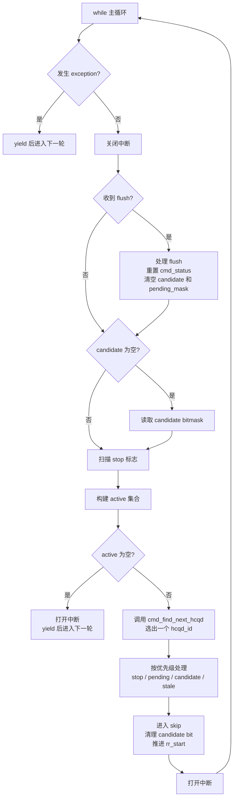
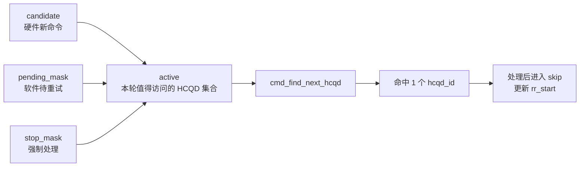
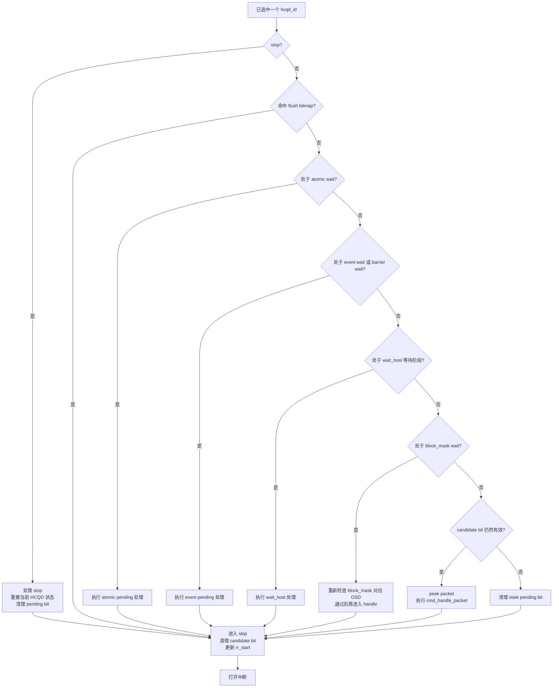
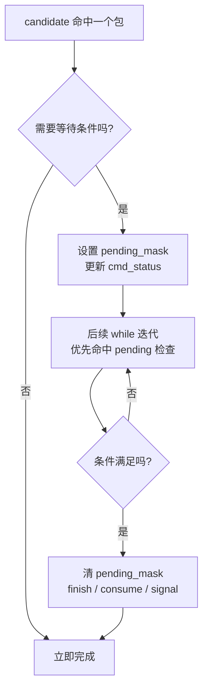
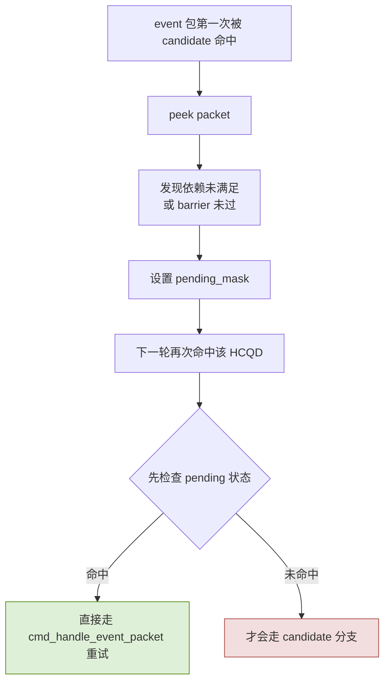
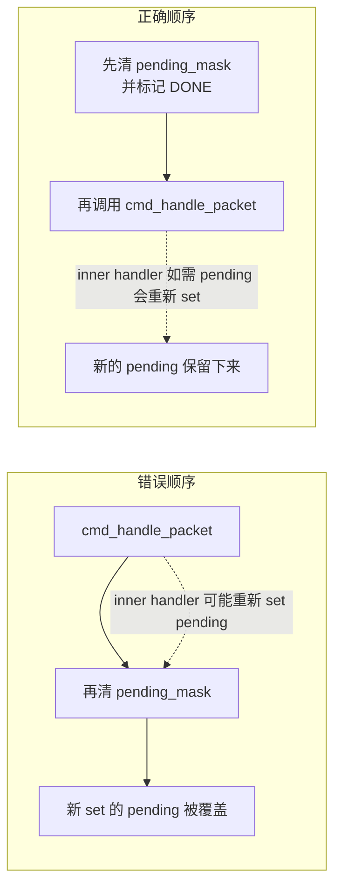
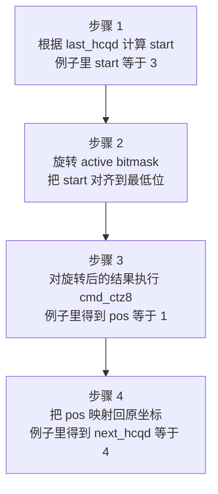

# CP User cmd_entry Candidate-Driven Dispatch 设计说明 V7

> **日期**: 2026-04-08  
> **分支**: zss/UpdateSchedule  
> **作者**: shuaishuai.zhu  
> **核心变化**: `active = candidate | pending_mask | stop_mask`，先确定“本轮值得处理的 HCQD 集合”，再用 CTZ 直接选中一个目标 HCQD。  
> **阅读建议**: 先看第 2 ~ 4 节，再看第 6 ~ 8 节。

## 1. 阅读地图

- 如果只想快速理解 V7 的核心变化，看第 2、3 节。
- 如果要对照 `cmd.c` 理解主循环，看第 4、5、9 节。
- 如果要确认 pending、idle、block_mask 这些边界行为，看第 6、8、10 节。

## 2. 一页看懂 V7

### 2.1 V7 到底解决了什么

V7 的重点不是“继续优化 round-robin 的写法”，而是把调度思路从“先轮到某个 HCQD，再判断它有没有必要处理”改成“先找出本轮所有值得处理的 HCQD，再从里面选一个”。

这带来三个直接收益：

| 旧问题 | 原因 | V7 的做法 |
|------|------|-----------|
| 会落到无效 HCQD 上产生 miss 迭代 | 先用 `rr_start % 8` 选 HCQD，再看它是否 active | 先构建 `active` 集合，再 CTZ 直接命中有效 HCQD |
| pending 命令在 candidate bit 被消费后容易“不可达” | 调度器缺少一个“软件侧待重试集合” | 新增 `pending_mask`，显式追踪需要重试的 HCQD |
| idle 时 busy-wait | `candidate == 0` 时仍继续空转 | `active == 0` 直接 `yield`，释放 CPU |

### 2.2 先记住 5 个变量

| 变量 | 含义 | 来源 | 何时更新 |
|------|------|------|----------|
| `rr_start` | round-robin 下一次搜索起点 | 软件状态 | `skip:` 统一更新为 `(hcqd_id + 1) % 8` |
| `candidate` | 硬件给出的“有新命令”的 HCQD bitmask | MMIO | 缓存为空时刷新；`skip:` 统一清 bit |
| `pending_mask` | 软件侧“还要继续重试”的 HCQD bitmask | 软件状态 | 进入 pending 时 set；完成、stop、flush、stale cleanup 时 clear |
| `stop_mask` | 当前轮询到的 stop 请求集合 | 软件状态 | 每轮扫描 `sf_get_stop_flag()` 生成 |
| `active` | 本轮真正值得访问的 HCQD 集合 | 临时变量 | `candidate | pending_mask | stop_mask` |

### 2.3 主循环总览



这里图里只保留主线动作，具体公式仍然是：

- `active = candidate | pending_mask | stop_mask`
- `skip` 阶段会清当前 `candidate` bit，并把 `rr_start` 推进到下一个 HCQD

### 2.4 理解 V7 时最重要的 4 条不变量

1. **每次 `while(1)` 只处理 1 个 HCQD。** 这让临界区稳定且容易推理。
2. **pending 只阻塞对应 HCQD。** 其他 HCQD 仍然可以被 `active` 命中并继续推进。
3. **`candidate` bit 在 `skip:` 统一清理。** 所有路径收口到一个出口，避免 stale bit 阻塞后续刷新。
4. **`flush` 会同时失效硬件缓存和软件缓存。** `candidate = 0`、`pending_mask = 0`、`cmd_status[]` reset，避免使用过期状态。

## 3. 核心思路

### 3.1 从“扫描 HCQD”变成“扫描 active 集合”



V7 的关键不是“让 `rr_start` 跳得更聪明”，而是先把**本轮有意义的目标**聚合成 `active`：

- `candidate` 代表硬件看到的新命令。
- `pending_mask` 代表软件尚未完成、后续还要重试的命令。
- `stop_mask` 代表当前轮必须优先处理的 stop 请求。

只要 `active != 0`，就说明当前至少有一个 HCQD 值得处理；只要 `active == 0`，就说明当前真的可以 idle。

### 3.2 为什么 V7 没有 miss 迭代

假设当前：

- `active = bits{1, 4, 7}`
- `rr_start = 0`

V7 不会先落到 `hcqd0` 再发现它无事可做，而是直接执行：

1. `cmd_find_next_hcqd(active, rr_start - 1)`
2. CTZ 从 `rr_start` 位置开始搜索
3. 直接得到 `hcqd1`
4. 处理完成后 `rr_start = 2`
5. 下一轮继续直接命中 `hcqd4`

因此：**3 个 active HCQD = 3 次迭代 = 0 次 miss**。

### 3.3 V4.1 / V6 / V7 对比

| 维度 | V4.1 | V6 | V7 |
|------|------|----|----|
| 选择 HCQD 的方式 | `for` 扫满 8 个 HCQD | `rr_start % 8` 先落点，再修正 | 先构建 `active`，再 CTZ 直接命中 |
| 每轮处理量 | 1 次 `while` 可能扫 8 个 HCQD | 每轮 1 个 HCQD | 每轮 1 个 HCQD |
| miss 迭代 | 无，但代价是全扫描 | 最多 1 次 | 0 次 |
| pending 可达性 | 依赖全扫描 | 依赖 round-robin 自然覆盖 | 显式依赖 `pending_mask` |
| idle 行为 | 空扫描 | busy-wait spin | `yield` |
| 代码推理难度 | 中 | 高，分支多 | 低，主线更清晰 |

## 4. `cmd_entry()` 主循环拆解

### 4.1 真实执行顺序

下面这张图对应 `cmd_entry()` 一次迭代里真正的判定顺序，也是阅读源码时最该先记住的顺序。



这张图刻意不把代码表达式直接写进节点里，重点是强调真实的判定优先级：

1. `stop`
2. `flush bitmap`
3. 各类 pending 状态
4. 普通 candidate dispatch
5. stale cleanup

### 4.2 为什么顺序必须是这样

- **stop 要最先处理。** 它是控制面优先级最高的动作，不能让一个 pending 或 candidate 继续占用该 HCQD。
- **pending 检查必须在 candidate 分支之前。** 这是 event / wait_host 不会重复 peek 的根本原因。
- **block_mask re-check 要晚于其他 pending、早于 `cmd_handle_packet()`。** 它是“允许命令真正执行”的最后一道门。
- **`skip:` 必须统一清 `candidate` bit。** 如果分散到不同分支，极易出现 stale bit 残留，阻塞后续 MMIO 刷新。

### 4.3 对照主循环的简化伪代码

```c
while (1)
{
    if (exception) {
        rt_thread_yield();
        continue;
    }

    level = rt_hw_interrupt_disable();

    if (flush) {
        sf_handle_flush();
        reset cmd_status;
        candidate = 0;
        pending_mask = 0;
    }

    if (candidate == 0)
        candidate = ib_get_candidate_bitmask();

    stop_mask = scan_stop_flags();
    active = candidate | pending_mask | stop_mask;

    if (active == 0) {
        rt_hw_interrupt_enable(level);
        rt_thread_yield();
        continue;
    }

    hcqd_id = cmd_find_next_hcqd(active, rr_start - 1);

    if (stop)          { handle_stop;              goto skip; }
    if (flush_bitmap)  {                           goto skip; }
    if (atomic_wait)   { handle_atomic;            goto skip; }
    if (event_wait)    { handle_event;             goto skip; }
    if (wait_host)     { handle_wait_host;         goto skip; }
    if (block_mask)    { recheck_then_handle;      goto skip; }

    if (candidate & BIT(hcqd_id)) {
        ib_peek_packet(...);
        cmd_handle_packet(...);
    } else {
        pending_mask &= ~BIT(hcqd_id);
    }

skip:
    candidate &= ~BIT(hcqd_id);
    rr_start = (hcqd_id + 1) % 8;
    rt_hw_interrupt_enable(level);
}
```

## 5. 命令类型到处理路径

这一节的目标是把 `cmd_handle_packet()` 和几个 pending helper 的关系一次看清。

| 命令类型 | 首次命中时做什么 | 为什么可能进入 pending | pending 何时退出 | consume / finish 时机 |
|---------|------------------|-------------------------|------------------|----------------------|
| `JOB` / `SDMA` | 直接 dispatch | 不进入 pending | 不适用 | 立即 `ib_consume_packet()` |
| `ATOMIC add/swap` | 先 dispatch，再检查 outstanding | outstanding 未清零 | OSD 清零 | dispatch 后通常已 consume；done 时清 pending |
| `ATOMIC cmp_swap` | dispatch 后可能长时间重试 | cmp_swap 可能失败并重试 | OSD 清零 | **done 后**才 consume |
| `EVENT signal` | 如果前序 OSD 清零，则 read + handle | barrier 语义要求等前序命令完成 | OSD 清零 | handle 时 `ib_read_packet()`、`ib_consume_packet()`、`ib_finish_packet()` |
| `EVENT wait` | 先检查 event dependency | 依赖尚未满足 | 依赖满足 | 依赖满足后 read + handle + finish |
| `WAIT_HOST` | 分两阶段：trig 与 poll | barrier 未过，或 CPU 尚未响应 | barrier 过且 polling 命中期待值 | phase1 consume，phase2 finish |
| `NOP` | 直接 read + finish | 不进入 pending | 不适用 | 立即 finish |
| `block_mask != 0` 的任意包 | 先过 block_mask gate | 对应 OSD 未清零 | `cmd_check_block_mask_osd()` 返回 true | 通过 gate 后才进入原始命令处理 |
| 非法 packet | read bad packet + finish + 上报异常 | 不进入 pending | 不适用 | 立即排空，避免死循环 |

### 5.1 一个常见误区

`candidate` 只说明“这个 HCQD 有东西值得看”，**不等于**“这个包现在一定可以真正执行完”。

真正的完成路径可能还要经过：

- atomic outstanding 清零
- event dependency 满足
- wait_host polling 命中
- block_mask 对应 OSD 清零

所以 `candidate` 负责“发现”，`pending_mask` 负责“记住还得回来继续做”。

## 6. Pending 模型

### 6.1 pending 的生命周期



### 6.2 `pending_mask` 在哪里 set / clear

这部分不需要背代码行号，只要记住“谁会进 pending，谁负责退出 pending”。

| 类别 | 进入 pending 的位置 | 退出 pending 的位置 |
|------|--------------------|--------------------|
| atomic | `cmd_handle_atomic_packet()` | `cmd_handle_atomic_packet()` |
| event barrier / wait | `cmd_handle_event_packet()` | `cmd_handle_event_packet()` |
| wait_host | `cmd_handle_wait_host_trig()`、`cmd_handle_wait_host_packet()` | `cmd_handle_wait_host_poll()` |
| block_mask | `cmd_entry()` 的 block_mask gate | `cmd_entry()` 在真正 `cmd_handle_packet()` 之前清掉 |
| stop / flush / stale | 不属于进入 pending 的原因 | `cmd_entry()` 统一兜底清理 |

可以把 `pending_mask` 理解为一个“软件重试队列的位图版索引”。它并不保存命令内容，真正的上下文仍然保存在：

- `cmd_status[hcqd_id]`
- `cmd_peek_pkt[hcqd_id]`

### 6.3 为什么 event pending 不会重复 peek

这是 V7 最容易被误解的一点。



结论只有一句话：

> **event pending 安全的根本原因，不是 candidate bit 被清掉了，而是 pending 检查发生在 candidate 分支之前。**

### 6.4 `block_mask` re-check 的关键顺序

这里是最值得在文档里单独强调的一处，因为它不只是“实现细节”，而是状态正确性的关键。



因此，V7 在 block_mask re-check 成功后采用的是：

1. `pending_mask &= ~BIT(hcqd_id)`
2. `cur_block_mask_handle_status = DONE`
3. `cmd_handle_packet(hcqd_id, &cmd_peek_pkt[hcqd_id])`

这个顺序不能反。

## 7. CTZ 与 Round-Robin

### 7.1 `cmd_find_next_hcqd()` 实际做了哪四步



示例输入输出如下：

- 输入：`active = 0b10010010`，`last_hcqd = 2`
- 输出：`next_hcqd = 4`

对应代码可以概括成：

```c
static rt_uint32_t cmd_find_next_hcqd(rt_uint32_t candidate, rt_uint32_t last_hcqd)
{
    rt_uint32_t start   = (last_hcqd + 1U) % IB_MAX_HCQD_NUM_PER_CORE;
    rt_uint32_t rotated = ((candidate >> start) |
                           (candidate << (IB_MAX_HCQD_NUM_PER_CORE - start))) & 0xFFU;
    rt_uint32_t pos     = cmd_ctz8(rotated);

    if (pos >= IB_MAX_HCQD_NUM_PER_CORE)
        return IB_MAX_HCQD_NUM_PER_CORE;

    return (start + pos) % IB_MAX_HCQD_NUM_PER_CORE;
}
```

### 7.2 为什么它既高效又公平

- **高效**: `cmd_ctz8()` 是 O(1) 的最低有效 bit 查找，不需要线性扫 8 次。
- **公平**: 搜索起点不是固定从 bit0 开始，而是从 `rr_start` 对应位置开始。
- **可预测**: 统一在 `skip:` 把 `rr_start` 更新到下一个位置，不会因为分支不同出现不同的推进规则。

### 7.3 `cmd_ctz8()` 为什么足够

因为当前每个 core 固定只有 8 个 HCQD：

- 输入只需要 8 bit。
- 低 4 bit、高 4 bit 两次 nibble 查表就够了。
- `val == 0` 返回 8，正好作为“无有效 bit”的哨兵值。

这也是 V7 能把“定位下一个 HCQD”压缩成一个非常小的常量时间操作的原因。

## 8. 典型场景 walkthrough

### 8.1 多个 candidate，同时没有 pending

假设：

- `candidate = bits{1, 4, 7}`
- `pending_mask = 0`
- `stop_mask = 0`

执行顺序就是：

1. `active = candidate`
2. CTZ 命中 `hcqd1`
3. `skip:` 后 `rr_start = 2`
4. 下一轮 CTZ 命中 `hcqd4`
5. 再下一轮命中 `hcqd7`

结论：没有任何一次会落到无效 HCQD 上。

### 8.2 一个 pending HCQD，外加一个新 candidate

假设：

- `pending_mask = bit3`
- `candidate = bit5`
- `rr_start = 0`

执行顺序通常是：

1. `active = bit3 | bit5`
2. 先命中 `hcqd3`，推进 pending 状态
3. 更新 `rr_start = 4`
4. 下一轮命中 `hcqd5`，处理新命令

结论：pending 不会饿死新命令，新命令也不会让 pending 永远得不到重试机会。

### 8.3 idle -> yield -> wake

假设：

- `candidate = 0`
- `pending_mask = 0`
- `stop_mask = 0`

这时：

1. `active == 0`
2. 直接 `interrupt_enable`
3. `rt_thread_yield()`
4. 调度器把 CPU 让给其他线程

后续只要有新的 candidate：

1. 下一次被调度回来
2. 刷新 `candidate`
3. 重新构建 `active`
4. 继续正常 dispatch

结论：idle 时不再 busy-wait，但恢复路径仍然很短。

### 8.4 stop / flush 发生时

这两个控制面场景的处理原则不同：

- **stop**: 针对单个 HCQD，优先于 pending / candidate，清该 HCQD 的 `cmd_status` 和 `pending_mask` bit。
- **flush**: 针对整个上下文，先执行 `sf_handle_flush()`，再全局 reset `cmd_status`、`candidate`、`pending_mask`。

可以把它们理解成：

- stop 是“单点打断”
- flush 是“整体失效并重新开始”

## 9. 从代码怎么读这套架构

### 9.1 推荐阅读顺序

如果要对着 `cmd.c` 读，建议按下面顺序：

1. `cmd_entry()`：先看调度框架和分支优先级。
2. `cmd_handle_packet()`：看包类型如何分发到不同 helper。
3. `cmd_handle_atomic_packet()` / `cmd_handle_event_packet()` / `cmd_handle_wait_host_packet()`：看 pending 如何推进。
4. `cmd_find_next_hcqd()` 与 `cmd_ctz8()`：最后看“为什么它能 O(1) 命中下一个 HCQD”。

### 9.2 关键函数职责对照

| 函数 | 作用 | 阅读重点 |
|------|------|----------|
| `cmd_entry()` | 调度主循环 | active 构建、优先级、`skip:` 收口 |
| `cmd_handle_packet()` | 按 packet type 分流 | 哪些类型直接完成，哪些会进 pending |
| `cmd_dispatch_handle_job_sdma_packet()` | job / sdma 快路径 | dispatch + consume |
| `cmd_dispatch_atomic_packet()` | atomic dispatch | cmp_swap consume 时机与其他 atomic 不同 |
| `cmd_handle_atomic_packet()` | atomic pending 推进 | outstanding 清零条件 |
| `cmd_handle_event_packet()` | event barrier / wait 推进 | barrier 与 dependency 的判定 |
| `cmd_handle_wait_host_packet()` | wait_host 两阶段推进 | barrier、trigger、polling 三段逻辑 |
| `cmd_check_block_mask_osd()` | block_mask gate | 哪些 OSD count 会阻塞真正执行 |
| `cmd_find_next_hcqd()` | 从 active 里选下一个 HCQD | rotate + CTZ + 映射回原坐标 |
| `cmd_ctz8()` | 8-bit 最低有效位定位 | 仅服务于 8 HCQD 场景 |

## 10. 验证重点、风险与回退

### 10.1 建议优先验证的场景

| 场景 | 目的 |
|------|------|
| 多个 candidate，`rr_start` 不在 candidate 上 | 验证 0 miss 迭代 |
| event pending + 新 candidate 并存 | 验证 pending 不会重复 peek，也不会阻塞其他 HCQD |
| wait_host 先 trig 后 poll | 验证 phase1 / phase2 状态推进 |
| block_mask re-check 成功后进入新的 pending | 验证“先 clear 再 handle”的顺序正确 |
| 全部 idle | 验证 `yield` 路径不会 busy-wait |
| stop / flush 打断正在 pending 的 HCQD | 验证软件缓存清理完整 |

### 10.2 主要风险

| 风险 | 影响 | 当前缓解 |
|------|------|----------|
| `pending_mask` set / clear 漏掉 | HCQD 饿死或无效轮询 | 所有 pending 入口和退出点均已显式管理 |
| `block_mask` 顺序写反 | 新 pending 被覆盖 | 文档和代码都要求“先 clear，再 handle” |
| stale candidate bit 残留 | 阻塞后续 MMIO 刷新 | `skip:` 统一清 `candidate` bit |
| flush 后残留旧状态 | 使用过期上下文 | `cmd_status`、`candidate`、`pending_mask` 一起 reset |

### 10.3 回退策略

如果 V7 需要回退，最直接的方式是只回退 `cmd_entry()` 调度框架；命令处理 helper 的接口层并没有改变，因此回退成本集中在主循环本身。

## 11. 总结

可以把 V7 浓缩成一句话：

> **V7 不是“把 round-robin 写得更花”，而是把调度问题拆成了两个更清晰的问题：先用 `active` 回答“谁值得看”，再用 CTZ 回答“先看谁”。**

围绕这个主线，`pending_mask` 负责保证可达性，`skip:` 负责统一收口，`yield` 负责让 idle 行为真实地 idle。这也是整份实现最值得把握的三件事。