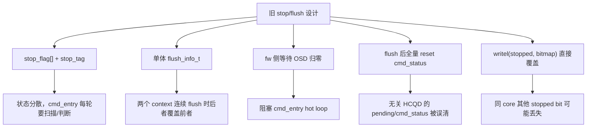
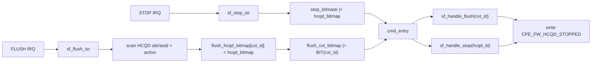
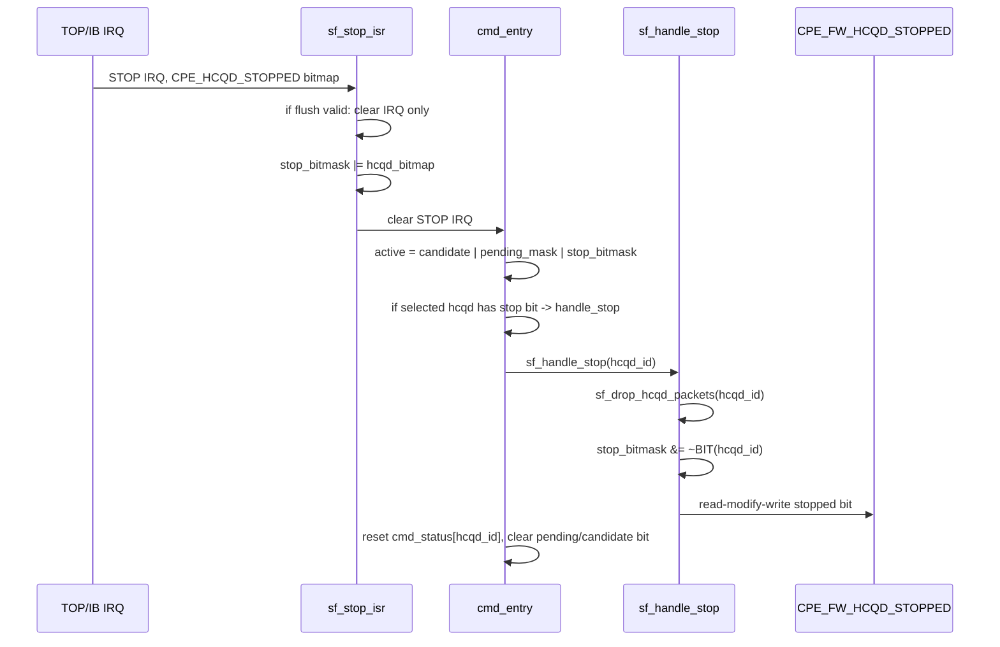
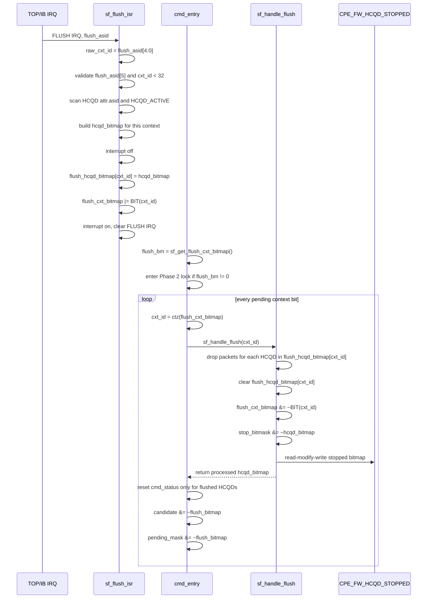
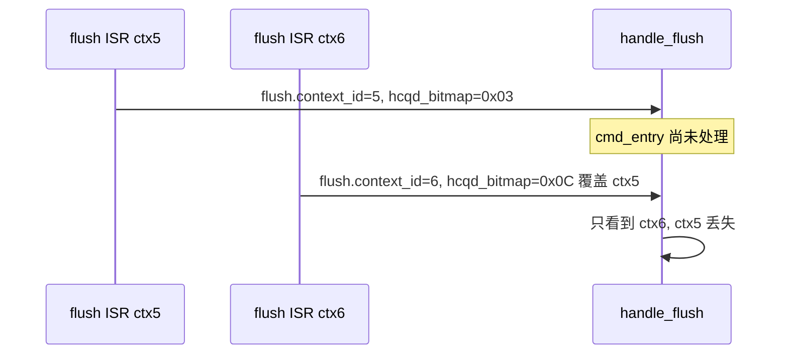
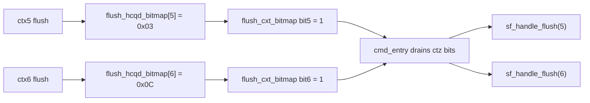
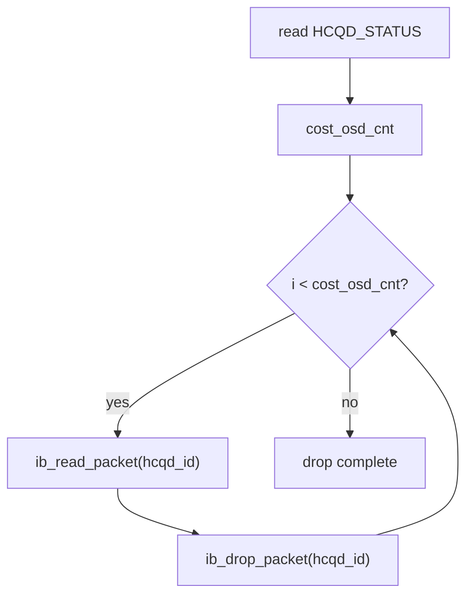
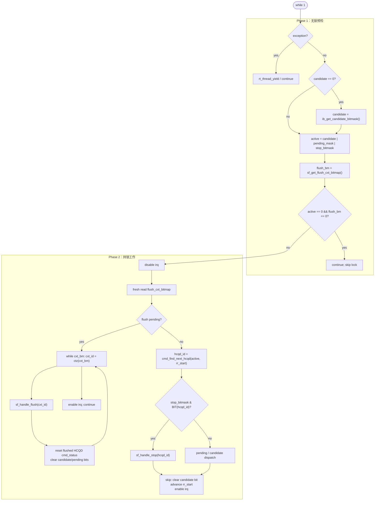
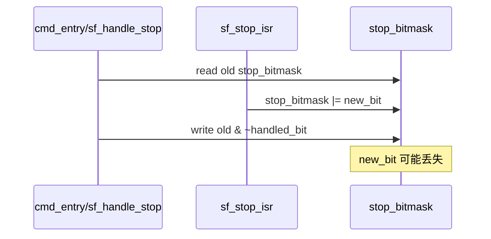

# CP User：Stop/Flush 与 cmd_entry 优化

> 对应代码：`sf.c` / `sf.h` / `cmd.c` / `cmd.h`  
> 当前校准源码：`/data3/shuaishuai.zhu/fw/aigc_sdk/grace/applications/cp/user/`  
> 更新日期：2026-05-09

这篇文档记录 CP user firmware 中 `sf` 模块 stop/flush 处理方式，以及它和 `cmd_entry()` candidate/pending 调度之间的关系。当前实现的核心方向是：

- stop 使用 `stop_bitmask` 表示 HCQD 维度状态。
- flush 使用 `flush_cxt_bitmap` 表示 context 维度是否有 pending flush。
- 每个 context 的 flush HCQD 集合保存在 `flush_hcqd_bitmap[cxt_id]`。
- `cmd_entry()` 的 hot loop 中，HCQD active 和 context flush 分开判断，flush 优先级最高。
- stop/flush 完成后通过 `CPE_FW_HCQD_STOPPED` 通知 master MCU。

## 一、为什么要改：背景和原问题

### 1.1 背景

`cmd_entry()` 是 CP user firmware 的 hot loop，负责从 Interaction Buffer 中发现 HCQD candidate、peek packet、推进 pending 命令，并把 packet 分发给 iDMA 或 firmware handler。stop/flush 不是普通 packet，而是控制面事件：

- stop：以 HCQD 为粒度，要求 firmware 停止并清理某个 HCQD 上已经驻留在 IB 中的 packet。
- flush：以 context 为粒度，要求 firmware 清理属于某个 context 的 active HCQD。
- 两者都可能和 candidate cache、pending packet、IB read/drop pointer 同时发生。

因此 stop/flush 的目标不是“多处理一种命令”，而是保证控制面事件能打断普通调度，同时不破坏 `cmd_entry()` hot path 的性能。

### 1.2 原设计的核心问题



这些问题的共同后果是：控制面事件会把 hot loop 变复杂，或者在并发场景下出现漏处理、误清理、性能下降。

### 1.3 为什么不能保持旧逻辑

- `cmd_entry()` 需要用 bitmask 快速构建 active 集合；逐个查询 stop flag 会把常态路径拖回 O(N) 扫描。
- flush 是 context 事件，但最终清理的是 HCQD 集合；如果只保存一个全局 `(context_id, hcqd_bitmap)`，多 context flush 会互相覆盖。
- OSD 等待放在 fw hot loop 内，会让 stop/flush 变成多轮阻塞状态机，影响普通 queue 调度。
- flush 只应该清理被 flush 的 HCQD；全量 reset 会影响其他 HCQD 的 pending 语义。
- stopped 寄存器是 bitfield；直接写 bitmap 会覆盖别的 bit，必须 read-modify-write。

## 二、改动收益总览

| 改动 | 为什么这样改 | 收益 |
|---|---|---|
| `stop_flag[]` -> `stop_bitmask` | stop 是 HCQD 维度事件，天然适合 bitmask | `cmd_entry()` 可 O(1) 合入 active；没有 candidate 时也能调度 stop |
| `flush_info_t` -> `flush_hcqd_bitmap[cxt_id]` | flush 是 context 维度事件，但每个 context 对应一个 HCQD bitmap | 多 context flush 不互相覆盖 |
| 新增 `flush_cxt_bitmap` | `cmd_entry()` 只需要快速判断哪些 context 有 pending flush | hot loop O(1) 判断 flush，不扫描 32 个 context |
| `sf_handle_flush(cxt_id)` 返回 processed bitmap | 调用方需要知道本次到底清了哪些 HCQD | 精确 reset `cmd_status/candidate/pending_mask` |
| 删除 stop/flush tag 多轮状态机 | fw 不应在 hot loop 中等待 OSD 归零 | 降低调度阻塞，控制路径单次完成 |
| `sf_drop_hcqd_packets()` 抽公共逻辑 | stop/flush 都要按 HCQD_STATUS drop IB-resident packet | 减少重复代码，统一 drop 语义 |
| `CPE_FW_HCQD_STOPPED` read-modify-write | stopped 是 bitfield | 不覆盖其他 HCQD stopped bit |
| flush 优先于普通 dispatch | flush 表示 context 级失效 | 避免旧 packet 在 flush 后继续执行 |

## 三、整体关系



`stop_bitmask` 是 HCQD-id space，`flush_cxt_bitmap` 是 context-id space。两者不能混在同一个 active mask 里，否则 `cmd_find_next_hcqd()` 会把 context bit 当成 HCQD bit。

## 四、sf 模块当前实现

### 4.1 状态变量

```c
static rt_uint32_t stop_bitmask = 0U;
static rt_uint32_t flush_cxt_bitmap = 0U;
static rt_uint32_t flush_hcqd_bitmap[SF_MAX_CONTEXT];
```

| 变量 | 维度 | 写入者 | 读取者 | 作用 |
|---|---|---|---|---|
| `stop_bitmask` | HCQD | `sf_stop_isr()` set，`sf_handle_stop/flush()` clear | `cmd_entry()` | 哪些 HCQD 需要 stop drain/drop |
| `flush_cxt_bitmap` | context | `sf_flush_isr()` set，`sf_handle_flush()` clear | `cmd_entry()` | 哪些 context 有 pending flush |
| `flush_hcqd_bitmap[cxt_id]` | context -> HCQD bitmap | `sf_flush_isr()` | `sf_handle_flush(cxt_id)` | 某个 context 需要 flush 的 HCQD 集合 |

### 4.2 stop 路径



关键点：

- `sf_stop_isr()` 从 `CPE_HCQD_STOPPED` 读硬件 bitmap，不再逐个 HCQD 改 `stop_flag[]`。
- 如果 flush valid bit 已经置位，stop ISR 只清 stop IRQ，避免 flush 期间重复处理 stop。
- `sf_handle_stop()` 负责 drop 该 HCQD 当前 IB-resident packets，然后清软件 stop bit，并写 `CPE_FW_HCQD_STOPPED`。
- `cmd_entry()` 处理 stop 后会 reset 对应 `cmd_status[hcqd_id]`，并清 `pending_mask/candidate` 对应 bit。

为什么这样改：

- stop 是 HCQD 级控制事件，把它放入 `stop_bitmask` 后，`cmd_entry()` 不需要额外扫描 stop 状态，只要把它 OR 进 `active`。
- stop 可以在没有新 candidate 的情况下被处理，避免“没有普通 packet 就看不到 stop”的漏处理。
- stop 完成后走统一 cleanup，能清掉 stale candidate/pending 状态，避免后续误 dispatch。

收益：

- 常态路径更短：stop 检查从逐个 flag 查询变成一次 bitmask 合并。
- 行为更确定：stop 命中后优先于 pending/candidate 分支。
- 更易验证：波形上只需要看 stop bit、selected HCQD、drop、stopped notify 四个点。

### 4.3 flush 路径



当前实现和早期设计的主要差异：

- 不是扫描 `flush_flag[]` 找 context，而是用 `flush_cxt_bitmap` 做 O(1) pending 判断。
- `sf_handle_flush()` 接口是 `sf_handle_flush(cxt_id)`，调用方先从 `flush_cxt_bitmap` 选 context。
- `cmd_entry()` 在持锁后会重新读取 `flush_cxt_bitmap`，然后一次 drain 所有 pending context。
- flush bitmap 返回给 `cmd_entry()`，用于精确 reset `cmd_status`、`candidate`、`pending_mask`。

为什么这样改：

- flush 的触发源是 context，但实际要清理的是属于该 context 的 HCQD 集合，所以必须同时保留 context bitmap 和 HCQD bitmap。
- `flush_cxt_bitmap` 让 hot loop 快速知道“有没有 flush”，`flush_hcqd_bitmap[cxt_id]` 让 handle 阶段知道“清哪些 HCQD”。
- `cmd_entry()` 持锁后 drain 所有 pending context，可以避免处理中途被新的 ISR 状态打断造成半清理。

收益：

- 修复多 context flush 覆盖问题。
- flush 后只清相关 HCQD，不影响其他 HCQD 的 pending 状态。
- 降低 hot loop 开销：Phase 1 不扫描所有 context，只读一个 bitmap。

### 4.4 per-context flush slot 解决的竞态

旧设计如果只有一个全局 `flush_info_t flush`，两个 context 连续 flush 会覆盖：



当前实现每个 context 有独立 slot：



这样 context 之间不会覆盖，`cmd_entry()` 也可以用 bit 操作逐个处理。

### 4.5 drop 公共函数

`sf_drop_hcqd_packets(hcqd_id_base, hcqd_id)` 把 stop/flush 共同逻辑收敛到一个地方：



注意这里按 `cost_osd_cnt` drop 当前 IB-resident packets，不再在 fw 侧等待 OSD 归零。OSD 等待责任应放到更高层控制流程，否则会阻塞 `cmd_entry()` hot loop。

## 五、cmd_entry 配合关系

### 5.1 两阶段结构



### 5.2 为什么 flush 要高于普通 dispatch

flush 表示某个 context 的 queue 需要整体 drain/drop。如果先继续普通 dispatch，可能出现：

- flush 对应 HCQD 的旧 packet 继续被执行。
- candidate cache 里保留的 bit 与 flush 后的 HCQD 状态不一致。
- pending packet 继续占用 `pending_mask`，导致 flush 后仍被访问。

所以当前 `cmd_entry()` 在 Phase 2 持锁后先处理所有 pending flush context，并在每个 context flush 后：

```c
rt_memset(&cmd_status[flush_idx], 0, sizeof(cmd_status[0]));
candidate    &= ~flush_bitmap;
pending_mask &= ~flush_bitmap;
```

### 5.3 stop 和 candidate/pending 的关系

stop bit 加入 HCQD active mask：

```c
active = candidate | pending_mask | sf_get_stop_bitmask();
```

这样即使某个 HCQD 没有新的 candidate，只要 stop ISR 设置了 bit，`cmd_entry()` 仍会访问它并执行 `sf_handle_stop()`。

处理完成后统一走 `skip`：

```c
candidate &= ~(1U << hcqd_id);
rr_start = (hcqd_id + 1U) % IB_MAX_HCQD_NUM_PER_CORE;
```

这保证 stop 后不会残留 stale candidate，同时 round-robin 起点继续推进。

## 六、当前代码仍需注意的点

### 6.1 stop_bitmask clear 的临界区

当前 `sf_flush_isr()` 和 `sf_handle_flush()` 对 `flush_hcqd_bitmap/flush_cxt_bitmap` 使用同一个 interrupt-disable critical section。但 `stop_bitmask` 的 set/clear 当前是直接读改写：

```c
// ISR
stop_bitmask |= hcqd_bitmap;

// handle_stop
stop_bitmask &= ~BIT(hcqd_id);

// handle_flush
stop_bitmask &= ~hcqd_bitmap;
```

风险是 RMW 竞争：如果 ISR 在 clear 的读-改-写窗口内设置新 bit，新 bit 可能被旧值覆盖。建议后续把 stop bit set/clear 也统一放入 interrupt-disable 临界区，或者封装为 `sf_set_stop_bits()` / `sf_clear_stop_bits()`。



### 6.2 stop/flush stopped 寄存器必须 read-modify-write

`CPE_FW_HCQD_STOPPED` 是 bitfield 通知寄存器。当前 stop/flush 都使用：

```c
val = readl(addr);
writel(addr, val | bitmap);
```

不要改回 `writel(addr, bitmap)`，否则会覆盖同 core 其他已经 stopped 的 HCQD bit。

### 6.3 context bitmap 和 HCQD bitmap 不要混用

- `flush_cxt_bitmap`：最多 32 bit，bit index 是 context id。
- `flush_hcqd_bitmap[cxt_id]`：最多 8 bit，bit index 是 HCQD id。
- `active`：只能放 HCQD-id space 的 `candidate | pending_mask | stop_bitmask`。

这条边界是当前设计正确性的关键。

## 七、接口变更摘要

| 旧接口/状态 | 当前接口/状态 | 说明 |
|---|---|---|
| `sf_get_stop_flag(id)` | `sf_get_stop_bitmask()` | 调用方按 HCQD bit 判断 stop |
| `stop_flag[]` | `stop_bitmask` | stop 状态从 per-HCQD enum 变成位图 |
| `flush_info_t flush` 单体 | `flush_hcqd_bitmap[SF_MAX_CONTEXT]` | 每个 context 独立保存 HCQD bitmap，避免覆盖 |
| 扫描 `flush_flag[]` | `sf_get_flush_cxt_bitmap()` | O(1) 判断是否有 pending flush context |
| `sf_handle_flush()` | `sf_handle_flush(cxt_id)` | 调用方指定 context，函数返回处理过的 HCQD bitmap |
| `stop_tag/flush_tag` 多轮状态机 | 单次 drop + notify | fw 不再等待 OSD 归零 |
| `writel(stopped, bitmap)` | `readl + OR + writel` | 避免覆盖其他 HCQD stopped bit |

## 八、验证重点

建议验证以下场景：

1. 单 HCQD stop：stop IRQ 后 `stop_bitmask` 置位，`cmd_entry()` 选择该 HCQD，drop 后写 `CPE_FW_HCQD_STOPPED`。
2. flush ctx5 + ctx6 连续触发：`flush_cxt_bitmap` 同时有 bit5/bit6，`cmd_entry()` 一次锁内 drain 两个 context。
3. flush 与 candidate cache 同时存在：flush 后 `candidate/pending_mask` 对应 HCQD bit 被清掉。
4. stop 与 flush 同时发生：flush valid 时 stop ISR 只清 IRQ，flush 路径负责 drain/drop。
5. stop_bitmask 并发 set/clear：如果后续补临界区，需要重点跑该回归。
