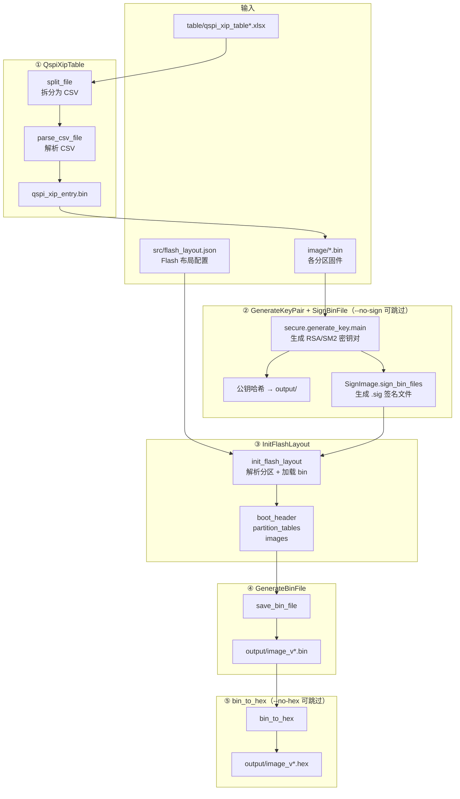
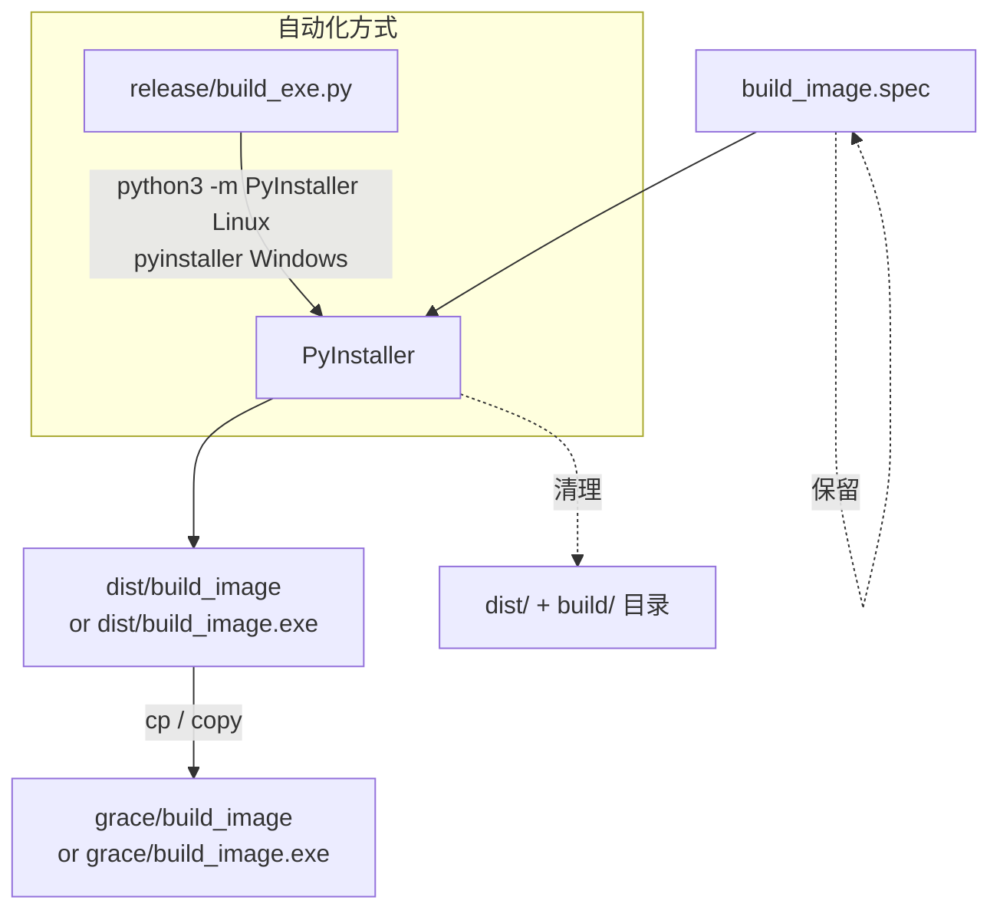

# image_tool 架构文档

## 概述

image_tool 是一个面向 AIGCIC grace SoC 的固件镜像打包工具，支持 Windows 和 Linux 平台。其主要功能是将各分区的 `.bin` 文件按照 Flash 布局配置打包，并可选择 RSA 或 SM2 签名、CRC-16 或 CRC-32 校验，最终生成用于烧录的 `.bin` 和 `.hex` 文件。

---

## 系统架构总览


---

## 仓库结构

```
image_tool/
├── grace/                      # 主工具目录（部署到目标环境的根目录）
│   ├── build_image.py          # 权威源文件（直接在服务器上修改）
│   └── build_image.spec        # PyInstaller 打包配置（含 gmssl 隐式导入声明）
├── release/                    # 发布工具目录
│   ├── build_exe.py            # PyInstaller 封装脚本
│   ├── release_tool.py         # 发布打包脚本
│   ├── release_tool            # 编译后 Linux 发布工具
│   └── release_tool.exe        # 编译后 Windows 发布工具
├── README.md                   # 用户使用说明文档
└── architecture.md             # 本文件
```

> **注意：** `include/`、`src/`、`emu/`、`secure/`、`verify/`、`table/` 等子目录
> 不在本仓库中，它们作为运行时依赖存在于 `grace/` 的部署包中。

---

## 运行时目录结构（grace/ 部署包）

```
grace/
├── build_image.py              # 主入口脚本
├── build_image.spec            # PyInstaller 打包配置
├── include/
│   └── image.py                # 公共常量与工具函数
├── src/
│   ├── flash_layout.json       # Flash 布局默认配置
│   ├── entry_table.json        # Entry table 配置
│   ├── parse_flash_layout.py   # 解析 Flash 布局 JSON
│   ├── generate_bin_file.py    # 生成最终 bin 文件
│   ├── parse_csv.py            # 解析 CSV 产品参数表
│   └── generate_entry.py       # 生成 entry table allinone
├── emu/
│   └── bin2hex.py              # 将 bin 转换为 Intel HEX 格式
├── secure/
│   ├── generate_key.py         # 生成 RSA / SM2 密钥对
│   ├── sign_image.py           # 对 bin 文件执行签名
│   └── crypto/
│       └── sm2.py              # SM2 算法实现（依赖 gmssl）
├── verify/
│   └── read_bin_file.py        # debug 模式下读取并校验 bin
├── table/
│   └── excel2csv.py            # 将 .xlsx 拆分为 CSV
├── image/                      # 待打包的 bin 文件（输入目录）
└── output/                     # 生成的 bin、hex 及公钥哈希（输出目录）
```

---

## 模块依赖


### 外部 Python 依赖

| 包 | 用途 |
|----|------|
| `cryptography` | RSA 密钥生成与签名 |
| `gmssl` | SM2 / SM3 国密算法（需在 PyInstaller 中显式声明为 hiddenimport） |
| `openpyxl` | 读取 .xlsx 产品参数表（`table/excel2csv.py` 使用，替代已弃用的 xlrd 2.x）|

---

## 数据流（normal 模式）



**输出文件：**

| 文件 | 说明 |
|------|------|
| `output/image_v1.1.2_gracec.bin` | 最终 bin 镜像 |
| `output/image_v1.1.2_gracec.hex` | Intel HEX 格式（用于烧录工具）|
| `output/<key>_*public*hash*` | 公钥哈希文件 |

---

## 三种运行模式


| 模式 | 用途 | 主要函数 |
|------|------|---------|
| `normal` | 打包固件，生成 bin + hex | `generate_bin()` → `bin_to_hex()` |
| `debug` | 读取并校验已有 bin 文件 | `verify_bin()` |
| `entry` | 生成 entry table allinone | `generate_entry_table()` |

---

## 配置参数

所有参数均有默认值，直接运行工具按 Enter 即可使用默认配置。

| 参数 | CLI 参数 | 默认值 | 可选值 |
|------|----------|--------|--------|
| 运行模式 | `-m` / `--mode` | `normal` | `normal`, `entry`, `debug` |
| 签名算法 | `-k` / `--key` | `rsa` | `rsa`, `sm2` |
| CRC 类型 | `-c` / `--crc` | `crc16` | `crc16`, `crc32` |
| 固件版本 | `--fw-version` | `10102` (v1.1.2) | 整型，格式 Major×10000+Minor×100+Patch |
| Flash 布局 | `-j` / `--json` | `src/flash_layout.json` | JSON 文件路径 |
| 输出文件名 | `-o` / `--output` | 自动生成 | 字符串 |
| 跳过签名 | `--no-sign` | False | flag |
| 跳过 HEX | `--no-hex` | False | flag |

> **交互行为：** CLI 未传入的参数才会出现交互提示；CLI 已传入的参数直接使用，不提示。

---

## 开发工作流

`grace/build_image.py` 是唯一的权威源文件，**直接在服务器上修改**，修改后提交 git：

```bash
# 1. SSH 到服务器或通过 VS Code Remote 直接编辑
# 2. 测试（4 次回车使用默认参数）
cd /home/shuaishuai.zhu/image_tool/grace
printf '\n\n\n\n' | python3 build_image.py

# 3. 提交
cd ..
git add grace/build_image.py
git commit -m "描述改动内容"
```

---

## 构建（PyInstaller 打包）

**必须使用 `build_image.spec`，不可直接打包 `.py` 脚本。**

原因：`gmssl` 库通过动态导入加载子模块，PyInstaller 静态分析无法自动发现：


`build_image.spec` 中已声明的 `hiddenimports`：

```python
hiddenimports=['gmssl', 'gmssl.sm2', 'gmssl.sm3', 'gmssl.func']
```

### 构建流程



**Linux 构建命令（在 grace/ 目录）：**

```bash
cd grace
python3 -m PyInstaller build_image.spec
cp dist/build_image .
```

**Windows 构建命令（在 grace/ 目录）：**

```bat
cd grace
pyinstaller build_image.spec
copy dist\build_image.exe .
```

---

## 工作目录机制

工具启动时会自动将工作目录切换到脚本/可执行文件所在的 `grace/` 目录：

```python
if getattr(sys, 'frozen', False):
    # PyInstaller 冻结二进制：切换到 .exe/.bin 文件所在目录
    os.chdir(os.path.dirname(sys.executable))
else:
    # 直接运行 Python 脚本：切换到 build_image.py 所在目录
    script_dir = os.path.dirname(os.path.abspath(__file__))
    os.chdir(script_dir)
```

因此用户无需手动 `cd` 到 `grace/` 目录。

---

## 常见问题

### 1. 提示"缺少必要的运行时模块"

```
[ERROR] 缺少必要的运行时模块，build_image 无法启动。
```

**原因**：`grace/` 目录缺少 SDK 模块包，`include/`、`src/`、`emu/`、`secure/`、`verify/`、`table/` 等子目录不存在。

**解决**：将 grace SDK 部署包中的子目录完整拷贝到 `grace/` 目录下。

---

### 2. `ModuleNotFoundError: No module named 'gmssl'`（PyInstaller 编译版）

**原因**：打包时未使用 `build_image.spec`，`gmssl` 通过动态导入链加载，PyInstaller 静态分析无法发现（见构建章节）。

**解决**：必须使用 spec 文件打包：

```bash
cd grace
pyinstaller build_image.spec    # 不可直接 pyinstaller build_image.py
```

---

### 3. 工具报 `Don't support OS`

**原因**：工具仅支持 `win32` 和 `linux` 平台，不支持 macOS 等其他系统。

---

### 4. `Excel xlsx file; not supported`（normal 模式）

**原因**：系统安装了 `xlrd` 2.x，该版本不再支持 `.xlsx` 格式。

**解决**：确认 `table/excel2csv.py` 已升级为使用 `openpyxl`，并执行：

```bash
pip3 install openpyxl
```
