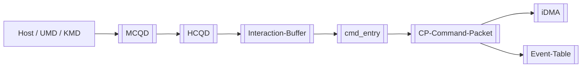

---
type: entry
title: "CP MAS 知识图谱入口"
created: 2026-05-09
updated: 2026-05-14
tags:
  - cp
  - mas
  - knowledge-map
status: active
---

# CP MAS 知识图谱入口

当前知识库已改为分层索引结构。建议不要从文件夹树随机找文件。

## 推荐入口

1. [[wiki/index|Wiki 总索引]]
2. [[wiki/fw/index|FW 技术知识库]]
3. [[wiki/fw/flows/CP command processing flow|CP command processing flow]]
4. [[wiki/fw/cp-user/index|CP User 索引]]
5. [[wiki/fw/cp-master/index|CP Master 索引]]
6. [[wiki/fw/cli/index|CLI 索引]]
7. [[wiki/synthesis/面试用工作笔记总结|面试用工作笔记总结]]

## 核心链路

## 维护说明

新增分析页或技术文档时，必须更新 [[wiki/index|Wiki 总索引]] 和对应分区索引。详细规则见 [[wiki/meta/wiki-maintenance-rules|Wiki 维护规则]]。