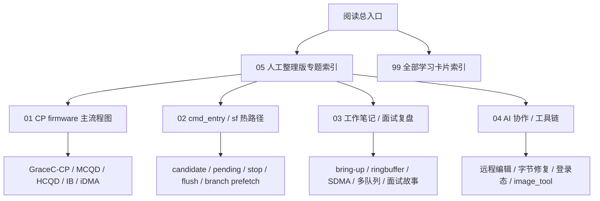

# 阅读总入口

这个文件夹是给你阅读学习用的资料层，位置：

C:\home\for_ai\_learning_guides

它不会替换原来的 wiki/。当前已经在自动卡片基础上，把四条主线升级成了人工整理版：CP 主链路、cmd_entry/sf 热路径、工作笔记/面试复盘、AI 协作/工具链。

## 先读这 5 个文件

1. [[_learning_guides/05 人工整理版专题索引|人工整理版专题索引]]
   - 最推荐入口。
   - 用一页把四条主线和关键学习卡片串起来。

2. [[_learning_guides/01 CP firmware 主流程图|CP firmware 主流程图]]
   - 看 Host/UMD/KMD、MCQD、HCQD、IB、cmd_entry、CPE、iDMA 的完整链路。

3. [[_learning_guides/02 cmd_entry 调度与 stop flush 图解|cmd_entry 调度与 stop flush 图解]]
   - 看 candidate、pending、stop、flush、branch prefetch、invalid trace。

4. [[_learning_guides/03 工作笔记与面试复盘图|工作笔记与面试复盘图]]
   - 看语雀工作笔记如何组织成面试故事。

5. [[_learning_guides/04 AI 协作经验图|AI 协作经验图]]
   - 看远程编辑、字节级修复、浏览器登录态、image_tool 维护流程。

## 当前覆盖范围

- 已扫描：89 个 wiki Markdown 文件
- 学习卡片：89 个
- 卡片目录：_learning_guides/cards/
- 生成日期：2026-05-09
- 人工增强：44 个重点学习文件

## 类别统计

- entities: 9 页
- fw/_index.md: 1 页
- fw/cp-master: 1 页
- fw/cp-user: 2 页
- fw/env.md: 1 页
- fw/learnings: 2 页
- meta: 1 页
- sources: 4 页
- sources/local-md: 44 页
- synthesis: 4 页
- topics: 16 页
- wiki-root: 4 页

## 总体入口图

## 使用方法

- 想建立整体认识：先看 05，再按需要跳到 01 到 04。
- 想查某个页面：打开 99 全部学习卡片索引。
- 想看原文：每张学习卡片开头都有原文链接。
- 想看图：重点文件已经补充人工 Mermaid 图；普通卡片仍保留基础关系图。
