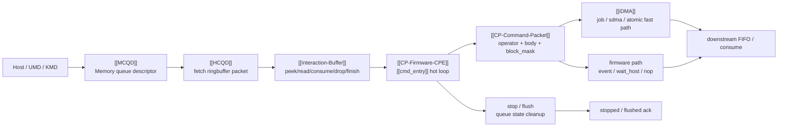
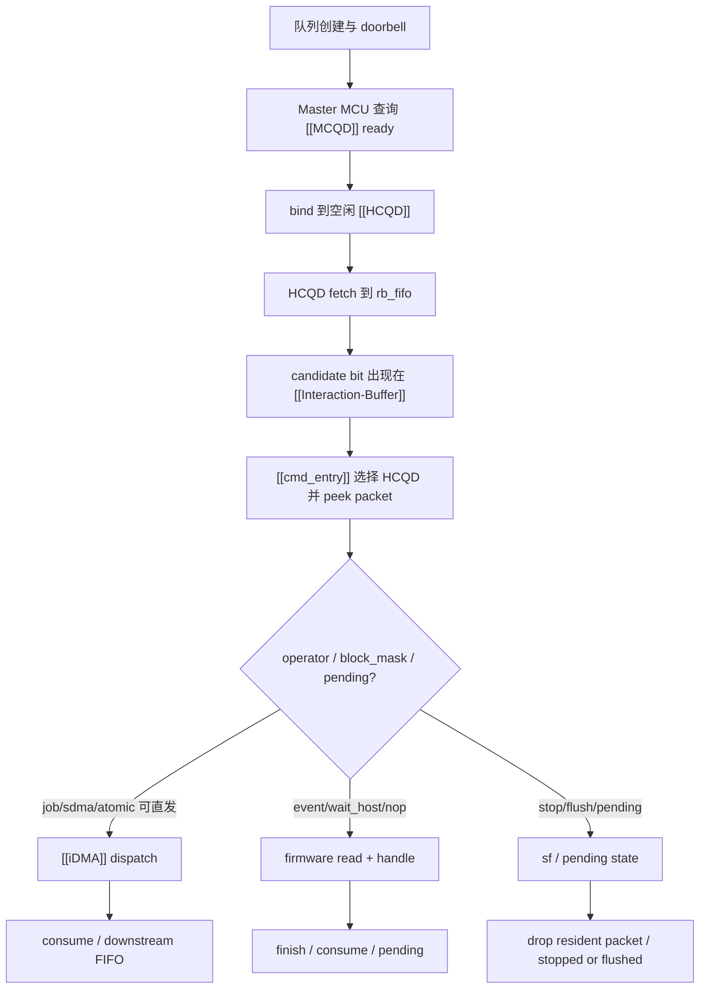
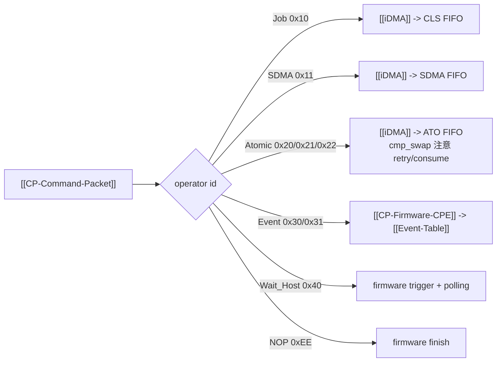

# CP firmware 主流程图

这页是 CP firmware 主链路的人工整理版。先用它建立全局图，再下钻到 [[GraceC CP MAS v1.4 code knowledge map]]、[[CP command processing flow]] 和各个实体页。

## 它解决什么问题

CP firmware 的难点不是单个函数，而是 host 写队列、硬件 fetch、firmware 分流、iDMA 下发、event/wait/stop/flush 回写状态这一整条链路。读这页时先回答四个问题：

- 命令从哪里来：host/UMD/KMD 写 [[MCQD]] 对应的 ringbuffer。
- 硬件做了什么：[[HCQD]] fetch packet，并通过 [[Interaction-Buffer]] 暴露 ready/candidate 状态。
- 固件决定什么：[[cmd_entry]] peek packet，按 operator 和资源状态选择 [[iDMA]] fast path 或 firmware path。
- 结束条件是什么：packet 被 consume、finish、drop，或者因为 event/wait/stop/flush 进入 pending/ack 流程。

## 主链路总览

## 在链路中的位置

## 输入输出

| 阶段 | 输入 | 输出 | 读的时候抓什么 |
|---|---|---|---|
| Host/UMD/KMD | command packet、ringbuffer wptr、doorbell | [[MCQD]] ready 信息 | 队列不是直接交给 firmware，而是先经 master/HCQD 绑定 |
| [[MCQD]] -> [[HCQD]] | memory descriptor、ready 状态 | HCQD fetch 上下文 | MCQD 是内存描述符，HCQD 是硬件执行槽 |
| [[HCQD]] -> [[Interaction-Buffer]] | rb_fifo packet、candidate bit | peek/read FIFO、consume/drop/finish MMIO | IB 是 firmware 看见硬件状态的窗口 |
| [[CP-Firmware-CPE]] | candidate mask、packet header/body、pending/stop/flush 状态 | dispatch 决策、pending 状态、finish/consume/drop | hot loop 的核心是少读 MMIO、少搬 packet、正确处理阻塞 |
| [[iDMA]] / firmware path | packet operator、body_size、block_mask | 下游 FIFO、event table 更新、wait_host poll、NOP finish | 不是所有 operator 都能 iDMA，event/wait_host 必须固件参与 |

## 分流图

## 推荐阅读顺序

1. [[GraceC CP MAS v1.4 code knowledge map]]：先建立 MAS 概念到代码入口的映射。
2. [[CP command processing flow]]：顺着 host 到 HCQD、IB、cmd_entry、iDMA/firmware 的主流程读。
3. [[GraceC-CP]]、[[MCQD]]、[[HCQD]]：明确 CP、内存队列描述符、硬件队列槽的分工。
4. [[Interaction-Buffer]]、[[CP-Command-Packet]]、[[CP-Firmware-CPE]]、[[iDMA]]：再看 packet 是怎么被观察、解析和下发的。

## 关键点

- [[MCQD]] 是队列描述符，[[HCQD]] 是硬件 fetch/执行槽，不要把两者混成一个队列对象。
- [[Interaction-Buffer]] 不是普通内存 buffer，它是一组 firmware 访问硬件 FIFO/MMIO 的接口。
- [[cmd_entry]] 的主职责是选择 HCQD、peek packet、处理 pending/stop/flush，并把 packet 分到 iDMA 或 firmware 路径。
- [[iDMA]] 是性能路径，但 event/wait_host/NOP 这类语义需要 firmware 参与。
- stop/flush 不是单纯停止循环，还要处理 IB resident packet、OSD 计数和 stopped/flushed ack。
