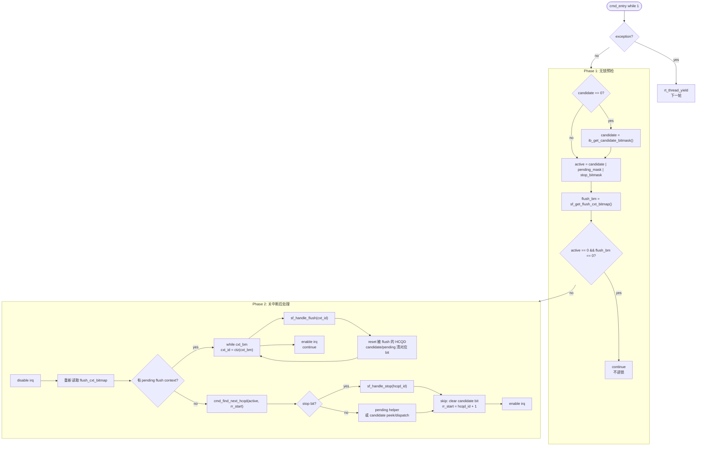
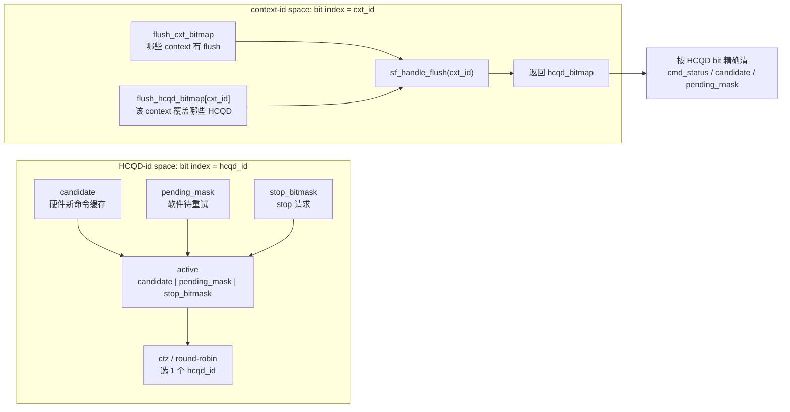
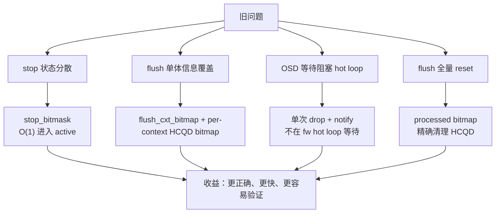

# cmd_entry 调度与 stop flush 图解

这页是 `cmd_entry()`、candidate/pending、stop/flush 的 hot path 总览。先记住一条主线：`cmd_entry()` 每轮先用无锁预检判断有没有值得处理的事，再进锁内优先 drain flush，最后才在 HCQD active 集合里选一个 HCQD 做 stop / pending / candidate dispatch。

## 背景：为什么 stop/flush 要重构

stop/flush 不是普通 packet，而是控制面事件。它们一旦发生，就要求 firmware 立刻调整 queue 状态；如果还按照普通 candidate dispatch 继续走，可能出现旧 packet 被继续执行、pending 状态被误清、或者多个 context flush 互相覆盖。

这次改动的核心收益：

- 正确性：stop 不依赖 candidate，也能通过 `stop_bitmask` 被调度到。
- 并发性：flush 不再用单体全局信息，而是 `flush_cxt_bitmap + flush_hcqd_bitmap[cxt_id]`，避免多 context 覆盖。
- 性能：hot loop 常态只做 bitmap 判断，不扫描 stop flag 或 32 个 context。
- 隔离性：flush 后只清被影响的 HCQD，不全量 reset 其他 queue。

## 必读页面

- [[CP cmd_entry Candidate V7 调度设计]]
- [[CP stop flush 与 queue 切换]]
- [[CP candidate peek 热路径优化]]
- [[CP 分支预取与 cmd_entry 布局优化]]
- [[CP queue scheduling stop flush]]

## 一图看主循环

## bitmask 关系

## 改动收益图

## 关联源文

- [[wiki/fw/cp-user/CP cmd_entry Candidate V7 调度设计|CP cmd_entry Candidate V7 调度设计]]
- [[wiki/fw/cp-user/CP stop flush 与 queue 切换|CP stop flush 与 queue 切换]]
- [[wiki/sources/local-md/C-home-shuaishuai.zhu/fw/docs/cp_user_sf_cmd_changes|CP User：Stop/Flush 与 cmd_entry 优化]]
- [[wiki/sources/local-md/C-home-shuaishuai.zhu/fw/cmd_entry_roundrobin_design|CP User cmd_entry Candidate-Driven Dispatch 设计说明 V7]]
## 关键不变量

- `candidate`、`pending_mask`、`stop_bitmask` 都是 HCQD-id space，能合成 `active`。
- `flush_cxt_bitmap` 是 context-id space，只能用来枚举 `cxt_id`，不能混进 `active`。
- `flush_hcqd_bitmap[cxt_id]` 是 context 到 HCQD bitmap 的映射，`sf_handle_flush(cxt_id)` 返回 HCQD bitmap 后，`cmd_entry()` 才能精确清软件缓存。
- flush 高于 stop/pending/candidate dispatch。进入 Phase 2 后只要看到 flush，就先 drain 所有 pending context。
- stop 加入 `active`，所以即使没有新 candidate，也能被 `cmd_entry()` 调度到。
- 每轮只处理一个普通 HCQD；flush 是例外，它在锁内按 context drain。

## 容易误解点

- `candidate` 不是“命令一定能执行完”，它只是“这个 HCQD 值得 peek”。event、atomic、wait_host、block_mask 都可能转入 pending。
- pending 安全依赖于“pending 检查在 candidate 分支之前”，不是依赖 candidate bit 保留。
- trace 里看到 `ib_wait_idma_idle` 一类地址，不一定代表真实执行；要结合 valid bit 判断它是不是分支/ret 目标未解析时的 wrong-path fetch。
- stop 是 HCQD 级控制；flush 是 context 级控制，处理后再落回 HCQD bitmap 清理。

