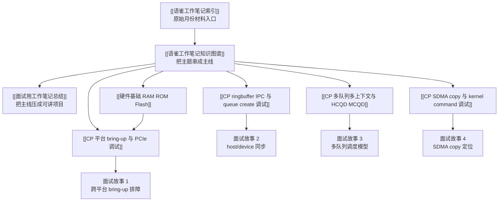
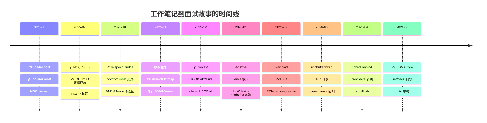

# 工作笔记与面试复盘图

这页把 [[语雀工作笔记索引]]、[[语雀工作笔记知识图谱]] 和 [[面试用工作笔记总结]] 串成一条面试复盘路线。使用顺序建议是：先看全局时间线，再选 2 到 4 个能展开的项目故事，最后回到 source 索引补证据。

## 总路线图

## 时间线

## 面试讲法

按“背景 -> 问题 -> 证据 -> 分层排查 -> 根因/收敛结论 -> 验证 -> 收益”讲。重点不是背每个月做了什么，而是证明自己能把 UMD、KMD、firmware、硬件平台和波形证据串起来。

## 这个主题可以怎么讲

把这页当成面试前的路线图，不需要逐条背诵。先用时间线说明工作覆盖了平台 bring-up、多队列、ringbuffer/IPC、SDMA 和热路径优化，再按面试官方向挑一个故事讲深。

## 技术抓手

- 系统层：UMD/KMD、CP firmware、PCIe/平台、host/device memory。
- 队列层：MCQD、HCQD、ringbuffer、doorbell、query/bind、stop/flush。
- 证据层：UMD log、kern.log、dmesg、packet dump、波形、trace valid 位。

## 证据材料

- [[语雀工作笔记索引]] 是月份证据入口。
- [[语雀工作笔记知识图谱]] 是主题关系入口。
- [[面试用工作笔记总结]] 是项目故事入口。

## 面试追问

- 你会优先讲哪个项目，为什么它最能代表你的能力？
- 这个故事有哪些原始证据可以支撑？
- 哪些结论已经验证，哪些还只是根据笔记收敛出的方向？
## 必读页面

- [[语雀工作笔记知识图谱]]
- [[面试用工作笔记总结]]
- [[语雀工作笔记索引]]
- [[CP 平台 bring-up 与 PCIe 调试]]
- [[CP ringbuffer IPC 与 queue create 调试]]
- [[CP 多队列多上下文与 HCQD MCQD]]
- [[CP SDMA copy 与 kernel command 调试]]
- [[硬件基础 RAM ROM Flash]]
- [[CP candidate peek 热路径优化]]
- [[CP 分支预取与 cmd_entry 布局优化]]
- [[CP stop flush 与 queue 切换]]

## 怎么选故事

- 如果面试官关注系统调试，优先讲 [[CP 平台 bring-up 与 PCIe 调试]] 和 [[CP ringbuffer IPC 与 queue create 调试]]。
- 如果面试官关注架构理解，优先讲 [[CP 多队列多上下文与 HCQD MCQD]]。
- 如果面试官关注性能和底层细节，优先讲 [[CP candidate peek 热路径优化]]、[[CP 分支预取与 cmd_entry 布局优化]] 和 [[CP SDMA copy 与 kernel command 调试]]。
- 如果面试官从基础知识切入，用 [[硬件基础 RAM ROM Flash]] 接到 bootrom、loader、firmware 镜像和平台 bring-up。