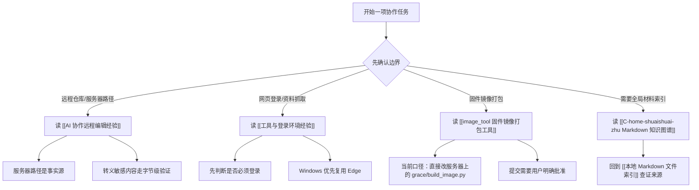

# AI 协作经验图

这页是 AI 协作、工具链登录、远程编辑和 `image_tool` 的人工整理入口。它不替代原始 wiki，只把多次真实踩坑整理成可执行的工程协作手册。

## 总览图

## 必读页面

- [[AI 协作远程编辑经验]]
- [[工具与登录环境经验]]
- [[image_tool 固件镜像打包工具]]
- [[C-home-shuaishuai-zhu Markdown 知识图谱]]
- [[本地 Markdown 文件索引]]

## 什么时候用

- 接手远程服务器、Windows 映射目录、SSH 编辑、登录态浏览器、飞书文档、`image_tool` 维护时，先从这里分流。
- 需要把“自动抽取的卡片”变成可执行 SOP 时，用这里判断该跳到 topic、source 还是 synthesis。
- 发现源文档互相冲突时，优先回到对应 source 卡片看“验证标准”和“当前口径”。

## 操作步骤

1. 先判断任务属于远程编辑、网页登录、`image_tool`、还是全局索引。
2. 进入对应 topic 卡片，按“什么时候用 / 操作步骤 / 常见失败 / 验证标准”执行。
3. 需要证据时跳回 source mirror 卡片，不直接改 `wiki/` 原文。
4. 修改代码或文档前确认写入范围；并发 agent 存在时，只改自己负责的文件。

## 常见失败

- 把本地 Windows 映射目录当成远程仓库事实源，导致验证和运行环境脱节。
- 看到浏览器登录页后继续用 WebFetch 抓取，实际拿不到受保护内容。
- 按旧 README 走 `build_image_new.py/_apply_changes.py` 同步流，忽略当前架构页里的直接服务器编辑口径。
- 整理卡片时丢掉原文链接和 wikilink，使后续无法回证据。

## 验证标准

- 本页保留以上 5 个入口 wikilink。
- 相关 topic/source 卡片都包含“什么时候用 / 操作步骤 / 常见失败 / 验证标准”。
- Mermaid 能覆盖四条关键图：远程编辑决策树、字节级修复流程、浏览器登录态/资料抓取流程、`image_tool` 架构流程。
- 未修改 `wiki/` 原始文件、`00/99` 总入口、CP 主链路、`cmd_entry` 或面试文件。