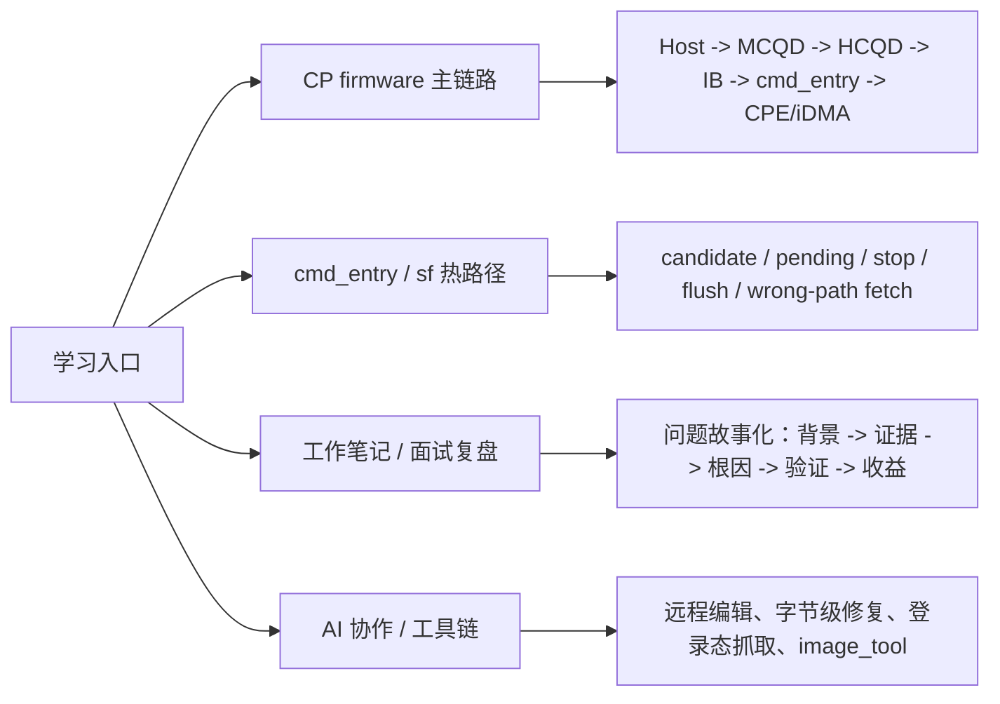
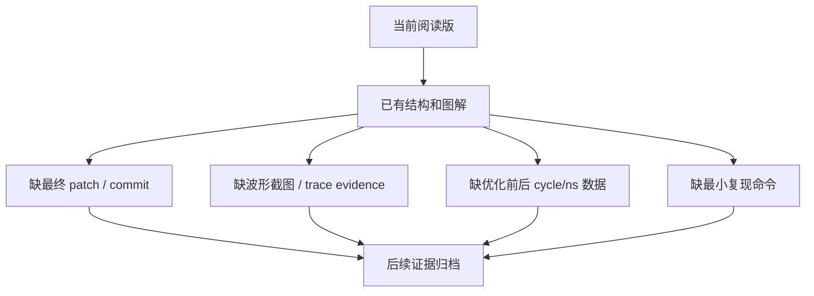

# 人工整理版专题索引

这页只收录已经人工增强过的学习材料。优先读这里，不需要从 `cards/` 目录里逐个找文件。

## 总图

## 1. CP firmware 主链路

先读：

- [[_learning_guides/01 CP firmware 主流程图|01 CP firmware 主流程图]]
- [[_learning_guides/cards/synthesis - GraceC CP MAS v1.4 code knowledge map|GraceC CP MAS v1.4 code knowledge map]]
- [[_learning_guides/cards/topics - CP command processing flow|CP command processing flow]]

核心实体：

- [[_learning_guides/cards/entities - GraceC-CP|GraceC-CP]]
- [[_learning_guides/cards/entities - MCQD|MCQD]]
- [[_learning_guides/cards/entities - HCQD|HCQD]]
- [[_learning_guides/cards/entities - Interaction-Buffer|Interaction-Buffer]]
- [[_learning_guides/cards/entities - CP-Command-Packet|CP-Command-Packet]]
- [[_learning_guides/cards/entities - CP-Firmware-CPE|CP-Firmware-CPE]]
- [[_learning_guides/cards/entities - iDMA|iDMA]]

阅读目标：

- 先理解系统分层，再看具体函数。
- 把 MCQD/HCQD/IB/cmd_entry/CPE/iDMA 各自职责分开。
- 读代码时确认“谁写状态、谁消费状态、谁通知完成”。

## 2. cmd_entry / sf 热路径

先读：

- [[_learning_guides/02 cmd_entry 调度与 stop flush 图解|02 cmd_entry 调度与 stop flush 图解]]
- [[_learning_guides/cards/topics - CP cmd_entry Candidate V7 调度设计|CP cmd_entry Candidate V7 调度设计]]
- [[_learning_guides/cards/topics - CP stop flush 与 queue 切换|CP stop flush 与 queue 切换]]

深入主题：

- [[_learning_guides/cards/topics - CP candidate peek 热路径优化|CP candidate peek 热路径优化]]
- [[_learning_guides/cards/topics - CP 分支预取与 cmd_entry 布局优化|CP 分支预取与 cmd_entry 布局优化]]
- [[_learning_guides/cards/topics - CP queue scheduling stop flush|CP queue scheduling stop flush]]
- [[_learning_guides/cards/topics - CP event atomic wait host handling|CP event atomic wait host handling]]
- [[_learning_guides/cards/fw - cp-user - cmd_entry|fw cp-user cmd_entry]]
- [[_learning_guides/cards/fw - cp-user - ib|fw cp-user IB]]

阅读目标：

- 明确 `candidate | pending_mask | stop_bitmask` 都是 HCQD space。
- 明确 `flush_cxt_bitmap` 是 context space，不能混入 active。
- 用 trace valid 位区分真实执行和 wrong-path fetch。
- 看优化时同时关注汇编布局、分支方向、invalid fetch 成本。

## 3. 工作笔记 / 面试复盘

先读：

- [[_learning_guides/03 工作笔记与面试复盘图|03 工作笔记与面试复盘图]]
- [[_learning_guides/cards/synthesis - 语雀工作笔记知识图谱|语雀工作笔记知识图谱]]
- [[_learning_guides/cards/synthesis - 面试用工作笔记总结|面试用工作笔记总结]]

主题卡：

- [[_learning_guides/cards/topics - CP 平台 bring-up 与 PCIe 调试|CP 平台 bring-up 与 PCIe 调试]]
- [[_learning_guides/cards/topics - CP ringbuffer IPC 与 queue create 调试|CP ringbuffer IPC 与 queue create 调试]]
- [[_learning_guides/cards/topics - CP 多队列多上下文与 HCQD MCQD|CP 多队列多上下文与 HCQD MCQD]]
- [[_learning_guides/cards/topics - CP SDMA copy 与 kernel command 调试|CP SDMA copy 与 kernel command 调试]]
- [[_learning_guides/cards/topics - 硬件基础 RAM ROM Flash|硬件基础 RAM ROM Flash]]
- [[_learning_guides/cards/sources - 语雀工作笔记索引|语雀工作笔记索引]]

阅读目标：

- 每个问题都整理成“背景、现象、证据、根因、修复、验证、收益”。
- 面试时不要只讲函数，要讲分层排查和证据闭环。
- 后续继续补最终 patch、commit、波形截图和性能对比。

## 4. AI 协作 / 工具链

先读：

- [[_learning_guides/04 AI 协作经验图|04 AI 协作经验图]]
- [[_learning_guides/cards/topics - AI 协作远程编辑经验|AI 协作远程编辑经验]]
- [[_learning_guides/cards/topics - 工具与登录环境经验|工具与登录环境经验]]
- [[_learning_guides/cards/topics - image_tool 固件镜像打包工具|image_tool 固件镜像打包工具]]

执行手册：

- [[_learning_guides/cards/synthesis - C-home-shuaishuai-zhu Markdown 知识图谱|C-home-shuaishuai-zhu Markdown 知识图谱]]
- [[_learning_guides/cards/sources - 本地 Markdown 文件索引|本地 Markdown 文件索引]]
- [[_learning_guides/cards/sources - local-md - C-home-shuaishuai.zhu - image_tool - README|image_tool README]]
- [[_learning_guides/cards/sources - local-md - C-home-shuaishuai.zhu - image_tool - architecture|image_tool architecture]]
- [[_learning_guides/cards/sources - local-md - C-home-shuaishuai.zhu - fw - .claude - learnings - patterns - ssh-remote-file-editing|SSH remote file editing]]
- [[_learning_guides/cards/sources - local-md - C-home-shuaishuai.zhu - fw - .claude - learnings - patterns - byte-level-file-surgery|Byte-level file surgery]]
- [[_learning_guides/cards/sources - local-md - C-home-shuaishuai.zhu - fw - .claude - learnings - errors - ssh-python-byte-escaping|SSH Python byte escaping]]

阅读目标：

- 远程 repo 以服务器当前文件为事实源。
- 对 escape-heavy 内容必须做字节级验证。
- 浏览器/语雀/飞书类资料抓取依赖登录态，不要用未认证 HTTP 推断权限。
- image_tool 维护要同步 README 和 architecture。

## 仍需补强

