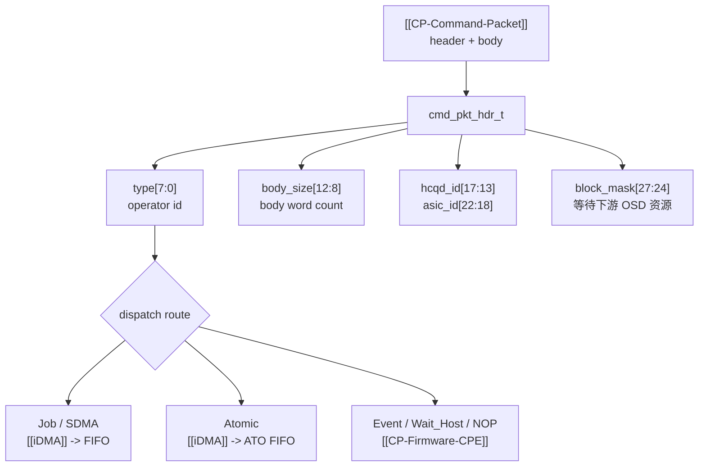

---
type: learning-card
created: 2026-05-09
source: "[[wiki/fw/concepts/CP-Command-Packet|CP-Command-Packet]]"
category: "entities"
---

# CP-Command-Packet

## 原文

- 原文链接：[[wiki/fw/concepts/CP-Command-Packet|CP-Command-Packet]]
- 原始路径：wiki\entities\CP-Command-Packet.md
- 分类：`entities`
- 文件大小：1160 bytes

## 它解决什么问题

[[CP-Command-Packet]] 是 CP 主链路里真正被处理的命令单元。host/UMD/KMD 把它写到 ringbuffer，[[HCQD]] fetch 后交给 [[Interaction-Buffer]]，[[cmd_entry]] 通过 header 字段判断 operator、body_size、hcqd_id、asic_id、block_mask，并决定走 [[iDMA]] 还是 firmware。

## 字段和分流图

## 在链路中的位置

Packet 位于数据流中心：[[MCQD]] 和 [[HCQD]] 负责让它到达硬件 FIFO，[[Interaction-Buffer]] 负责让 firmware 看见它，[[CP-Firmware-CPE]] 根据它的 header 做分流。

## 输入输出

| 项 | 内容 |
|---|---|
| 输入 | host 写入 ringbuffer 的 header/body，最多 32 words |
| 解析字段 | operator id、body_size、hcqd_id、asic_id、block_mask |
| 输出动作 | iDMA dispatch、firmware event/wait_host/NOP 处理、consume/finish/pending/drop |

## Operator 读法

| 类型 | operator id | 读的时候抓什么 |
|---|---:|---|
| Job | `0x10` | 目标是 CLS FIFO，通常走 [[iDMA]] |
| SDMA | `0x11` | 目标是 SDMA FIFO，通常走 [[iDMA]] |
| VPU | `0x12` | 预留/映射到 VPU，注意实际启用状态 |
| Atomic add/swap/cmp_swap | `0x20/0x21/0x22` | 目标是 ATO FIFO，cmp_swap 要特别看 retry/consume 语义 |
| Event signal/wait | `0x30/0x31` | 必须 firmware 参与 [[Event-Table]] |
| Wait_Host | `0x40` | trigger + polling 两阶段 |
| NOP | `0xEE` | firmware read 后 finish |

## 阅读关键点

- `body_size + 1` 常用于 iDMA length，因为 header 也要随 body 一起搬运。
- `block_mask` 决定是否需要等下游 OSD 资源，不只是 packet 的静态属性。
- operator id 决定主路径，但 event/wait_host/atomic 的边界条件决定正确性。

## 关联页面

- [[CP command processing flow|CP command processing flow]]
- [[CP event atomic wait host handling|CP event atomic wait host handling]]
- [[CP-Firmware-CPE|CP-Firmware-CPE]]
- [[Event-Table|Event-Table]]
- [[iDMA|iDMA]]
- [[Interaction-Buffer|Interaction-Buffer]]
