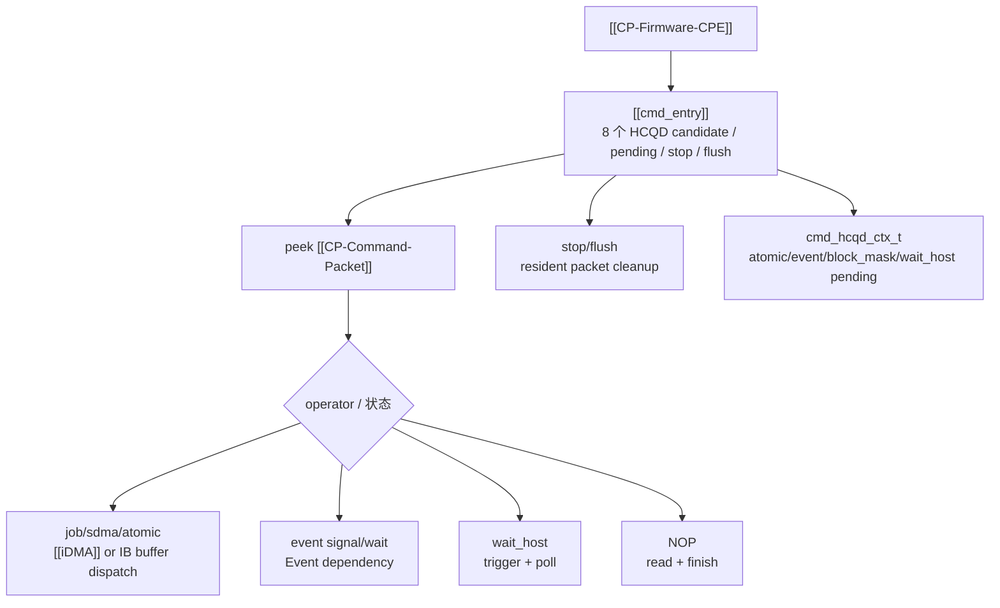

---
type: learning-card
created: 2026-05-09
source: "[[wiki/fw/concepts/CP-Firmware-CPE|CP-Firmware-CPE]]"
category: "entities"
---

# CP-Firmware-CPE

## 原文

- 原文链接：[[wiki/fw/concepts/CP-Firmware-CPE|CP-Firmware-CPE]]
- 原始路径：wiki\entities\CP-Firmware-CPE.md
- 分类：`entities`
- 文件大小：945 bytes

## 它解决什么问题

[[CP-Firmware-CPE]] 是 CP user firmware 的执行侧，运行在 NX900 RISC-V core 上。它解决的是硬件 fetch 到 packet 之后，哪些可以快速下发，哪些必须由 firmware 维护语义的问题。

这页读法要围绕 `cmd_entry` hot loop：轮询 HCQD candidate，处理 pending/stop/flush，解析 packet，分发 job/sdma/atomic/event/wait_host/NOP。

## 固件职责图

## 在链路中的位置

CPE 位于 [[Interaction-Buffer]] 之后、[[iDMA]]/firmware handlers 之前。硬件已经把 packet fetch 出来，但还没有决定 packet 应该被快速搬运、firmware 处理、pending，还是因为 stop/flush 被 drop。

## 输入输出

| 项 | 内容 |
|---|---|
| 输入 | candidate mask、peek/read packet、per-HCQD context、stop/flush 中断状态、下游 OSD 状态 |
| 内部状态 | `cmd_hcqd_ctx_t` 中 atomic/event/block_mask/wait_host pending 信息 |
| 输出 | `idma_dispatch_packet()`、event/wait_host handler、consume/finish/drop、pending_mask 更新、queue stopped/flushed 处理 |

## 阅读关键点

- `cmd.c` 是主干：不要只看分发函数，也要看 candidate、pending、stop、flush 的循环顺序。
- `event_entry.c` 说明 event dependency 为什么不能简单 iDMA 直发。
- `sf.c` 说明 stop/flush 为什么要处理 IB resident packet 和 OSD 计数。
- pending 状态是跨循环的，不是一次函数调用内就能完全理解。

## 关联页面

- [[cmd_entry|cmd_entry]]
- [[CP event atomic wait host handling|CP event atomic wait host handling]]
- [[CP-Command-Packet|CP-Command-Packet]]
- [[iDMA|iDMA]]
