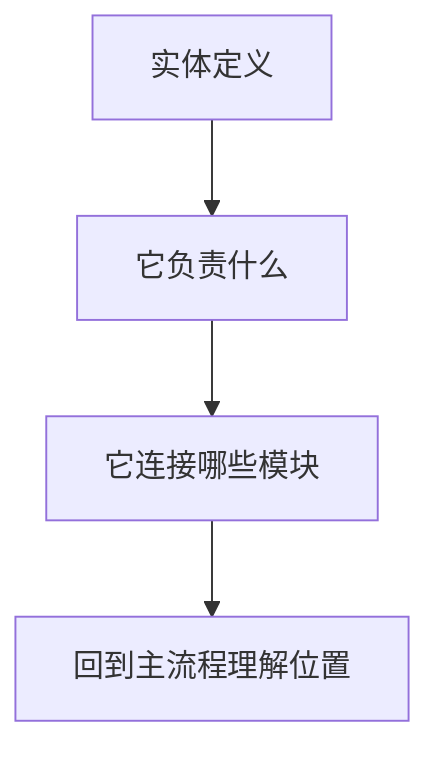
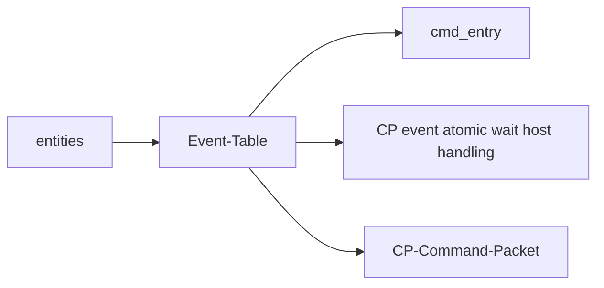

---
type: learning-card
created: 2026-05-09
source: "[[wiki/fw/concepts/Event-Table|Event-Table]]"
category: "entities"
---

# Event-Table

## 原文

- 原文链接：[[wiki/fw/concepts/Event-Table|Event-Table]]
- 原始路径：wiki\entities\Event-Table.md
- 分类：`entities`
- 文件大小：1161 bytes

## 怎么读

实体页：解释系统中的对象、模块或概念。

## 本页关系图

## 小节索引

- 职责
- 代码入口
- 延伸

## 关联页面

- [[cmd_entry|cmd_entry]]
- [[CP event atomic wait host handling|CP event atomic wait host handling]]
- [[CP-Command-Packet|CP-Command-Packet]]

## 阅读提示

- 如果这页是 sources，优先把它当证据材料，不要从这里开始建立全局理解。
- 如果这页是 synthesis 或 topics，优先看 Mermaid 图和小节标题，再跳到关联页面。
- 如果这页没有显式链接，读完后回到 [[_learning_guides/00 阅读总入口|阅读总入口]] 或 [[wiki/index|Wiki Index]]。