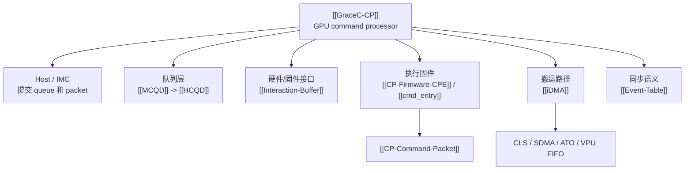

---
type: learning-card
created: 2026-05-09
source: "[[wiki/fw/concepts/GraceC-CP|GraceC-CP]]"
category: "entities"
---

# GraceC-CP

## 原文

- 原文链接：[[wiki/fw/concepts/GraceC-CP|GraceC-CP]]
- 原始路径：wiki\entities\GraceC-CP.md
- 分类：`entities`
- 文件大小：1120 bytes

## 它解决什么问题

[[GraceC-CP]] 是整条 CP firmware 主链路的系统边界。它解释 CP 不是单纯的 firmware，也不是单纯的硬件队列，而是 host、IMC、Gctrl、SDMA、VPU、Atomic、Event table、data/ctrl fabric 和 CP user firmware 共同组成的命令处理单元。

读这页是为了先搞清楚“CP 里面有哪些角色”，再去看 [[MCQD]]、[[HCQD]]、[[Interaction-Buffer]]、[[CP-Firmware-CPE]]、[[iDMA]] 的分工。

## 组成图

## 在链路中的位置

这页是实体总入口，适合在 [[CP command processing flow]] 之前或之后快速回看。它不负责解释某个函数细节，而是帮助你把 CP 主链路分成队列、接口、固件、搬运、同步几层。

## 输入输出

| 方向 | 内容 |
|---|---|
| 输入 | host/UMD/KMD 提交的 queue、doorbell、command packet、event/wait/stop/flush 请求 |
| 内部处理 | MCQD 查询和绑定、HCQD fetch、IB 暴露 packet、CPE 分流、iDMA 搬运、event/wait 处理 |
| 输出 | 下游 FIFO 命令、event table 状态、wait_host 结果、queue stopped/flushed ack、packet consume/finish/drop |

## 阅读关键点

- [[MCQD]] 和 [[HCQD]] 是队列层，不是 packet 本身。
- [[Interaction-Buffer]] 是 firmware 访问 HCQD rb_fifo 和 MMIO 的接口。
- [[CP-Firmware-CPE]] 才是 `cmd_entry`、event、wait_host、stop/flush 这些 firmware 逻辑所在。
- [[iDMA]] 是性能优化路径，不覆盖所有 packet 语义。

## 关联页面

- [[CP command processing flow|CP command processing flow]]
- [[CP queue scheduling stop flush|CP queue scheduling stop flush]]
- [[CP-Firmware-CPE|CP-Firmware-CPE]]
- [[Event-Table|Event-Table]]
- [[GraceC CP MAS v1.4|GraceC CP MAS v1.4]]
- [[GraceC CP MAS v1.4 code knowledge map|GraceC CP MAS v1.4 code knowledge map]]
- [[HCQD|HCQD]]
- [[iDMA|iDMA]]
- [[Interaction-Buffer|Interaction-Buffer]]
- [[MCQD|MCQD]]
