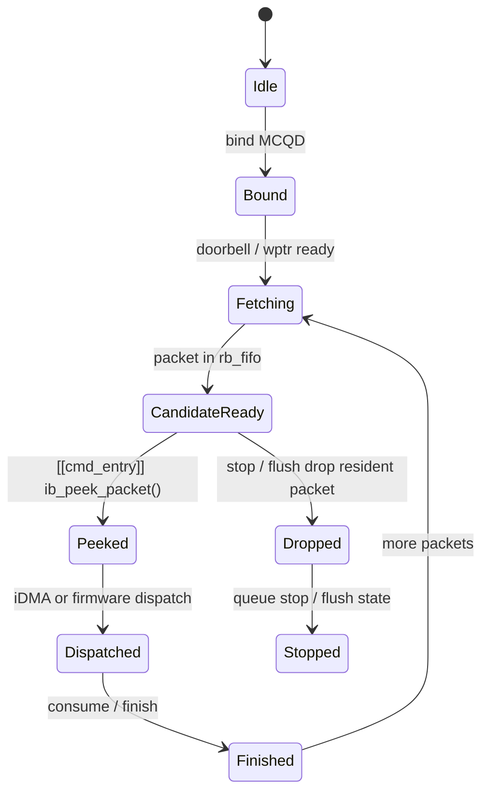

---
type: learning-card
created: 2026-05-09
source: "[[wiki/fw/concepts/HCQD|HCQD]]"
category: "entities"
---

# HCQD

## 原文

- 原文链接：[[wiki/fw/concepts/HCQD|HCQD]]
- 原始路径：wiki\entities\HCQD.md
- 分类：`entities`
- 文件大小：1202 bytes

## 它解决什么问题

[[HCQD]] 解决的是“硬件如何把 ringbuffer 里的 command packet 取出来，并告诉 firmware 哪个队列有活可干”。它从 ringbuffer fetch 1024-bit packet，维护 read pointer，把 packet 放到 rb_fifo，并通过 [[Interaction-Buffer]] 暴露 candidate bit、peek/read FIFO 和 consume/drop/finish 通道。

## 状态交接图

## 在链路中的位置

HCQD 位于 [[MCQD]] 之后、[[Interaction-Buffer]] 之前。MCQD 解决“哪个队列 ready”，HCQD 解决“packet 已经被硬件 fetch 到哪里，firmware 怎么知道”。

## 输入输出

| 项 | 内容 |
|---|---|
| 输入 | 已绑定的 [[MCQD]]、ringbuffer rptr/wptr、host/device memory 中的 command packet |
| 输出给 firmware | candidate bit、peek FIFO、read FIFO、可 consume/drop/finish 的硬件状态 |
| 输出给队列状态 | stop/flush 时的 stopped 状态、resident packet drop 结果 |

## 阅读关键点

- `ib_get_candidate_bitmask()` 读到的是 HCQD ready bit，是 [[cmd_entry]] 选择队列的入口。
- `ib_peek_packet()` 只看 packet，不消费；`ib_read_packet()` 会切换 use_idma 并读取完整 packet。
- `ib_consume_packet()`、`ib_drop_packet()`、`ib_finish_packet()` 对应三种收尾语义，读 stop/flush 时尤其要分清。
- HCQD 的 stop/flush 语义不只是停止 fetch，还包含等待 read 返回和 queue stopped 状态。

## 关联页面

- [[cmd_entry|cmd_entry]]
- [[CP queue scheduling stop flush|CP queue scheduling stop flush]]
- [[iDMA|iDMA]]
- [[Interaction-Buffer|Interaction-Buffer]]

