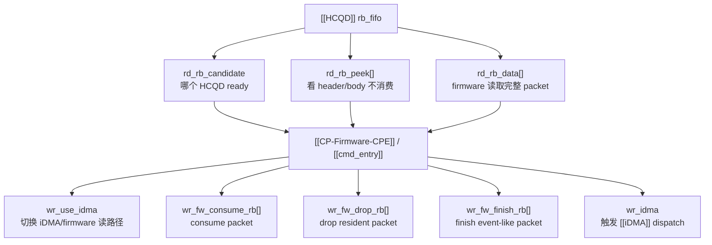

---
type: learning-card
created: 2026-05-09
source: "[[wiki/fw/concepts/Interaction-Buffer|Interaction-Buffer]]"
category: "entities"
---

# Interaction-Buffer

## 原文

- 原文链接：[[wiki/fw/concepts/Interaction-Buffer|Interaction-Buffer]]
- 原始路径：wiki\entities\Interaction-Buffer.md
- 分类：`entities`
- 文件大小：1182 bytes

## 它解决什么问题

[[Interaction-Buffer]] 解决的是“CP firmware 怎么和 [[HCQD]] 的 rb_fifo、下游 FIFO、event/interrupt 状态以及 MMIO 寄存器交互”。它不是普通软件 buffer，而是一组硬件通道：candidate、peek、read、use_idma、consume、drop、finish、wr_idma。

读这页时要把每个寄存器/通道对应到 packet 生命周期里的动作。

## 通道图

## 在链路中的位置

IB 位于 [[HCQD]] 和 [[CP-Firmware-CPE]] 之间。HCQD 把 packet fetch 到硬件侧，CPE 不直接读 ringbuffer，而是通过 IB 观察、读取和提交收尾动作。

## 输入输出

| 方向 | 内容 |
|---|---|
| HCQD -> IB | rb_fifo packet、candidate ready bit、peek/read 数据 |
| CPE -> IB | use_idma 控制、consume/drop/finish 命令、iDMA dispatch 触发 |
| IB -> 下游 | iDMA 搬运请求、firmware 写 FIFO、queue 状态更新 |

## 阅读关键点

- candidate 是调度入口，peek 是判断入口，read 是 firmware 真正拿 packet 的入口。
- `ib_read_packet()` 会等待 [[iDMA]] idle，并在读取期间关闭 use_idma，避免 firmware 和 iDMA 同时抢路径。
- consume/drop/finish 不同：consume 是正常消耗，drop 常见于 stop/flush resident packet，finish 常见于 event-like packet。
- `idma_dispatch_packet()` 通过 IB 的 `wr_idma` 触发硬件搬运，不等于 firmware 手动写每个 word。

## 关联页面

- [[cmd_entry|cmd_entry]]
- [[HCQD|HCQD]]
- [[iDMA|iDMA]]
