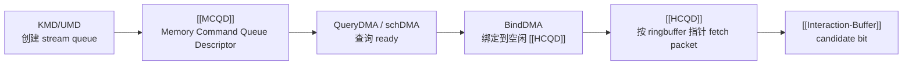

---
type: learning-card
created: 2026-05-09
source: "[[wiki/fw/concepts/MCQD|MCQD]]"
category: "entities"
---

# MCQD

## 原文

- 原文链接：[[wiki/fw/concepts/MCQD|MCQD]]
- 原始路径：wiki\entities\MCQD.md
- 分类：`entities`
- 文件大小：596 bytes

## 它解决什么问题

[[MCQD]] 解决的是“host 创建的 command queue 如何被 CP master 发现并交给硬件执行槽”的问题。它保存在 device memory 中，描述一个 memory command queue；master MCU 查询它是否 ready，再把 ready 的 MCQD bind 到空闲 [[HCQD]]。

不要把 MCQD 理解成 firmware 正在处理的 packet。它更像队列描述符，真正 fetch packet 并暴露 candidate 状态的是 [[HCQD]]。

## 位置图

## 在链路中的位置

MCQD 位于 host 队列和 HCQD fetch 之间。它的读法应该偏“队列生命周期”：谁创建、谁查询、什么时候 ready、如何绑定到 HCQD。

## 输入输出

| 项 | 内容 |
|---|---|
| 输入 | KMD/UMD 创建的 stream queue、ringbuffer 地址和指针、mailbox/share memory 通知 |
| 处理者 | CP master MCU，通过 QueryDMA/schDMA 判断 ready，通过 BindDMA 绑定 |
| 输出 | 一个 ready MCQD 被分配给空闲 [[HCQD]]，后续由 HCQD fetch command packet |

## 阅读关键点

- [[MCQD]] 是 memory descriptor，[[HCQD]] 是 hardware descriptor，名字相近但层级不同。
- MCQD 的核心动词是 query、schedule、bind，不是 peek、consume、finish。
- doorbell 到来后，后续主链路要转到 [[HCQD]] 和 [[Interaction-Buffer]]。

## 关联页面

- [[CP queue scheduling stop flush|CP queue scheduling stop flush]]
- [[GraceC-CP|GraceC-CP]]
- [[HCQD|HCQD]]
