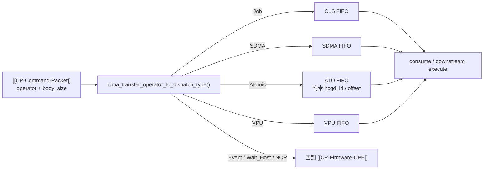

---
type: learning-card
created: 2026-05-09
source: "[[wiki/fw/concepts/iDMA|iDMA]]"
category: "entities"
---

# iDMA

## 原文

- 原文链接：[[wiki/fw/concepts/iDMA|iDMA]]
- 原始路径：wiki\entities\iDMA.md
- 分类：`entities`
- 文件大小：858 bytes

## 它解决什么问题

[[iDMA]] 解决的是 command packet 搬运成本问题。对于 job、SDMA、atomic 这类可以直接送往下游 FIFO 的 packet，firmware 不需要逐字读取和写出，而是配置 iDMA 从 [[HCQD]] rb_fifo 直接搬到目标 FIFO。

它是性能路径，但不是万能路径。event signal/event wait、wait_host、NOP 仍需要 [[CP-Firmware-CPE]] 参与语义处理。

## 搬运路径图

## 在链路中的位置

iDMA 位于 [[cmd_entry]] 分流之后、下游 FIFO 之前。它依赖 [[Interaction-Buffer]] 的 `wr_idma` 通道触发，也依赖 packet header 中的 operator 和 body_size 来设置目的地和长度。

## 输入输出

| 项 | 内容 |
|---|---|
| 输入 | HCQD id、operator id、body_size、atomic 附加信息、目标 FIFO 类型 |
| 操作 | 等待 iDMA idle，设置 src/dst/length，触发 `wr_idma` |
| 输出 | packet 被搬到 CLS/SDMA/ATO/VPU FIFO，随后按路径 consume 或进入下游执行 |

## 阅读关键点

- `body_size + 1` 表示 header 加 body 一起搬运。
- atomic path 不是普通 job path，尤其 cmp_swap 的 retry/consume 语义要回到 event/atomic 主题页交叉验证。
- event signal/event wait 需要 firmware 和 [[Event-Table]]，不能因为能搬运就直接走 iDMA。
- `ib_wait_idma_idle()` 这类等待点关系到 firmware read 和 iDMA direct path 的互斥。

## 关联页面

- [[CP command processing flow|CP command processing flow]]
- [[CP event atomic wait host handling|CP event atomic wait host handling]]
- [[Interaction-Buffer|Interaction-Buffer]]
