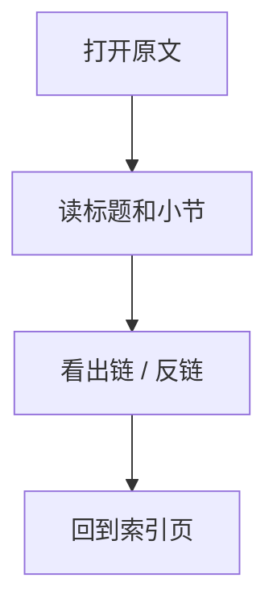
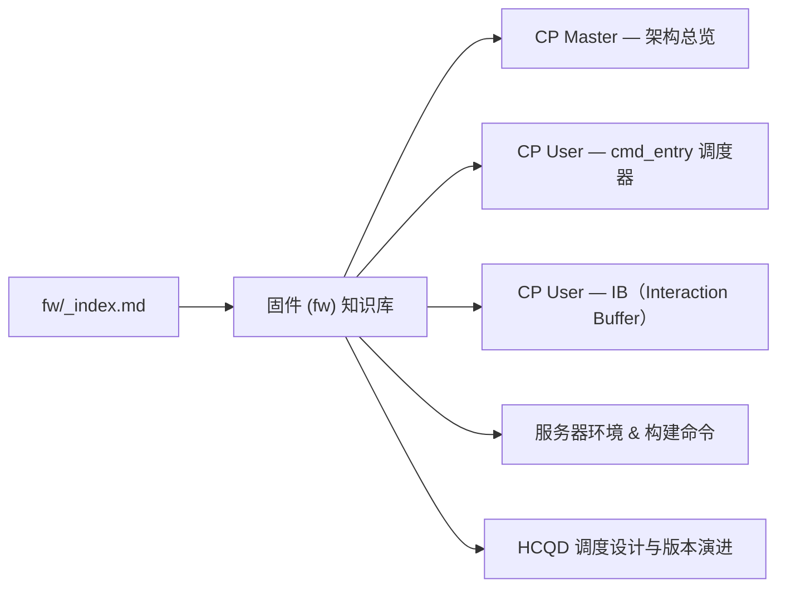

---
type: learning-card
created: 2026-05-09
source: "[[wiki/fw/index|固件 (fw) 知识库]]"
category: "fw/_index.md"
---

# 固件 (fw) 知识库

## 原文

- 原文链接：[[wiki/fw/index|固件 (fw) 知识库]]
- 原始路径：wiki\fw\_index.md
- 分类：`fw/_index.md`
- 文件大小：702 bytes

## 怎么读

fw 专项页：偏代码、模块和经验。

## 本页关系图

## 小节索引

- 子模块
- 历史 Learnings
- 环境

## 关联页面

- [[wiki/fw/cp-master/overview|CP Master — 架构总览]]
- [[wiki/fw/cp-user/cmd_entry|CP User — cmd_entry 调度器]]
- [[wiki/fw/cp-user/ib|CP User — IB（Interaction Buffer）]]
- [[wiki/fw/env|服务器环境 & 构建命令]]
- [[wiki/fw/learnings/hcqd-scheduling|HCQD 调度设计与版本演进]]
- [[wiki/fw/learnings/review-rules|固件 Code Review 规则]]

## 阅读提示

- 如果这页是 sources，优先把它当证据材料，不要从这里开始建立全局理解。
- 如果这页是 synthesis 或 topics，优先看 Mermaid 图和小节标题，再跳到关联页面。
- 如果这页没有显式链接，读完后回到 [[_learning_guides/00 阅读总入口|阅读总入口]] 或 [[wiki/index|Wiki Index]]。