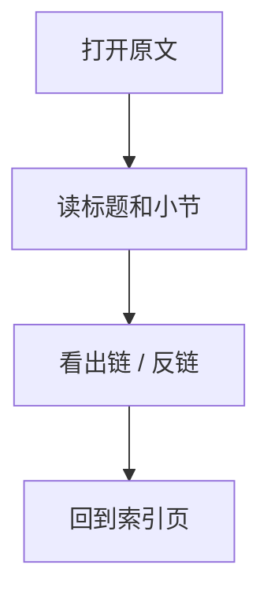
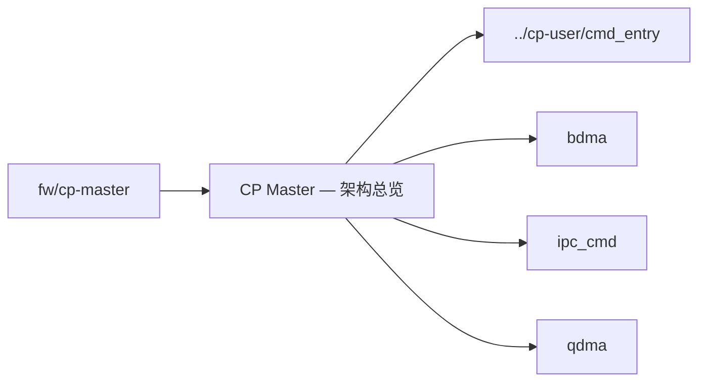

# CP Master — 架构总览

## 原文

- 原文链接：[[wiki/fw/cp-master/overview|CP Master — 架构总览]]
- 原始路径：wiki\fw\cp-master\overview.md
- 分类：`fw/cp-master`
- 文件大小：908 bytes

## 怎么读

fw 专项页：偏代码、模块和经验。

## 本页关系图

## 小节索引

- 源码文件清单
- 待补充

## 关联页面

- [[../cp-user/cmd_entry|../cp-user/cmd_entry]]
- `bdma`：当前 wiki 中还没有独立页面，先作为 CP master 待补模块记录。
- `ipc_cmd`：当前 wiki 中还没有独立页面，先作为 CP master 待补模块记录。
- `qdma`：当前 wiki 中还没有独立页面，先作为 CP master 待补模块记录。

## 阅读提示

- 如果这页是 sources，优先把它当证据材料，不要从这里开始建立全局理解。
- 如果这页是 synthesis 或 topics，优先看 Mermaid 图和小节标题，再跳到关联页面。
- 如果这页没有显式链接，读完后回到 [[_learning_guides/00 阅读总入口|阅读总入口]] 或 [[wiki/index|Wiki Index]]。