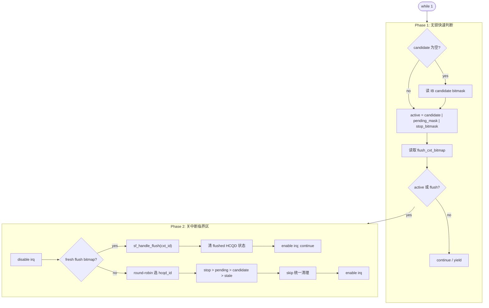

# cmd_entry - CP User 调度器

## 原文

- 原文链接：[[wiki/fw/cp-user/cmd_entry|cmd_entry - CP User 调度器]]
- 原始路径：wiki\fw\cp-user\cmd_entry.md
- 分类：`fw/cp-user`
- 文件大小：3290 bytes

## 角色定位

`cmd_entry()` 是 CP user firmware 的 hot loop：它从 Interaction Buffer 发现 HCQD candidate，推进 pending 命令，响应 stop/flush 控制面事件，并把每轮工作收束到一个可推理的调度出口。

## 两阶段执行结构

## 分支优先级

1. flush context drain：context 级整体失效，优先于普通 HCQD 工作。
2. stop：HCQD 级打断，清该 HCQD 的 IB-resident packet 和软件状态。
3. pending：atomic/event/wait_host/block_mask 已经 peek，需要继续推进。
4. candidate：普通新 packet，执行 `ib_peek_packet()` 和 `cmd_handle_packet()`。
5. stale cleanup：active 命中但 candidate/pending 已无效时清理残留。

## 核心不变量

- `active` 只能由 HCQD space bitmask 组成。
- `flush_cxt_bitmap` 是 context space，只作为 flush 队列索引。
- pending 分支必须在 candidate 分支之前。
- `skip:` 是普通 HCQD 路径的唯一收口：清 candidate bit，推进 `rr_start`，打开中断。
- flush 返回的 HCQD bitmap 必须用于精确清 `cmd_status`、`candidate`、`pending_mask`。

## 关联页面

- `ipc_cmd`：CP master IPC 命令入口，当前学习资料中还没有独立页面。
- [[../learnings/hcqd-scheduling|../learnings/hcqd-scheduling]]
- [[../learnings/review-rules|../learnings/review-rules]]
- [[ib|ib]]
