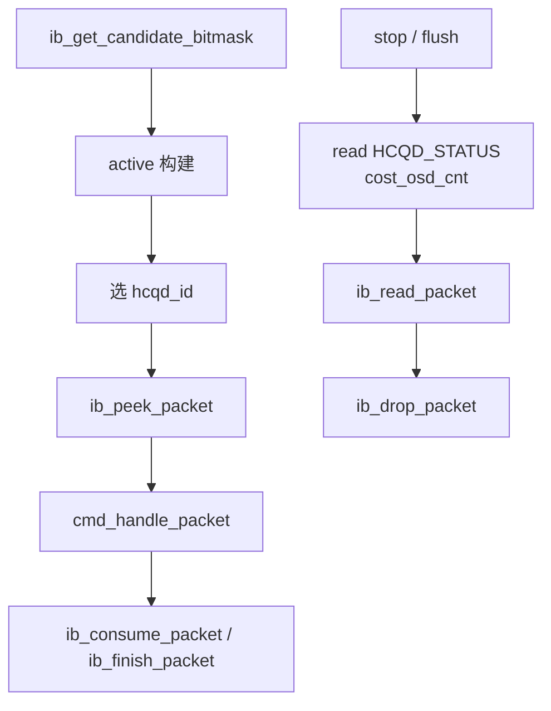

---
type: learning-card
created: 2026-05-09
source: "[[wiki/fw/cp-user/ib|IB - Interaction Buffer]]"
category: "fw/cp-user"
---

# IB - Interaction Buffer

## 原文

- 原文链接：[[wiki/fw/cp-user/ib|IB - Interaction Buffer]]
- 原始路径：wiki\fw\cp-user\ib.md
- 分类：`fw/cp-user`
- 文件大小：2113 bytes

## 在 hot path 里的位置

IB 是 `cmd_entry()` 和硬件 queue 之间的接口层。`cmd_entry()` 通过 IB 拿 candidate、peek/read/drop/consume/finish packet；stop/flush 则会要求 IB 丢弃当前 HCQD 上已经 resident 的 packet。

## cmd_entry 与 IB 操作关系

## 几个接口的复习语义

| 接口 | 语义 | hot path 注意点 |
|---|---|---|
| `ib_get_candidate_bitmask()` | 哪些 HCQD 有新命令 | 尽量缓存到 `candidate`，避免重复读 |
| `ib_peek_packet()` | 看当前 packet 但不一定消费 | event/wait pending 后不能重复 peek |
| `ib_read_packet()` | 真正读取 packet | stop/flush drop 路径会用 |
| `ib_consume_packet()` | 推进 queue consumer | job/sdma/部分 wait_host phase1 常见 |
| `ib_finish_packet()` | packet 完成通知 | event/wait_host phase2 等路径常见 |
| `ib_drop_packet()` | 丢弃 IB-resident packet | stop/flush 共同 drop 逻辑 |

## flush 中的 ASID / context 边界

flush ISR 根据 `flush_asid` 解析 `cxt_id`，再扫描 HCQD attr/asid 和 active 状态，得到该 context 对应的 HCQD bitmap。这里的边界很重要：ASID/context 用来定位 flush 范围，真正清理时仍要落回 HCQD bitmap。

## 关键不变量

- `ib_peek_packet()` 之后如果进入 pending，后续重试应复用保存的 packet/status，不应重复 peek。
- stop/flush drop 的对象是 IB 中当前 resident 的 packet，不是在 firmware hot loop 里等待所有 OSD 归零。
- flush 的 ASID/context 判断只决定范围，最终清理仍以 HCQD bitmap 为准。
## 关联页面

- [[../learnings/review-rules|../learnings/review-rules]]
- [[cmd_entry|cmd_entry]]

