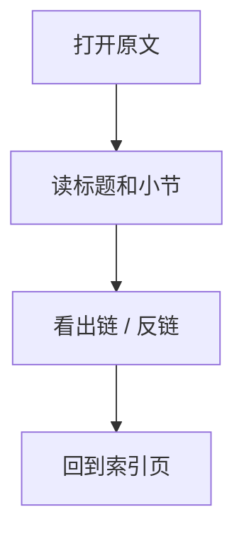
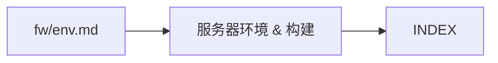

# 服务器环境 & 构建

## 原文

- 原文链接：[[wiki/fw/env|服务器环境 & 构建]]
- 原始路径：wiki\fw\env.md
- 分类：`fw/env.md`
- 文件大小：1548 bytes

## 怎么读

fw 专项页：偏代码、模块和经验。

## 本页关系图

## 小节索引

- 服务器
- 项目路径
- 构建命令
- 文件访问规则
- understand-anything 产物

## 关联页面

- 暂无显式 wikilink。

## 阅读提示

- 如果这页是 sources，优先把它当证据材料，不要从这里开始建立全局理解。
- 如果这页是 synthesis 或 topics，优先看 Mermaid 图和小节标题，再跳到关联页面。
- 如果这页没有显式链接，读完后回到 [[_learning_guides/00 阅读总入口|阅读总入口]] 或 [[wiki/index|Wiki Index]]。