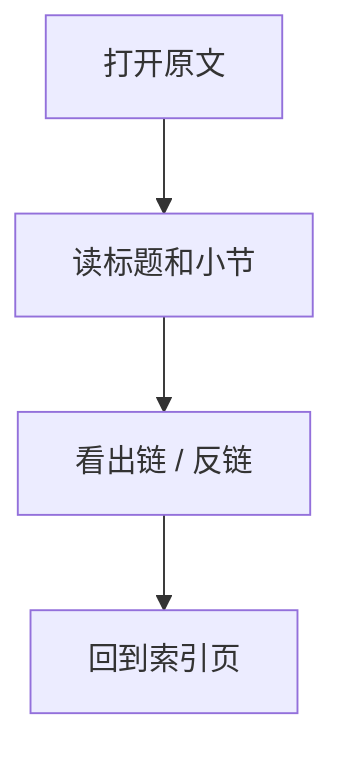
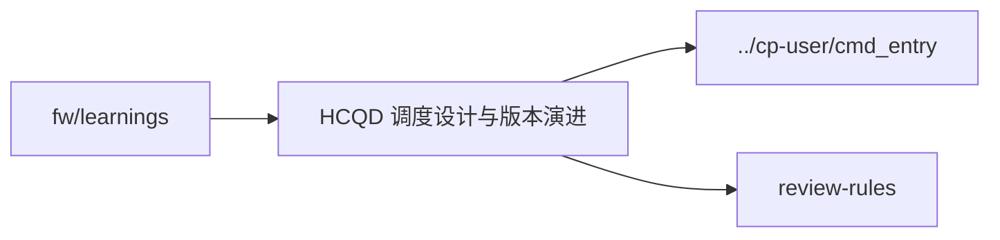

# HCQD 调度设计与版本演进

## 原文

- 原文链接：[[wiki/fw/learnings/hcqd-scheduling|HCQD 调度设计与版本演进]]
- 原始路径：wiki\fw\learnings\hcqd-scheduling.md
- 分类：`fw/learnings`
- 文件大小：2687 bytes

## 怎么读

fw 专项页：偏代码、模块和经验。

## 本页关系图

## 小节索引

- 核心设计原则
  - 1. pending 是 per-HCQD，不是全局
  - 2. CTZ 跳跃优于 round-robin 空转
  - 3. firmware 职责边界
  - 4. candidate 缓存失效路径要完整
- 版本演进表
- active 与 flush_bm 解耦（V7.1）

## 关联页面

- [[../cp-user/cmd_entry|../cp-user/cmd_entry]]
- [[review-rules|review-rules]]

## 阅读提示

- 如果这页是 sources，优先把它当证据材料，不要从这里开始建立全局理解。
- 如果这页是 synthesis 或 topics，优先看 Mermaid 图和小节标题，再跳到关联页面。
- 如果这页没有显式链接，读完后回到 [[_learning_guides/00 阅读总入口|阅读总入口]] 或 [[wiki/index|Wiki Index]]。