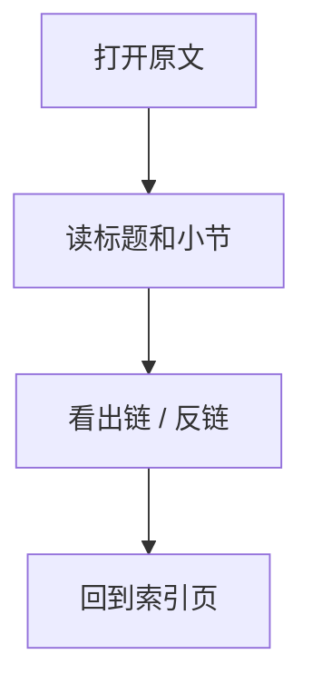
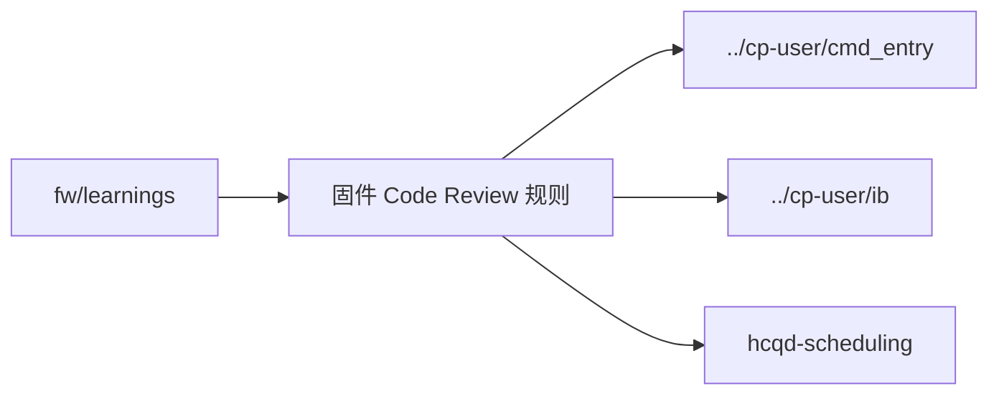

# 固件 Code Review 规则

## 原文

- 原文链接：[[wiki/fw/learnings/review-rules|固件 Code Review 规则]]
- 原始路径：wiki\fw\learnings\review-rules.md
- 分类：`fw/learnings`
- 文件大小：2007 bytes

## 怎么读

fw 专项页：偏代码、模块和经验。

## 本页关系图

## 小节索引

- 必查清单
  - 1. Magic Number 必须 grep 验证
  - 2. Exception Handler 必须 continue
  - 3. CPE_FW_HCQD_STOPPED 必须 RMW
  - 4. flush_asid 必须 mask 提取
  - 5. IB FIFO 寄存器读必须在中断锁内
- Review 工作流

## 关联页面

- [[../cp-user/cmd_entry|../cp-user/cmd_entry]]
- [[../cp-user/ib|../cp-user/ib]]
- [[hcqd-scheduling|hcqd-scheduling]]

## 阅读提示

- 如果这页是 sources，优先把它当证据材料，不要从这里开始建立全局理解。
- 如果这页是 synthesis 或 topics，优先看 Mermaid 图和小节标题，再跳到关联页面。
- 如果这页没有显式链接，读完后回到 [[_learning_guides/00 阅读总入口|阅读总入口]] 或 [[wiki/index|Wiki Index]]。