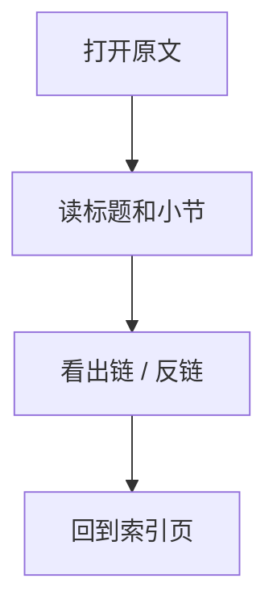
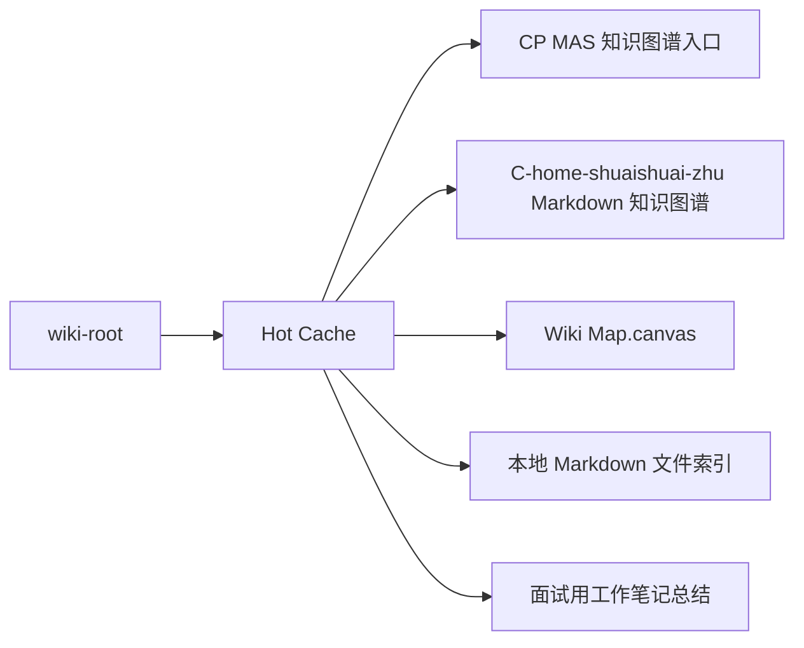

# Hot Cache

## 原文

- 原文链接：[[wiki/hot|Hot Cache]]
- 原始路径：wiki\hot.md
- 分类：`wiki-root`
- 文件大小：2217 bytes

## 怎么读

根级页面：全局入口或最近上下文。

## 本页关系图

## 小节索引

- Last Updated
- Key Recent Facts
- Recent Changes
- Active Threads

## 关联页面

- [[00 CP MAS 知识图谱入口|CP MAS 知识图谱入口]]
- [[C-home-shuaishuai-zhu Markdown 知识图谱|C-home-shuaishuai-zhu Markdown 知识图谱]]
- [[wiki/Wiki Map.canvas|Wiki Map.canvas]]
- [[本地 Markdown 文件索引|本地 Markdown 文件索引]]
- [[面试用工作笔记总结|面试用工作笔记总结]]
- [[语雀工作笔记知识图谱|语雀工作笔记知识图谱]]

## 阅读提示

- 如果这页是 sources，优先把它当证据材料，不要从这里开始建立全局理解。
- 如果这页是 synthesis 或 topics，优先看 Mermaid 图和小节标题，再跳到关联页面。
- 如果这页没有显式链接，读完后回到 [[_learning_guides/00 阅读总入口|阅读总入口]] 或 [[wiki/index|Wiki Index]]。