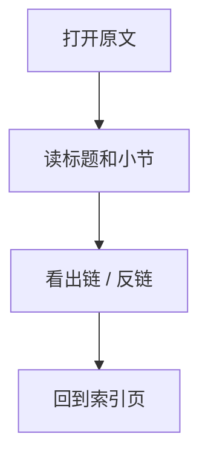
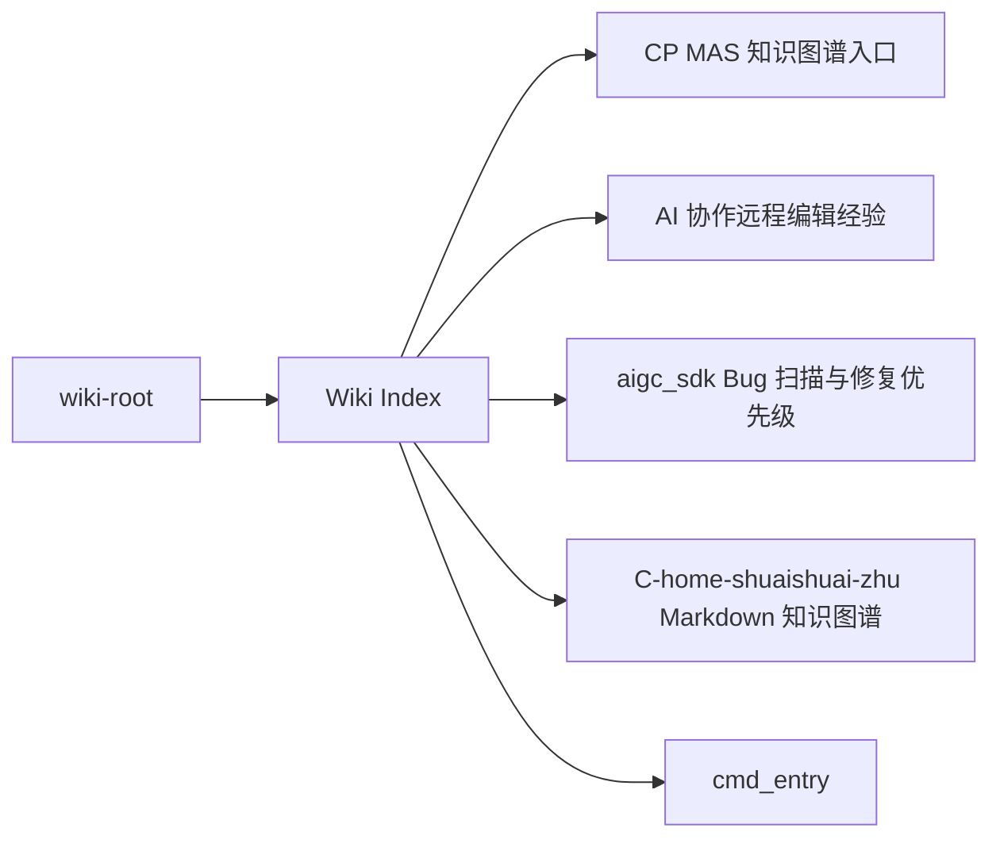

# Wiki Index

## 原文

- 原文链接：[[wiki/index|Wiki Index]]
- 原始路径：wiki\index.md
- 分类：`wiki-root`
- 文件大小：2175 bytes

## 怎么读

根级页面：全局入口或最近上下文。

## 本页关系图

## 小节索引

- Entry
- CP MAS
- Entities
- Sources
- Yuque Work Notes
- Existing FW Notes

## 关联页面

- [[00 CP MAS 知识图谱入口|CP MAS 知识图谱入口]]
- [[AI 协作远程编辑经验|AI 协作远程编辑经验]]
- [[aigc_sdk Bug 扫描与修复优先级|aigc_sdk Bug 扫描与修复优先级]]
- [[C-home-shuaishuai-zhu Markdown 知识图谱|C-home-shuaishuai-zhu Markdown 知识图谱]]
- [[cmd_entry|cmd_entry]]
- [[CP candidate peek 热路径优化|CP candidate peek 热路径优化]]
- [[CP cmd_entry Candidate V7 调度设计|CP cmd_entry Candidate V7 调度设计]]
- [[CP command processing flow|CP command processing flow]]
- [[CP event atomic wait host handling|CP event atomic wait host handling]]
- [[CP queue scheduling stop flush|CP queue scheduling stop flush]]
- [[CP ringbuffer IPC 与 queue create 调试|CP ringbuffer IPC 与 queue create 调试]]
- [[CP SDMA copy 与 kernel command 调试|CP SDMA copy 与 kernel command 调试]]

## 阅读提示

- 如果这页是 sources，优先把它当证据材料，不要从这里开始建立全局理解。
- 如果这页是 synthesis 或 topics，优先看 Mermaid 图和小节标题，再跳到关联页面。
- 如果这页没有显式链接，读完后回到 [[_learning_guides/00 阅读总入口|阅读总入口]] 或 [[wiki/index|Wiki Index]]。