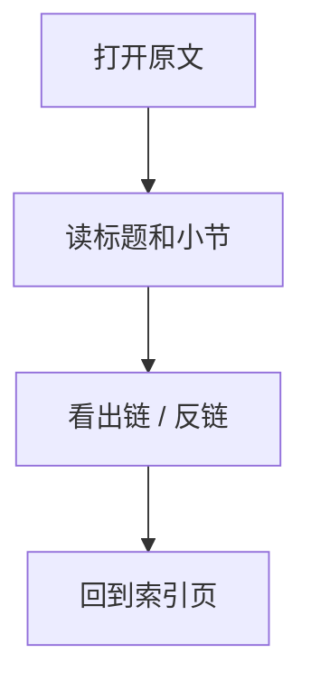
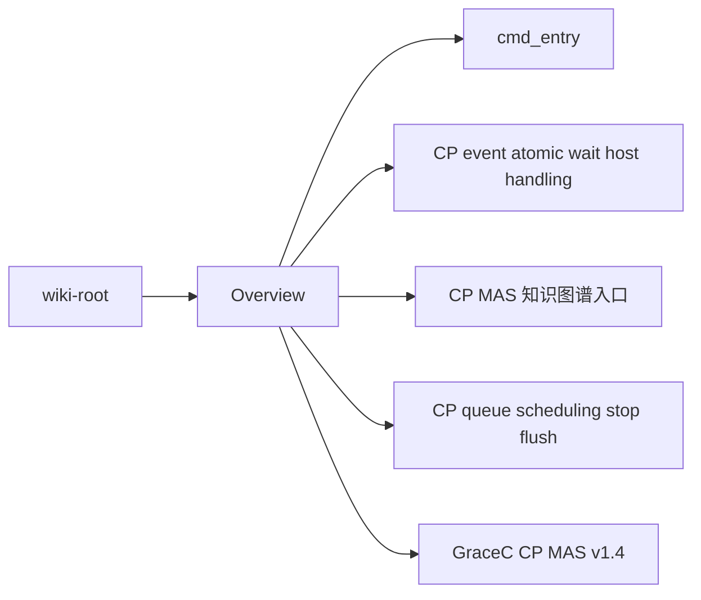

# Overview

## 原文

- 原文链接：[[wiki/overview|Overview]]
- 原始路径：wiki\overview.md
- 分类：`wiki-root`
- 文件大小：697 bytes

## 怎么读

根级页面：全局入口或最近上下文。

## 本页关系图

## 小节索引

- 暂无二级/三级标题。

## 关联页面

- [[cmd_entry|cmd_entry]]
- [[CP event atomic wait host handling|CP event atomic wait host handling]]
- [[00 CP MAS 知识图谱入口|CP MAS 知识图谱入口]]
- [[CP queue scheduling stop flush|CP queue scheduling stop flush]]
- [[GraceC CP MAS v1.4|GraceC CP MAS v1.4]]
- [[HCQD|HCQD]]
- [[iDMA|iDMA]]
- [[Interaction-Buffer|Interaction-Buffer]]
- [[MCQD|MCQD]]
- [[wiki/index|Wiki Index]]
- [[wiki/Wiki Map.canvas|Wiki Map.canvas]]

## 阅读提示

- 如果这页是 sources，优先把它当证据材料，不要从这里开始建立全局理解。
- 如果这页是 synthesis 或 topics，优先看 Mermaid 图和小节标题，再跳到关联页面。
- 如果这页没有显式链接，读完后回到 [[_learning_guides/00 阅读总入口|阅读总入口]] 或 [[wiki/index|Wiki Index]]。