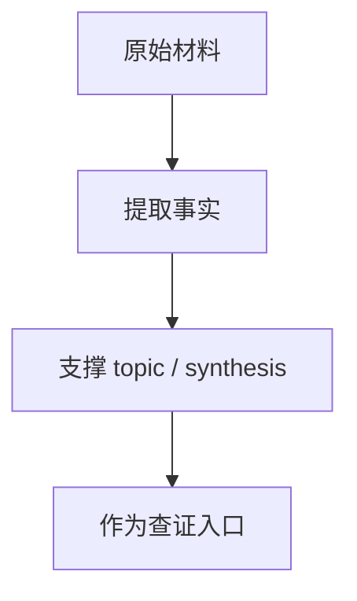
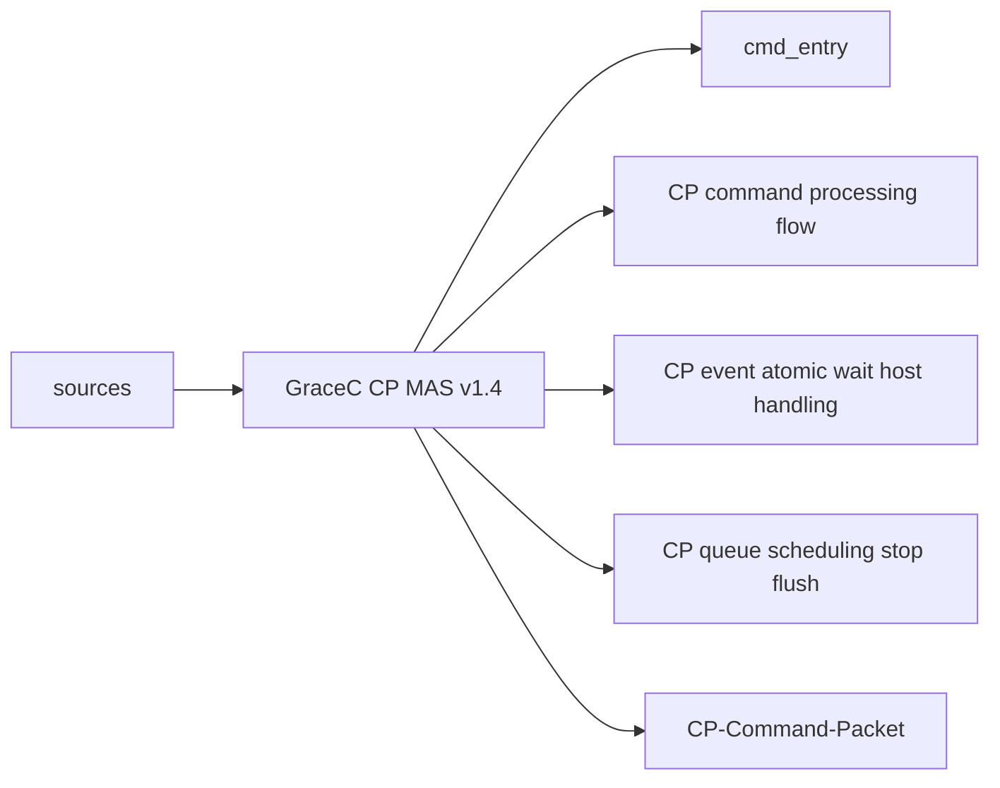

# GraceC CP MAS v1.4

## 原文

- 原文链接：[[wiki/sources/GraceC CP MAS v1.4|GraceC CP MAS v1.4]]
- 原始路径：wiki\sources\GraceC CP MAS v1.4.md
- 分类：`sources`
- 文件大小：2299 bytes

## 怎么读

来源页：原始材料、索引或原文镜像，适合查证。

## 本页关系图

## 小节索引

- 来源
- 核心结论
- 关键对象
- 与代码的对应
- 延伸

## 关联页面

- [[cmd_entry|cmd_entry]]
- [[CP command processing flow|CP command processing flow]]
- [[CP event atomic wait host handling|CP event atomic wait host handling]]
- [[CP queue scheduling stop flush|CP queue scheduling stop flush]]
- [[CP-Command-Packet|CP-Command-Packet]]
- [[CP-Firmware-CPE|CP-Firmware-CPE]]
- [[Event-Table|Event-Table]]
- [[fw CP user firmware code summary|fw CP user firmware code summary]]
- [[GraceC CP MAS v1.4 code knowledge map|GraceC CP MAS v1.4 code knowledge map]]
- [[GraceC-CP|GraceC-CP]]
- [[HCQD|HCQD]]
- [[iDMA|iDMA]]

## 阅读提示

- 如果这页是 sources，优先把它当证据材料，不要从这里开始建立全局理解。
- 如果这页是 synthesis 或 topics，优先看 Mermaid 图和小节标题，再跳到关联页面。
- 如果这页没有显式链接，读完后回到 [[_learning_guides/00 阅读总入口|阅读总入口]] 或 [[wiki/index|Wiki Index]]。