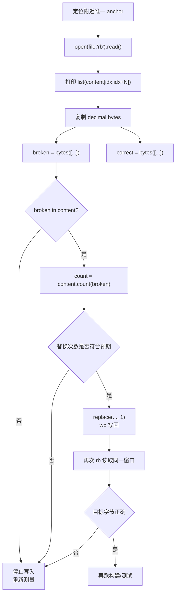

# Byte-Level File Surgery: Diagnosis and Replacement

## 原文

- 原文链接：[[wiki/sources/local-md/C-home-shuaishuai.zhu/fw/.claude/learnings/patterns/byte-level-file-surgery|Byte-Level File Surgery: Diagnosis and Replacement]]
- 原始路径：wiki\sources\local-md\C-home-shuaishuai.zhu\fw\.claude\learnings\patterns\byte-level-file-surgery.md
- 分类：`sources/local-md`

## 什么时候用

- 文本模式、`chr()` 或普通二进制字符串修复都不可信，或者脚本说成功但文件仍旧错误。
- 需要修 C 字符串中的真实换行、空字节、不可见字符、编码污染。
- 必须用可度量证据区分 `10` 真实换行与 `92,110` 字面 `\n`。

## 字节级修复流程

## 操作步骤

1. 找一个附近不会重复的 anchor，例如函数名、日志前缀或独特文本。
2. 用 `rb` 读取并打印十进制字节列表，不用字符串字面量猜。
3. 用测到的整数构造 `broken = bytes([...])` 和 `correct = bytes([...])`。
4. 写入前检查 `broken in content` 和 `count`；不符合预期就停止。
5. 只替换预期次数，通常先 `replace(broken, correct, 1)`。
6. 写回后再次读取同一窗口，确认关键字节已经变成目标值。

## 常见失败

- 看到脚本退出 0 就认为修好了，没有重新读取。
- 用 `b"\\n"` 猜 pattern，实际文件里是 `10` 或其他已变化字节。
- anchor 不唯一，替换到错误位置。
- 替换所有 occurrence，误伤同类字符串。

## 验证标准

- 修复前后都有 decimal byte list 证据。
- 能明确指出错误字节和目标字节，例如 `10 -> 92,110`。
- 替换次数与预期一致。
- 字节验证通过后，仍执行编译、测试或 CLI 复现。

## 关联页面

- [[AI 协作远程编辑经验|AI 协作远程编辑经验]]
- [[wiki/sources/local-md/C-home-shuaishuai.zhu/fw/.claude/learnings/patterns/ssh-remote-file-editing|SSH Remote File Editing -- Patterns and Pitfalls]]
- [[wiki/sources/local-md/C-home-shuaishuai.zhu/fw/.claude/learnings/errors/ssh-python-byte-escaping|SSH Python Binary-Mode Replacement: False-Positive Trap]]