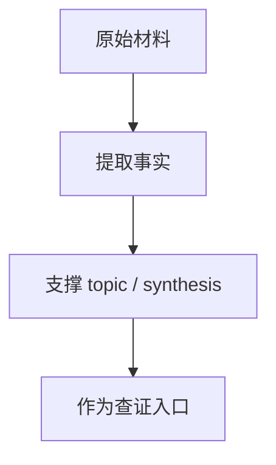

# Session Retrospective: 2026-04-08

## 原文

- 原文链接：[[wiki/sources/local-md/C-home-shuaishuai.zhu/fw/.claude/retros/2026-04-08-v7-candidate-driven|Session Retrospective: 2026-04-08]]
- 原始路径：wiki\sources\local-md\C-home-shuaishuai.zhu\fw\.claude\retros\2026-04-08-v7-candidate-driven.md
- 分类：`sources/local-md`
- 文件大小：2603 bytes

## 怎么读

来源页：原始材料、索引或原文镜像，适合查证。

## 本页关系图

## 小节索引

- Summary
- Context Recovery
- Changes Made
  - File: `aigc_sdk/grace/applications/cp/user/cmd.c`
- Bug Found and Fixed During Review
- Verification
- Patterns Used

## 关联页面

- 暂无显式 wikilink。

## 阅读提示

- 如果这页是 sources，优先把它当证据材料，不要从这里开始建立全局理解。
- 如果这页是 synthesis 或 topics，优先看 Mermaid 图和小节标题，再跳到关联页面。
- 如果这页没有显式链接，读完后回到 [[_learning_guides/00 阅读总入口|阅读总入口]] 或 [[wiki/index|Wiki Index]]。