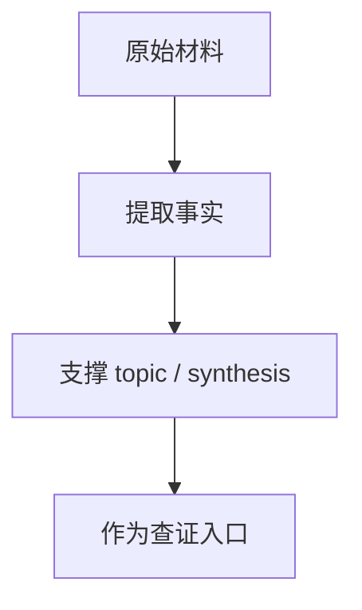

# aigc_sdk Bug 扫描报告

## 原文

- 原文链接：[[wiki/sources/local-md/C-home-shuaishuai.zhu/fw/aigc_sdk_bug_report|aigc_sdk Bug 扫描报告]]
- 原始路径：wiki\sources\local-md\C-home-shuaishuai.zhu\fw\aigc_sdk_bug_report.md
- 分类：`sources/local-md`
- 文件大小：23698 bytes

## 怎么读

来源页：原始材料、索引或原文镜像，适合查证。

## 本页关系图

## 小节索引

- 汇总表
- 详细描述
  - BUG-001 ⚠️ Critical — `sf_stop_isr()` 中 `hcqd_id` 未初始化就使用
  - BUG-002 🔴 High — `upper_32_bits` 宏对 32-bit 操作数移位 32 位（未定义行为）
  - BUG-003 🔴 High — `qdma_query_mcqd()` 缺少 return 语句
  - BUG-004 🔴 High — `ipc_cmd_create_event()` 使用未初始化的 `event_info`
  - BUG-005 🔴 High — `ipc_msg_send()` 中 `rt_malloc` 失败后直接 `memcpy`
  - BUG-006 🔴 High — `nor_flash_init()` 无 return 语句
  - BUG-007 🔴 High — XIP 模式下 `buf` 未分配但仍被 `rt_free`
  - BUG-008 🔴 High — `drv_d2d_port_map_init()` 中 `boot_info` 未检查 NULL

## 关联页面

- 暂无显式 wikilink。

## 阅读提示

- 如果这页是 sources，优先把它当证据材料，不要从这里开始建立全局理解。
- 如果这页是 synthesis 或 topics，优先看 Mermaid 图和小节标题，再跳到关联页面。
- 如果这页没有显式链接，读完后回到 [[_learning_guides/00 阅读总入口|阅读总入口]] 或 [[wiki/index|Wiki Index]]。