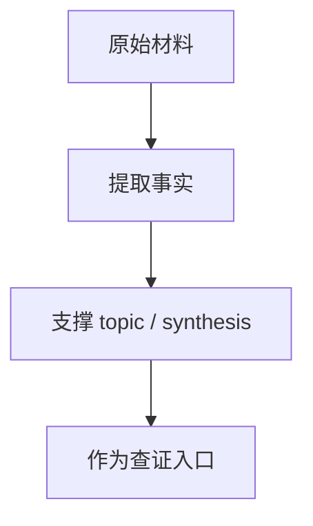
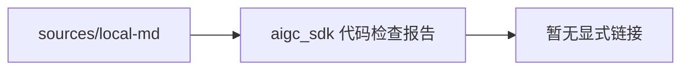

# aigc_sdk 代码检查报告

## 原文

- 原文链接：[[wiki/sources/local-md/C-home-shuaishuai.zhu/fw/aigc_sdk_check_report|aigc_sdk 代码检查报告]]
- 原始路径：wiki\sources\local-md\C-home-shuaishuai.zhu\fw\aigc_sdk_check_report.md
- 分类：`sources/local-md`
- 文件大小：13974 bytes

## 怎么读

来源页：原始材料、索引或原文镜像，适合查证。

## 本页关系图

## 小节索引

- 问题汇总
- HIGH（高危）
  - BUG-001：`ib_get_osd_count()` 缺少 return 语句（UB）
  - BUG-002：`sf_stop_isr()` 使用未初始化变量
  - BUG-003：`top_reg_dump_hcqd()` 缺少 return 语句（用户侧）
  - BUG-004：`bdma_stop_hcqd()` 缺少 return 语句
  - BUG-005：`qdma_query_mcqd()` 缺少 return 语句
- MEDIUM（中危）
  - BUG-006：`exception_check_and_set_exc()` 竞态条件
  - BUG-007：`top_reg_write_doorbell()` 缺少 return 语句

## 关联页面

- 暂无显式 wikilink。

## 阅读提示

- 如果这页是 sources，优先把它当证据材料，不要从这里开始建立全局理解。
- 如果这页是 synthesis 或 topics，优先看 Mermaid 图和小节标题，再跳到关联页面。
- 如果这页没有显式链接，读完后回到 [[_learning_guides/00 阅读总入口|阅读总入口]] 或 [[wiki/index|Wiki Index]]。