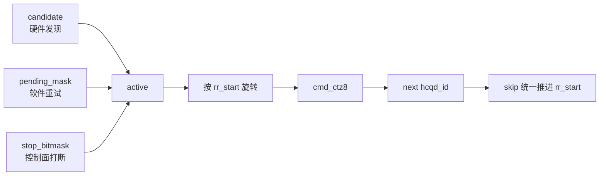
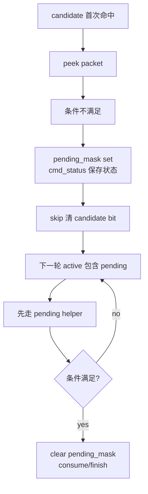

---
type: learning-card
created: 2026-05-09
source: "[[wiki/sources/local-md/C-home-shuaishuai.zhu/fw/cmd_entry_roundrobin_design|CP User cmd_entry Candidate-Driven Dispatch 设计说明 V7]]"
category: "sources/local-md"
---

# CP User cmd_entry Candidate-Driven Dispatch 设计说明 V7

## 原文

- 原文链接：[[wiki/sources/local-md/C-home-shuaishuai.zhu/fw/cmd_entry_roundrobin_design|CP User cmd_entry Candidate-Driven Dispatch 设计说明 V7]]
- 原始路径：wiki\sources\local-md\C-home-shuaishuai.zhu\fw\cmd_entry_roundrobin_design.md
- 分类：`sources/local-md`
- 文件大小：11416 bytes

## 这份 source 的核心

V7 把调度模型从“先轮到一个 HCQD，再看它有没有事”改成“先合成 active 集合，再从集合里选一个 HCQD”。这让 candidate、pending、stop 都能被同一个 O(1) 选择器处理。

## active 选择器

## 一页复习 V7

| 主题 | 要点 |
|---|---|
| 0 miss | `active` 里只有值得访问的 HCQD，CTZ 直接命中有效 bit |
| pending 可达 | `pending_mask` 让已 peek 的命令不依赖新 candidate |
| idle 行为 | `active == 0` 才是真 idle，可以 yield |
| 公平性 | `rr_start` 决定下一轮搜索起点，不固定从 bit0 开始 |
| 收口 | `skip:` 统一清 candidate bit，统一推进 round-robin |

## pending 不能重复 peek

## 关键不变量与最容易写错的点

- 把 `flush_cxt_bitmap` 混进 `active`：这是 context/HCQD 空间混用。
- 在多个分支分散清 candidate：容易留下 stale bit 或重复清理。
- candidate 分支早于 pending：会导致 event/wait_host 重复 peek。
- block_mask re-check 成功后先 handle 再 clear pending：可能覆盖 handler 新 set 的 pending。
- stop 不进 `active`：无新 candidate 时 stop 可能长期不可达。

## 关联页面

- [[CP cmd_entry Candidate V7 调度设计]]
- [[CP candidate peek 热路径优化]]
- [[CP event atomic wait host handling]]
- [[cmd_entry]]
- [[HCQD]]
- [[Interaction-Buffer]]

