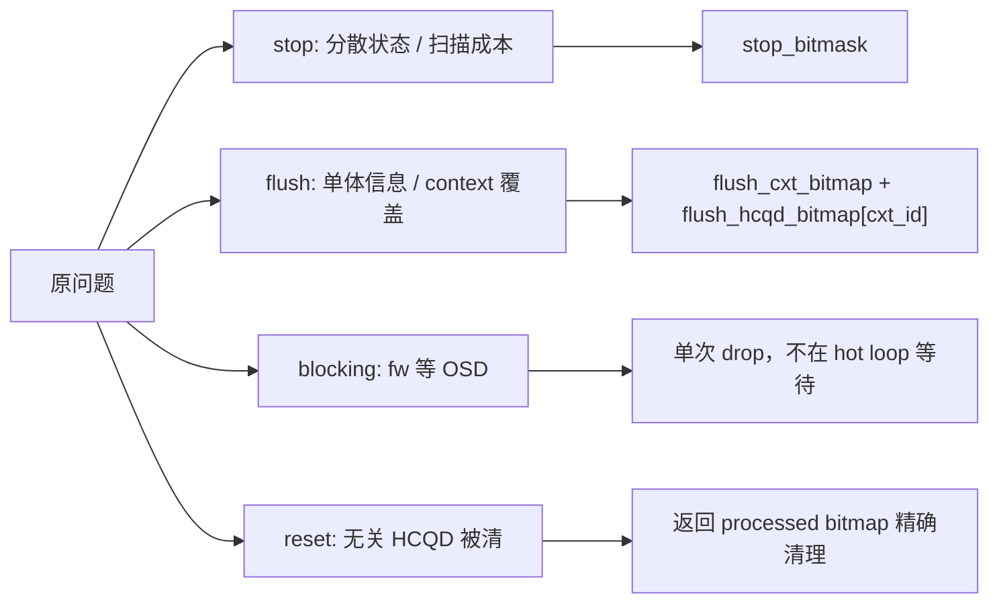
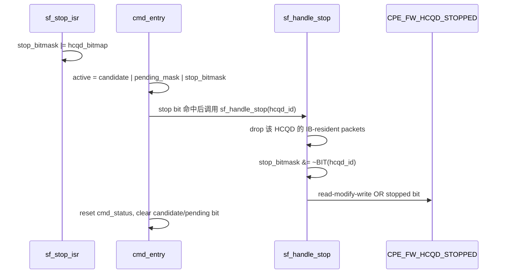
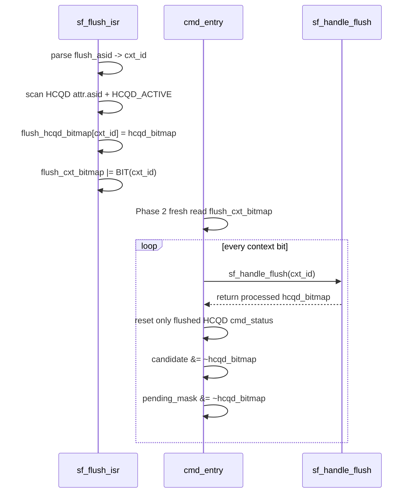

# CP User：Stop/Flush 与 cmd_entry 优化

## 原文

- 原文链接：[[wiki/sources/local-md/C-home-shuaishuai.zhu/fw/docs/cp_user_sf_cmd_changes|CP User：Stop/Flush 与 cmd_entry 优化]]
- 原始路径：wiki\sources\local-md\C-home-shuaishuai.zhu\fw\docs\cp_user_sf_cmd_changes.md
- 分类：`sources/local-md`
- 文件大小：17220 bytes

## 这份 source 提供什么证据

这是 stop/flush 与 `cmd_entry()` 配合关系的主证据页。复习时优先提取三个事实：stop 是 HCQD bitmask，flush 是 context bitmap + per-context HCQD bitmap，`cmd_entry()` 进入 Phase 2 后 flush 优先。

## 背景和改动动机

stop/flush 是控制面事件，不是普通 command packet。它们的处理必须插入 `cmd_entry()` hot loop，但不能把 hot loop 变成复杂的多轮状态机。

旧设计有几个直接风险：

- stop 状态分散，`cmd_entry()` 需要额外扫描或逐项判断。
- flush 信息如果只有一个全局 slot，多 context flush 会被后来的 ISR 覆盖。
- fw 侧等待 OSD 归零会阻塞普通调度。
- flush 后全量 reset 会误清无关 HCQD 的 pending 状态。
- stopped 寄存器直接写 bitmap 会覆盖其他 bit。

## 状态变量对照

| 变量 | 空间 | set 方 | clear 方 | 作用 |
|---|---|---|---|---|
| `stop_bitmask` | HCQD | `sf_stop_isr()` | `sf_handle_stop/flush()` | 哪些 HCQD 需要 stop/drop |
| `flush_cxt_bitmap` | context | `sf_flush_isr()` | `sf_handle_flush(cxt_id)` | 哪些 context 有 pending flush |
| `flush_hcqd_bitmap[cxt_id]` | context -> HCQD | `sf_flush_isr()` | `sf_handle_flush(cxt_id)` | 某 context 覆盖的 HCQD 集合 |

## stop 路径摘要

## flush 路径摘要

## 关键不变量

- `flush_cxt_bitmap` 是 context space，不能和 HCQD space 的 `active` 混用。
- per-context `flush_hcqd_bitmap[]` 避免两个 context 连续 flush 时互相覆盖。
- flush 完成后应精确清对应 HCQD，不要全量 reset 无关 HCQD。
- `CPE_FW_HCQD_STOPPED` 是 bitfield，stop/flush 写入时必须 read-modify-write。
- 当前仍需关注 `stop_bitmask` set/clear 是否需要同类 interrupt-disable 临界区保护。

## 改动收益

| 改动 | 收益 |
|---|---|
| stop 使用 `stop_bitmask` | 无 candidate 时也能处理 stop；hot loop O(1) 合并 active |
| flush 使用 `flush_cxt_bitmap` | 快速判断是否有 pending flush context |
| per-context `flush_hcqd_bitmap[]` | 避免多 context flush 覆盖 |
| `sf_handle_flush(cxt_id)` 返回 bitmap | `cmd_entry()` 可精确清理 flushed HCQD |
| 删除 fw 侧 OSD 等待 | stop/flush 不再长时间阻塞普通调度 |
| stopped read-modify-write | 不破坏其他 HCQD 的 stopped 通知 |

## 关联页面

- [[CP stop flush 与 queue 切换]]
- [[CP cmd_entry Candidate V7 调度设计]]
- [[cmd_entry]]
- [[Interaction-Buffer]]
