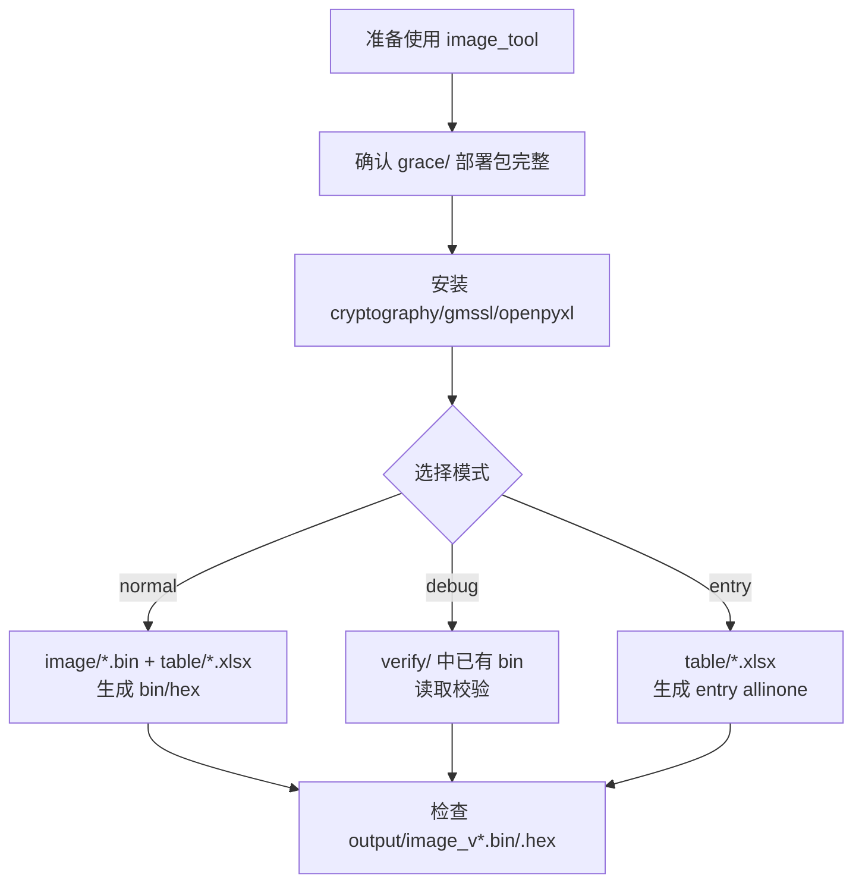

# image_tool — Grace SoC 固件镜像打包工具

## 原文

- 原文链接：[[wiki/sources/local-md/C-home-shuaishuai.zhu/image_tool/README|image_tool — Grace SoC 固件镜像打包工具]]
- 原始路径：wiki\sources\local-md\C-home-shuaishuai.zhu\image_tool\README.md
- 分类：`sources/local-md`

## 什么时候用

- 查 `image_tool` 面向用户的运行方式、默认参数、输入输出、PyInstaller 打包和常见问题。
- 需要验证固件镜像打包工具的用户可执行说明是否完整。
- 需要识别 README 中仍保留的旧同步口径，并和 [[wiki/sources/local-md/C-home-shuaishuai.zhu/image_tool/architecture|image_tool 架构文档]] 对照。

## README 执行流程

## 操作步骤

1. 使用前确认 `grace/` 下有 `include/ src/ emu/ secure/ verify/ table/ image/ output/` 等运行时目录。
2. 安装依赖：`cryptography`、`gmssl`、`openpyxl`。
3. 默认交互运行可直接回车；命令行运行时传入 `-m/-k/-c/--fw-version/-j/-o/--no-sign/--no-hex`。
4. 打包必须使用 `build_image.spec`，不要直接 `pyinstaller build_image.py`。
5. 注意：README 的“文件同步规则”属于历史口径；当前维护以架构页和协作约定中的 `grace/build_image.py` 直接服务器编辑为准。

## 常见失败

- 缺少 SDK 子目录导致启动时报“缺少必要的运行时模块”。
- `gmssl` 在 PyInstaller 编译版里缺模块，通常是没用 `build_image.spec`。
- `xlrd` 2.x 不支持 `.xlsx`，需要确认使用 `openpyxl`。
- macOS 或其他非 `win32/linux` 平台报 `Don't support OS`。
- 误按旧 README 同步 `build_image_new.py/_apply_changes.py/write_files.py`，把已废弃流程带回当前工作流。

## 验证标准

- 用户操作说明能覆盖 `normal/debug/entry` 三种模式。
- 产物路径说清楚：`output/image_v*.bin`、`output/image_v*.hex`、公钥哈希文件。
- 构建说明明确使用 `build_image.spec` 和 `hiddenimports`。
- 维护口径和 [[wiki/sources/local-md/C-home-shuaishuai.zhu/image_tool/architecture|architecture]] 一致：直接编辑服务器 `grace/build_image.py`，提交需用户批准。

## 关联页面

- [[image_tool 固件镜像打包工具|image_tool 固件镜像打包工具]]
- [[wiki/sources/local-md/C-home-shuaishuai.zhu/image_tool/architecture|image_tool 架构文档]]