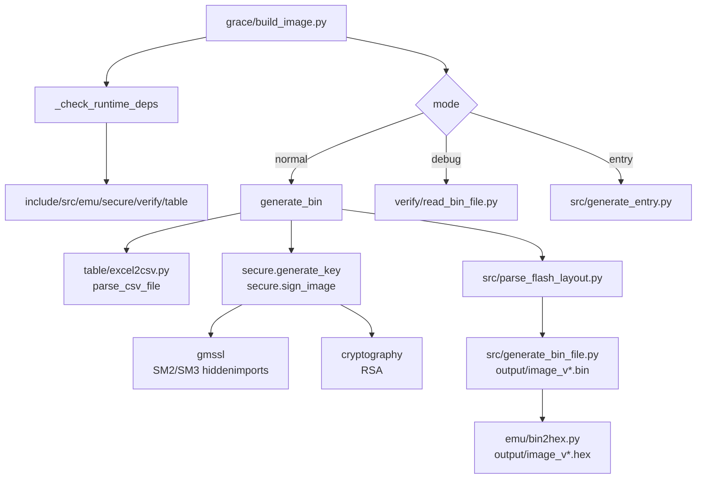

# image_tool 架构文档

## 原文

- 原文链接：[[wiki/sources/local-md/C-home-shuaishuai.zhu/image_tool/architecture|image_tool 架构文档]]
- 原始路径：wiki\sources\local-md\C-home-shuaishuai.zhu\image_tool\architecture.md
- 分类：`sources/local-md`

## 什么时候用

- 需要理解 `image_tool` 的真实模块依赖、数据流、运行模式、构建流程和当前开发工作流。
- README 与架构说明口径不一致时，以这里的当前架构描述作为主要判断依据。
- 维护 `build_image.py`、`build_image.spec`、`release/build_exe.py` 或运行时部署包时。

## 架构图

## 操作步骤

1. 从 `grace/build_image.py` 的入口开始读，先确认工作目录自动切到 `grace/`。
2. 检查 `_check_runtime_deps` 需要哪些 SDK 子目录，判断问题是代码逻辑还是部署包缺失。
3. 按模式分支定位：`normal` 看打包和签名，`debug` 看校验，`entry` 看 entry table。
4. 构建问题先看 `build_image.spec`，确认 `gmssl` hiddenimports。
5. 开发维护默认直接在服务器上的 `grace/build_image.py` 改；不要自动 commit。

## 常见失败

- 把运行时 SDK 子目录误认为仓库自带源码，导致本地检查缺文件。
- PyInstaller 静态分析找不到 `gmssl` 动态导入链。
- CLI 参数和交互提示混淆，导致自动化运行被 `input()` 卡住。
- 架构页已更新为直接编辑，README 旧同步段落未清理干净。

## 验证标准

- 能画出 `normal` 模式从 xlsx、分区 bin、签名、flash layout 到 bin/hex 的完整数据流。
- 能说明三种模式的主要函数：`generate_bin()`、`verify_bin()`、`generate_entry_table()`。
- 构建验证使用 `build_image.spec`，不是裸打包脚本。
- 维护动作只发生在用户授权文件；commit 等待明确批准。

## 关联页面

- [[image_tool 固件镜像打包工具|image_tool 固件镜像打包工具]]
- [[wiki/sources/local-md/C-home-shuaishuai.zhu/image_tool/README|image_tool — Grace SoC 固件镜像打包工具]]
- [[AI 协作远程编辑经验|AI 协作远程编辑经验]]