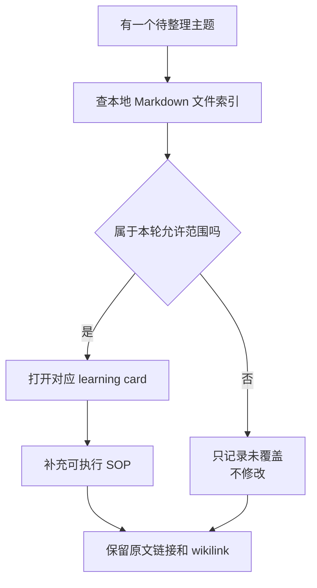

# 本地 Markdown 文件索引

## 原文

- 原文链接：[[wiki/sources/本地 Markdown 文件索引|本地 Markdown 文件索引]]
- 原始路径：wiki\sources\本地 Markdown 文件索引.md
- 分类：`sources`

## 什么时候用

- 需要查 `C:\home\shuaishuai.zhu` 本地 Markdown 被镜像到了哪些 wiki/source 页面。
- 需要确认某张卡片的原文路径、主题归属、是否已有 source mirror。
- 并发整理时，用它检查哪些文件不在本 agent 写入范围。

## 索引使用流程

## 操作步骤

1. 按主题名、路径片段或 source mirror 名称定位原文。
2. 判断页面类型：`topics` 适合写执行手册，`sources` 适合证据摘要，`synthesis` 适合导航。
3. 只打开用户授权的 `_learning_guides` 文件写入；`wiki/sources` 原文只读。
4. 对未授权但相关的材料，放入“未覆盖”说明，不顺手整理。

## 常见失败

- 看到索引里有相关 CP 或面试文件，就顺手修改，越过用户写入范围。
- 自动生成卡片只保留文件列表，没有提炼使用场景和验证标准。
- source mirror 名称里路径很长，手工复制时丢失 wikilink。

## 验证标准

- 被整理页面都能追溯到原文链接。
- 未授权页面只被引用，不被修改。
- 覆盖状态能回答“改了哪些文件、哪些文件没覆盖”。

## 关联页面

- [[AI 协作远程编辑经验|AI 协作远程编辑经验]]
- [[aigc_sdk Bug 扫描与修复优先级|aigc_sdk Bug 扫描与修复优先级]]
- [[C-home-shuaishuai-zhu Markdown 知识图谱|C-home-shuaishuai-zhu Markdown 知识图谱]]
- [[CP cmd_entry Candidate V7 调度设计|CP cmd_entry Candidate V7 调度设计]]
- [[image_tool 固件镜像打包工具|image_tool 固件镜像打包工具]]
- [[wiki/sources/local-md/C-home-shuaishuai.zhu/ajthunk/.claude/learnings/agent-browser-windows-edge-workaround|agent-browser on Windows: Use Edge Instead of Chrome]]
- [[wiki/sources/local-md/C-home-shuaishuai.zhu/ajthunk/.claude/learnings/feishu-requires-auth|Feishu Documents Require Authentication]]
- [[wiki/sources/local-md/C-home-shuaishuai.zhu/fw/.claude/learnings/patterns/ssh-remote-file-editing|SSH Remote File Editing -- Patterns and Pitfalls]]
- [[wiki/sources/local-md/C-home-shuaishuai.zhu/fw/.claude/learnings/patterns/byte-level-file-surgery|Byte-Level File Surgery: Diagnosis and Replacement]]
- [[wiki/sources/local-md/C-home-shuaishuai.zhu/fw/.claude/learnings/errors/ssh-python-byte-escaping|SSH Python Binary-Mode Replacement: False-Positive Trap]]
- [[wiki/sources/local-md/C-home-shuaishuai.zhu/image_tool/architecture|image_tool 架构文档]]
- [[wiki/sources/local-md/C-home-shuaishuai.zhu/image_tool/README|image_tool — Grace SoC 固件镜像打包工具]]