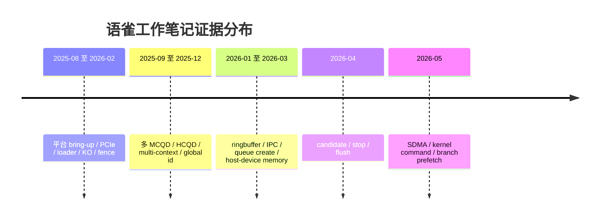

# 语雀工作笔记索引

## 原文

- 原文链接：[[wiki/sources/语雀工作笔记索引|语雀工作笔记索引]]
- 原始路径：wiki\sources\语雀工作笔记索引.md
- 分类：`sources`
- 原始材料目录：`C:\home\for_ai\.raw\yuque\work-notes`

## 这个主题可以怎么讲

这张卡是证据入口，不是主讲稿。面试前用它做两件事：第一，确认每个项目故事对应哪些月份；第二，当面试官追问“证据是什么”时，能回到原始笔记、HTML 快照或 meta 信息，而不是只靠整理后的总结。

## 月份到故事映射

## 技术抓手

- 2025-08 到 2026-02：平台 bring-up 证据，包括 loader、reset、PCIe、fence、KO 加载。
- 2025-09 到 2025-12：多队列和多 context 证据，包括 MCQD 地址、128B 连续存放、HCQD 轮转、global id。
- 2026-01 到 2026-03：ringbuffer、IPC、queue create、host/device memory 放置和构建产物一致性。
- 2026-04 到 2026-05：candidate 多读、stop/flush、SDMA copy、ret/beqz 预取和 goto 布局。
- 2025 工作笔记：RAM/ROM/NAND/NOR 基础，可作为 boot 和 firmware 背景材料。

## 证据材料

- manifest：`C:\home\for_ai\.raw\yuque\work-notes\_manifest.json`
- 链接索引：`C:\home\for_ai\.raw\yuque\work-notes-index.json`
- 生成页：[[语雀工作笔记知识图谱]]、[[面试用工作笔记总结]]、[[CP 平台 bring-up 与 PCIe 调试]]、[[CP ringbuffer IPC 与 queue create 调试]]、[[CP 多队列多上下文与 HCQD MCQD]]、[[CP SDMA copy 与 kernel command 调试]]、[[硬件基础 RAM ROM Flash]]。

## 面试追问

- 这个结论来自哪一篇月份笔记？
- 有没有原始 log、packet dump 或波形能支撑？
- 这个问题最终修复了吗，还是只收敛到复现条件？
- 哪些内容是你亲自验证的，哪些是根据笔记整理出的推断？
- 如果要把某个故事讲深，应该回看哪个原始文件？

## 生成页

- [[语雀工作笔记知识图谱]]
- [[CP candidate peek 热路径优化]]
- [[CP 分支预取与 cmd_entry 布局优化]]
- [[CP stop flush 与 queue 切换]]
- [[CP SDMA copy 与 kernel command 调试]]
- [[CP 多队列多上下文与 HCQD MCQD]]
- [[CP ringbuffer IPC 与 queue create 调试]]
- [[CP 平台 bring-up 与 PCIe 调试]]
- [[硬件基础 RAM ROM Flash]]
- [[面试用工作笔记总结]]