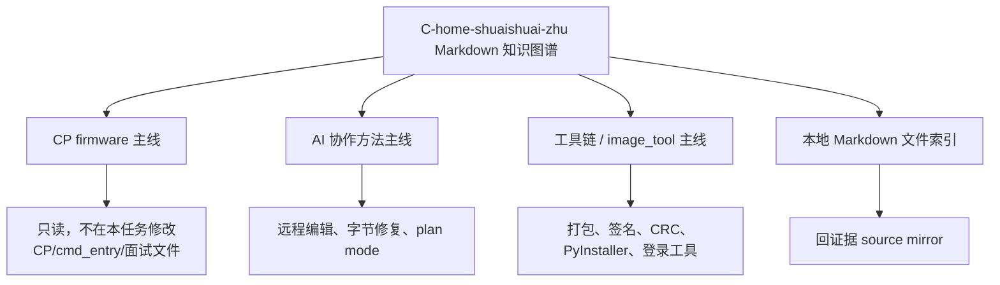

# C-home-shuaishuai-zhu Markdown 知识图谱

## 原文

- 原文链接：[[wiki/synthesis/C-home-shuaishuai-zhu Markdown 知识图谱|C-home-shuaishuai-zhu Markdown 知识图谱]]
- 原始路径：wiki\synthesis\C-home-shuaishuai-zhu Markdown 知识图谱.md
- 分类：`synthesis`

## 什么时候用

- 需要从 `C:\home\shuaishuai.zhu` 的本地 Markdown 材料里找主线、证据页和来源覆盖范围。
- 不确定该读 topic、source 还是具体工程文档时。
- 整理学习卡片时，用它确认哪些页面属于 CP 主链路、AI 协作、工具链或 `image_tool`。

## 知识图谱读法

## 操作步骤

1. 先看“三条主线”：CP firmware、AI 协作方法、工具链。
2. 如果任务是卡片升级，优先处理用户授权的 `_learning_guides/cards` 文件，不碰 `wiki/` 源文件。
3. 需要事实证据时，从 topic 跳到对应 `wiki/sources/local-md/...` mirror，再回到 learning card 写可执行结论。
4. 对源文档冲突做标注：说明哪个是历史口径，哪个是当前可执行口径。

## 常见失败

- 从 source 页开始读，陷入单点材料，忘了 synthesis 已经给出主线分组。
- 整理 AI 协作卡片时误改 CP firmware 主链路或 `cmd_entry` 相关文档。
- 只复制原文索引，没有把它翻译成“何时用、怎么做、如何验证”。
- 忘记保留原文链接，后续无法追溯证据。

## 验证标准

- 本页仍链接 [[本地 Markdown 文件索引]]、[[AI 协作远程编辑经验]]、[[image_tool 固件镜像打包工具]]。
- 对本轮任务，明确 CP 主链路只作为背景，不纳入写入范围。
- source、topic、synthesis 的用途区分清楚：source 查证，topic 执行，synthesis 导航。

## 关联页面

- [[AI 协作远程编辑经验|AI 协作远程编辑经验]]
- [[aigc_sdk Bug 扫描与修复优先级|aigc_sdk Bug 扫描与修复优先级]]
- [[CP cmd_entry Candidate V7 调度设计|CP cmd_entry Candidate V7 调度设计]]
- [[CP stop flush 与 queue 切换|CP stop flush 与 queue 切换]]
- [[image_tool 固件镜像打包工具|image_tool 固件镜像打包工具]]
- [[wiki/sources/local-md/C-home-shuaishuai.zhu/ajthunk/.claude/learnings/agent-browser-no-sudo-install|agent-browser Installation Without sudo]]
- [[wiki/sources/local-md/C-home-shuaishuai.zhu/ajthunk/.claude/learnings/agent-browser-windows-edge-workaround|agent-browser on Windows: Use Edge Instead of Chrome]]
- [[wiki/sources/local-md/C-home-shuaishuai.zhu/ajthunk/.claude/learnings/feishu-requires-auth|Feishu Documents Require Authentication]]
- [[wiki/sources/local-md/C-home-shuaishuai.zhu/fw/.claude/learnings/patterns/byte-level-file-surgery|Byte-Level File Surgery: Diagnosis and Replacement]]
- [[wiki/sources/local-md/C-home-shuaishuai.zhu/fw/.claude/learnings/patterns/ssh-remote-file-editing|SSH Remote File Editing -- Patterns and Pitfalls]]