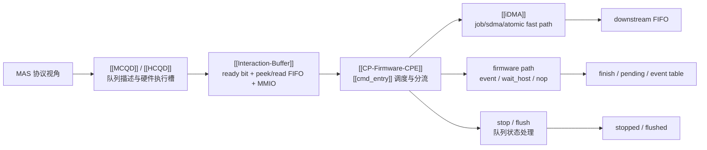

---
type: learning-card
created: 2026-05-09
source: "[[wiki/fw/source-maps/GraceC CP MAS v1.4 code knowledge map|GraceC CP MAS v1.4 code knowledge map]]"
category: "synthesis"
---

# GraceC CP MAS v1.4 code knowledge map

## 原文

- 原文链接：[[wiki/fw/source-maps/GraceC CP MAS v1.4 code knowledge map|GraceC CP MAS v1.4 code knowledge map]]
- 原始路径：wiki\synthesis\GraceC CP MAS v1.4 code knowledge map.md
- 分类：`synthesis`
- 文件大小：2935 bytes

## 它解决什么问题

这页把 MAS 文档里的硬件概念和 CP user firmware 的代码入口接起来。它不是细节页，作用是回答：一个 command packet 从 host 写入后，会经过哪些硬件/固件对象，最后由谁分发、谁收尾。

重点不是背概念名，而是建立这组对应关系：[[MCQD]] 是内存中的队列描述符，[[HCQD]] 是硬件 fetch 槽，[[Interaction-Buffer]] 是 firmware 观察/操作 HCQD 的窗口，[[cmd_entry]] 是 [[CP-Firmware-CPE]] 的 hot loop，[[iDMA]] 是 job/sdma/atomic 的快速搬运路径。

## 总览图

## 在链路中的位置

这张 synthesis 卡应该放在阅读开头。先用它确定“对象分层”，再进入 [[CP command processing flow]] 看时序，最后才去实体页查字段和函数入口。

| 层级 | 页面 | 作用 |
|---|---|---|
| 总入口 | 本页、[[GraceC-CP]] | 建立 CP 是硬件/固件协同系统的整体印象 |
| 队列层 | [[MCQD]]、[[HCQD]] | 看 host 队列如何变成硬件可执行槽 |
| 固件接口层 | [[Interaction-Buffer]] | 看 firmware 如何 peek/read/consume/drop/finish packet |
| 执行层 | [[CP-Firmware-CPE]]、[[CP-Command-Packet]]、[[iDMA]] | 看 operator 如何被分流到 fast path 或 firmware path |

## 输入输出

- 输入：[[GraceC CP MAS v1.4]] 的协议描述、[[fw CP user firmware code summary]] 的代码入口总结。
- 输出：一张“概念到代码”的路线图，告诉你读 `cmd.c`、`ib.c`、`sf.c`、`event_entry.c` 时每块代码在 MAS 里的位置。
- 读完应能回答：candidate bit 从哪里来，`ib_peek_packet()` 和 `ib_read_packet()` 差在哪里，哪些 operator 走 [[iDMA]]，哪些必须由 firmware 处理。

## 阅读关键点

- `ib_get_candidate_bitmask()` 对应 HCQD ready 状态，是 hot loop 选择队列的入口。
- `ib_peek_packet()` 只看 header/body，不代表 packet 已经被消费。
- job/sdma/atomic 的性能重点是 [[iDMA]] direct dispatch，event/wait_host 的正确性重点是 firmware 状态机。
- stop/flush 读法要从队列状态看，不要只看单个 packet 的分发。

## 关联页面

- [[cmd_entry|cmd_entry]]
- [[CP command processing flow|CP command processing flow]]
- [[CP event atomic wait host handling|CP event atomic wait host handling]]
- [[CP queue scheduling stop flush|CP queue scheduling stop flush]]
- [[CP-Command-Packet|CP-Command-Packet]]
- [[CP-Firmware-CPE|CP-Firmware-CPE]]
- [[Event-Table|Event-Table]]
- [[GraceC CP MAS v1.4|GraceC CP MAS v1.4]]
- [[GraceC-CP|GraceC-CP]]
- [[HCQD|HCQD]]
- [[iDMA|iDMA]]
- [[Interaction-Buffer|Interaction-Buffer]]
