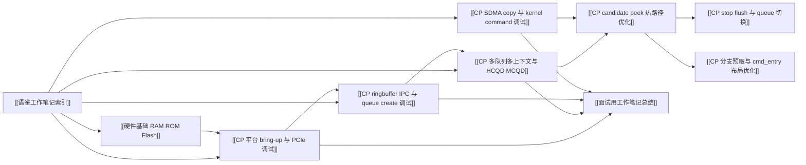

---
type: learning-card
created: 2026-05-09
source: "[[wiki/synthesis/语雀工作笔记知识图谱|语雀工作笔记知识图谱]]"
category: "synthesis"
---

# 语雀工作笔记知识图谱

## 原文

- 原文链接：[[wiki/synthesis/语雀工作笔记知识图谱|语雀工作笔记知识图谱]]
- 原始路径：wiki\synthesis\语雀工作笔记知识图谱.md
- 分类：`synthesis`

## 这个主题可以怎么讲

这张卡用来开场，不直接讲某个 bug，而是说明你的工作不是孤立修补：从 CP loader/平台 bring-up 进入多队列、多 context、ringbuffer/IPC，再到 `cmd_entry` 热路径和 SDMA/kernel command 调试。面试里可以先用一句话定位：“我做的是 GraceC CP firmware 相关工作，常见问题需要跨 UMD/KMD、firmware、硬件平台和波形一起定位。”

适合讲成 30 秒总览：

1. 先有平台能否起来的问题，包括 CP loader、bootrom、PCIe、PZ/Palladium。
2. 平台起来后，核心变成 queue 能否正确创建、query、bind 和执行。
3. 多队列、多 context 能跑后，再进入 stop/flush、candidate/peek、branch prefetch 这类热路径优化。
4. SDMA/kernel command 这类问题用 packet、memory diff、版本差异和稳定失败点来收敛。

## 模块关系图

## 技术抓手

- 分层视角：UMD 组包、KMD 通知、CP firmware 取包、硬件平台执行、host 侧 fence/IPC 反馈。
- 队列模型：MCQD、HCQD、query/bind、doorbell、ringbuffer、write pointer、stop/flush。
- 证据闭环：UMD log、kern.log、dmesg、packet dump、波形、trace valid 位、host/device memory diff。
- 优化抓手：candidate cache、减少多余 peek 前读取、控制 beqz/ret wrong-path fetch、把高频 false path 布局成 fall-through。

## 证据材料

- [[wiki/sources/语雀工作笔记索引|语雀工作笔记索引]] 记录了 2025-08 到 2026-05 的月份主题。
- [[wiki/fw/debug/CP 平台 bring-up 与 PCIe 调试|CP 平台 bring-up 与 PCIe 调试]] 提供 CP loader、PCIe、KO、fence 的跨层问题。
- [[wiki/fw/flows/CP 多队列多上下文与 HCQD MCQD|CP 多队列多上下文与 HCQD MCQD]] 提供 MCQD 128B 连续存放、global HCQD id、多 context attr/asid 等证据。
- [[wiki/fw/debug/CP ringbuffer IPC 与 queue create 调试|CP ringbuffer IPC 与 queue create 调试]] 提供 wrap、IPC 时序、host/device 可见性的证据。
- [[wiki/fw/debug/CP SDMA copy 与 kernel command 调试|CP SDMA copy 与 kernel command 调试]] 提供 V9 SDMA copy、index 202、packet 检查的证据。

## 面试追问

- 你怎么判断一个问题属于 UMD、KMD、firmware 还是硬件平台？
- 多队列调度里 MCQD 和 HCQD 的职责怎么分？
- 为什么波形里看到地址还不够，要看 valid 位？
- queue create 不动时，你会按什么顺序排查？
- 性能优化怎么证明不是“只是改了代码”，而是真的减少了热路径浪费？

## 关联页面

- [[面试用工作笔记总结]]
- [[CP 平台 bring-up 与 PCIe 调试]]
- [[CP ringbuffer IPC 与 queue create 调试]]
- [[CP 多队列多上下文与 HCQD MCQD]]
- [[CP SDMA copy 与 kernel command 调试]]
- [[硬件基础 RAM ROM Flash]]
- [[语雀工作笔记索引]]