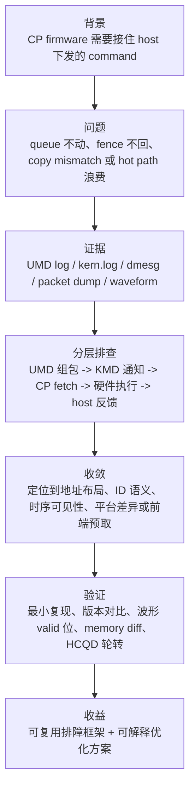

# 面试用工作笔记总结

## 原文

- 原文链接：[[wiki/synthesis/面试用工作笔记总结|面试用工作笔记总结]]
- 原始路径：wiki\synthesis\面试用工作笔记总结.md
- 分类：`synthesis`

## 这个主题可以怎么讲

这张卡是面试前的主讲稿。不要按月份流水账讲，建议压成四个可展开项目：平台 bring-up、MCQD/HCQD 多队列、ringbuffer/IPC queue create、V9 SDMA copy。每个项目都按同一套结构说：背景、问题、证据、排查路径、收敛结论、验证方式、沉淀方法。

可以用这句开场：

> 我做的是 GraceC CP firmware 相关工作，问题经常不是单层代码 bug，而是 UMD/KMD、firmware、硬件平台和测试镜像之间的协同问题。我比较熟悉从日志、packet、波形和源码一起收敛问题。

## 面试故事结构

## 技术抓手

- CP 架构：CP master/user firmware、MCQD、HCQD、ringbuffer、doorbell、Interaction Buffer、stop/flush。
- host 协同：UMD 组包、KMD 通知、IPC、中断、fence、PCIe remove/rescan、KO 加载。
- 平台差异：Palladium、PZ、EMU、Speed bridge、bootrom、DM1.1/DM1.4/V9 emu。
- 调试证据：waveform、trace valid 位、packet header/body、host/device memory 对比、kern.log、dmesg。
- 性能优化：candidate 到 peek 的路径、beqz/ret wrong-path fetch、手写 goto 布局、debug `-O0` 下的取指浪费。

## 四个可讲项目

| 项目 | 一句话讲法 | 关键证据 | 能体现的能力 |
|---|---|---|---|
| [[CP 平台 bring-up 与 PCIe 调试]] | 平台不稳定时先分层，不把所有问题都归到 firmware | CP user reset、NOC bus err、PCIe speed bridge、DM1.4 fence、PZ1 KO | 跨平台 bring-up 和最小化回归 |
| [[CP 多队列多上下文与 HCQD MCQD]] | 多队列问题的核心是地址布局、ID 语义和 query/bind 链路 | MCQD base、128B 连续存放、HCQD0/1 轮转、global HCQD id | 架构建模和硬件约束落地 |
| [[CP ringbuffer IPC 与 queue create 调试]] | queue create 不动要同时看写入、可见性、IPC 和测试产物 | ringbuffer wrap、IPC 时序、host/device ringbuffer 放置、UMD 重编译改变现象 | host/device 同步排查 |
| [[CP SDMA copy 与 kernel command 调试]] | copy mismatch 先把 packet 和内存证据固定住，再谈根因 | V9 emu、index 202、operator SDMA、body 字段、版本差异 | 稳定复现点和证据收敛 |

## 证据材料

- [[wiki/synthesis/面试用工作笔记总结|面试用工作笔记总结]] 给出面试主线和问答草稿。
- [[wiki/synthesis/语雀工作笔记知识图谱|语雀工作笔记知识图谱]] 给出全局图谱和时间线。
- [[wiki/sources/语雀工作笔记索引|语雀工作笔记索引]] 是月份证据入口。
- [[CP candidate peek 热路径优化]]、[[CP 分支预取与 cmd_entry 布局优化]]、[[CP stop flush 与 queue 切换]] 可作为性能优化追问的扩展材料。

## 面试追问

- 你最有代表性的 firmware 优化是什么，优化前后的证据是什么？
- 如果 CP 已执行完 command，但 host fence 不返回，你怎么拆？
- 多 MCQD 并行为什么需要 128B 连续存放？
- global HCQD id 和内部 id 混用会造成什么现象？
- V9 SDMA copy 只在一个 emu 复现时，你怎么避免盲猜？

## 还要补强的证据

- 每个代表项目的最终 patch/commit 和验证记录。
- `cmd_entry` 优化前后的波形截图、trace valid 位说明和 cycle/ns 对比。
- V9 SDMA copy 的最终根因和修复结论。
- 多 MCQD/HCQD 调度的最小复现脚本或测试命令。