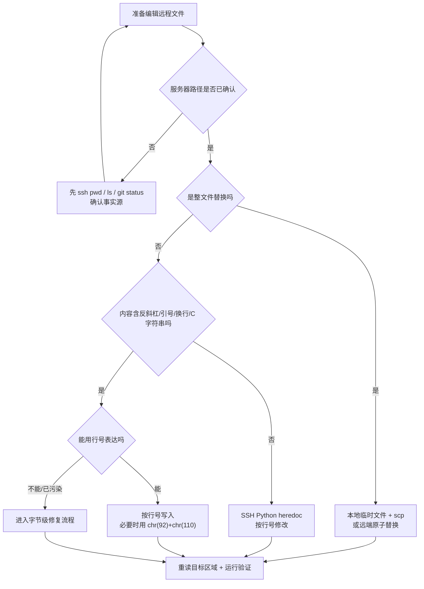
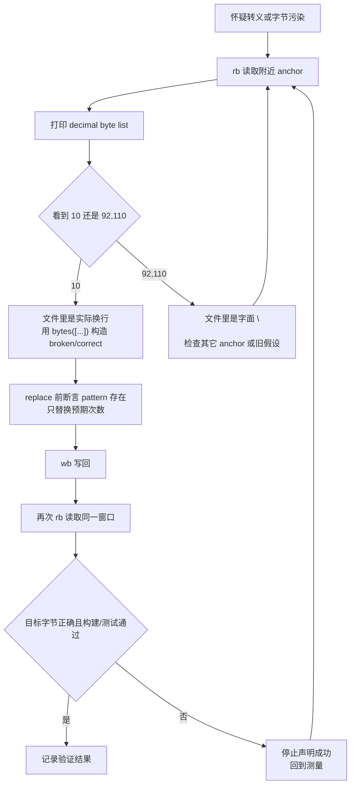

---
type: learning-card
created: 2026-05-09
source: "[[wiki/synthesis/AI 协作远程编辑经验|AI 协作远程编辑经验]]"
category: "topics"
---

# AI 协作远程编辑经验

## 原文

- 原文链接：[[wiki/synthesis/AI 协作远程编辑经验|AI 协作远程编辑经验]]
- 原始路径：wiki\topics\AI 协作远程编辑经验.md
- 分类：`topics`
- 文件大小：7821 bytes

## 什么时候用

- 任务发生在远程服务器、SSH、Windows 映射目录、VS Code Remote 或多 agent 并发编辑场景。
- 文件内容包含 C 字符串、反斜杠、`\n`、`\t`、二进制字节、Markdown 大段替换等容易被 shell/Python/SSH 多层转义污染的内容。
- 用户明确给出服务器路径、行号、日志、plan mode 状态或“只改这些文件”的边界时。
- 需要判断“本地可见内容”和“服务器真实运行内容”谁是事实源时。

## 远程编辑决策树

## 字节级修复流程

## 操作步骤

1. 先确认事实源：远程仓库以服务器路径为准，本地 Windows 映射只当辅助视图。
2. 编辑前读取目标上下文；对 C 字符串或转义敏感内容，用 `cat -A` 或 `rb` 字节窗口确认真实内容。
3. 选择最小可靠编辑方式：整文件替换用传输或远端原子写入；局部改动优先行号；转义不可靠时用 `bytes([...])`。
4. 修改后重读同一区域，不接受脚本的“fixed ok”作为唯一证据。
5. 按任务性质运行构建、CLI 复现、文档链接检查或 git diff，只报告实际验证过的结果。

## 常见失败

- `content.replace()` 找不到 pattern 但脚本仍退出 0，造成“假成功”。
- `b"\\n"`、`"\n"`、SSH heredoc、PowerShell 字符串经过多层解释后和预期字节不一致。
- 多点编辑按原始 offset 顺序执行，前一次替换改变后续坐标。
- 用户声明 plan mode 或写入边界后，agent 按工具状态或默认习惯继续自动改。
- 并发 agent 改其它文件时，误做全局整理、格式化或入口页更新。

## 验证标准

- 远程事实源已重读，且验证命令在同一事实源上执行。
- 对转义敏感修复，能指出目标区域里的关键字节，例如 `10`、`92,110` 或替换次数。
- diff 只包含用户授权文件；没有顺手改 `00/99` 入口、CP 主链路、`cmd_entry` 或面试文件。
- 结论区分“推断”“已验证”“未覆盖”，不把脚本输出当最终证据。

## 关联页面

- [[wiki/sources/local-md/C-home-shuaishuai.zhu/ajthunk/.claude/learnings/agent-browser-no-sudo-install|agent-browser Installation Without sudo]]
- [[wiki/sources/local-md/C-home-shuaishuai.zhu/ajthunk/.claude/learnings/agent-browser-windows-edge-workaround|agent-browser on Windows: Use Edge Instead of Chrome]]
- [[wiki/sources/local-md/C-home-shuaishuai.zhu/ajthunk/.claude/learnings/feishu-requires-auth|Feishu Documents Require Authentication]]
- [[wiki/sources/local-md/C-home-shuaishuai.zhu/ajthunk/.claude/learnings/ssh-windows-path-export-issue|SSH One-liner PATH Export Fails with Windows Paths]]
- [[wiki/sources/local-md/C-home-shuaishuai.zhu/ajthunk/.claude/retros/2026-03-30-1935|Session Retrospective — 2026-03-30 19:35]]
- [[wiki/sources/local-md/C-home-shuaishuai.zhu/fw/.claude/learnings/2026-03-31-hcqd-v3|Learning: HCQD Round-Robin V3 Design Patterns]]
- [[wiki/sources/local-md/C-home-shuaishuai.zhu/fw/.claude/learnings/candidate-cache-pattern|Learning: Candidate Bitmask Caching Pattern]]
- [[wiki/sources/local-md/C-home-shuaishuai.zhu/fw/.claude/learnings/errors/plan-mode-silent-detection-failure|Plan Mode Detection Failure — Copilot Chat Agent Handoff Limitation]]
- [[wiki/sources/local-md/C-home-shuaishuai.zhu/fw/.claude/learnings/errors/plan-mode-violation-root-cause|Plan Mode 违规根因分析]]
- [[wiki/sources/local-md/C-home-shuaishuai.zhu/fw/.claude/learnings/errors/ssh-heredoc-backslash-expansion|Backslash-N Expansion Through SSH Heredoc Layers]]
- [[wiki/sources/local-md/C-home-shuaishuai.zhu/fw/.claude/learnings/errors/ssh-python-byte-escaping|SSH Python Binary-Mode Replacement: False-Positive Trap]]
- [[wiki/sources/local-md/C-home-shuaishuai.zhu/fw/.claude/learnings/local-pointer-extraction|Local Pointer Extraction: pending_mask Bitmask Pattern]]
- [[wiki/sources/local-md/C-home-shuaishuai.zhu/fw/.claude/learnings/patterns/byte-level-file-surgery|Byte-Level File Surgery: Diagnosis and Replacement]]
- [[wiki/sources/local-md/C-home-shuaishuai.zhu/fw/.claude/learnings/patterns/ssh-remote-file-editing|SSH Remote File Editing -- Patterns and Pitfalls]]

## 阅读提示

先读本页建立操作边界；需要具体命令时跳到 source mirror。source mirror 是证据入口，不要直接修改 `wiki/` 原文。