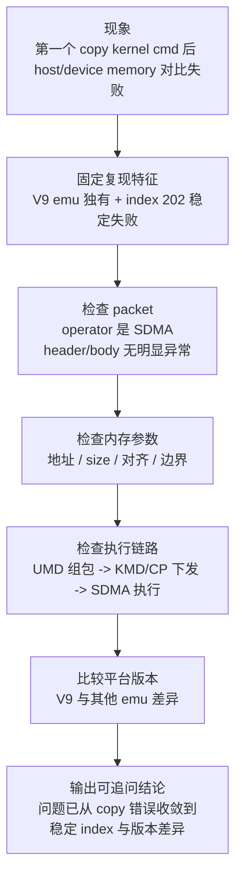

---
type: learning-card
created: 2026-05-09
source: "[[wiki/fw/debug/CP SDMA copy 与 kernel command 调试|CP SDMA copy 与 kernel command 调试]]"
category: "topics"
---

# CP SDMA copy 与 kernel command 调试

## 原文

- 原文链接：[[wiki/fw/debug/CP SDMA copy 与 kernel command 调试|CP SDMA copy 与 kernel command 调试]]
- 原始路径：wiki\topics\CP SDMA copy 与 kernel command 调试.md
- 分类：`topics`

## 这个主题可以怎么讲

这个主题适合讲“面对 copy mismatch，我怎么把问题从泛化现象收敛成可验证线索”。重点不要说成“SDMA 出错”，而要说清楚：先确认 UMD 下发的 command packet，再看 host/device memory、size、地址、边界，最后利用 V9 emu 独有和 index 202 稳定失败这两个特征收敛版本差异或边界问题。

## 调试顺序图

## 技术抓手

- packet 证据：operator 确认为 SDMA，body 字段暂时没有明显异常。
- 内存证据：host/device memory 对比失败，稳定停在 index 202。
- 版本证据：只在 V9 emu 出现，其他 emu 没有复现。
- 边界推理：index 202 可反推 size、burst、对齐、cache 或同步边界。
- 分层排查：不要直接认定 SDMA 硬件错，先排 UMD 组包和 KMD/CP 传递是否一致。

## 证据材料

- [[wiki/fw/debug/CP SDMA copy 与 kernel command 调试|原文]] 记录 V9 SDMA copy 的关键事实和调试顺序。
- [[语雀工作笔记索引]] 中 2026-05 是主要来源：V9 SDMA copy、kernel cmd 对比、ret/beqz 预取、goto 布局。
- [[面试用工作笔记总结]] 将它整理成代表性调试项目。
- 需要回看原始材料的证据：SDMA command packet dump、host/device memory diff、V9 与其他 emu 的版本对比日志。

## 面试追问

- 为什么第 202 个 index 是重要线索？
- 如果 operator 和 body 看起来都对，你下一步查什么？
- 只在 V9 emu 复现时，怎么区分平台差异和代码 bug？
- copy mismatch 要怎样证明 UMD 组包没有问题？
- 你会怎样把这个问题转成可复现的最小 case？

## 关联页面

- [[CP-Command-Packet]]
- [[iDMA]]
- [[CP 平台 bring-up 与 PCIe 调试]]
- [[面试用工作笔记总结]]
- [[语雀工作笔记索引]]