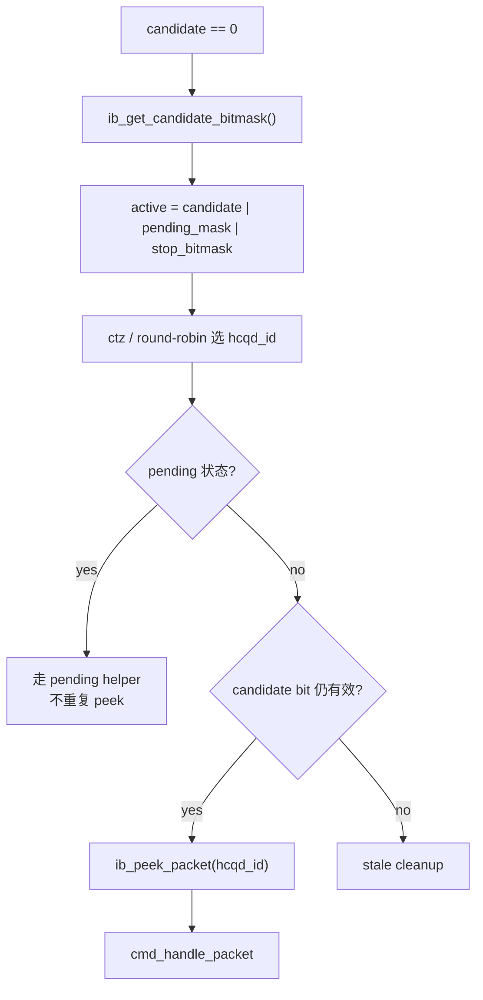
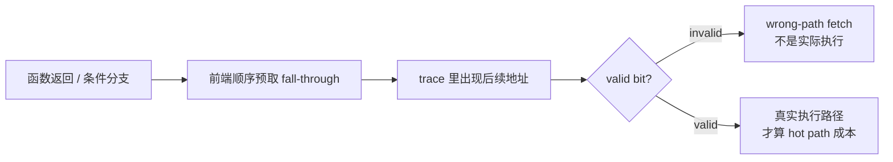

---
type: learning-card
created: 2026-05-09
source: "[[wiki/fw/performance/CP candidate peek 热路径优化|CP candidate peek 热路径优化]]"
category: "topics"
---

# CP candidate peek 热路径优化

## 原文

- 原文链接：[[wiki/fw/performance/CP candidate peek 热路径优化|CP candidate peek 热路径优化]]
- 原始路径：wiki\topics\CP candidate peek 热路径优化.md
- 分类：`topics`
- 文件大小：1544 bytes

## 结论

`candidate` 的价值是把“硬件上有哪些 HCQD 可能有新命令”缓存到 hot loop 里，减少反复 MMIO 读取。真正优化点不是盲目少读，而是让 `candidate`、`pending_mask`、`stop_bitmask` 的语义边界清楚，保证 peek 前没有多余路径，也不会因为缓存旧 bit 误处理 packet。

## 从 candidate 到 peek

## candidate / pending 的职责分离

| bitmask | 解决的问题 | 错用后果 |
|---|---|---|
| `candidate` | 减少“发现新命令”的硬件扫描 | 当成完成条件会误判 event/wait_host |
| `pending_mask` | 记住“已经 peek 但还没完成”的 HCQD | 漏 set 会导致 pending packet 不可达 |
| `stop_bitmask` | 让 stop 控制面请求进入普通选择器 | 漏 OR 会导致无 candidate 时 stop 不被处理 |

## 热路径优化要看什么

- `ib_get_candidate_bitmask()` 后是否直接进入 active 构建和选择，而不是再次读取 candidate。
- `ib_peek_packet()` 前是否存在只为 debug 或可缓存信息服务的 MMIO 读。
- pending 是否先于 candidate 分支，避免同一个 event/wait packet 反复 peek。
- stop/flush 是否会清掉对应 stale candidate，避免旧缓存误导下一轮。

## 与分支预取的边界

## 关联页面

- [[cmd_entry|cmd_entry]]
- [[CP stop flush 与 queue 切换|CP stop flush 与 queue 切换]]
- [[CP 分支预取与 cmd_entry 布局优化|CP 分支预取与 cmd_entry 布局优化]]
- [[Interaction-Buffer|Interaction-Buffer]]
- [[语雀工作笔记索引|语雀工作笔记索引]]
