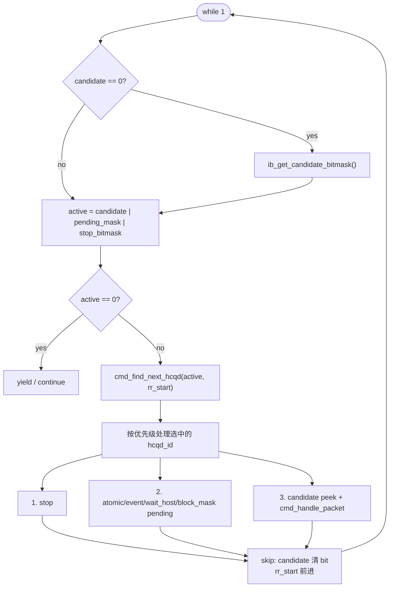
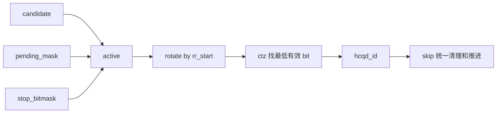

---
type: learning-card
created: 2026-05-09
source: "[[wiki/fw/cp-user/CP cmd_entry Candidate V7 调度设计|CP cmd_entry Candidate V7 调度设计]]"
category: "topics"
---

# CP cmd_entry Candidate V7 调度设计

## 原文

- 原文链接：[[wiki/fw/cp-user/CP cmd_entry Candidate V7 调度设计|CP cmd_entry Candidate V7 调度设计]]
- 原始路径：wiki\topics\CP cmd_entry Candidate V7 调度设计.md
- 分类：`topics`
- 文件大小：3002 bytes

## 学习目标

这张卡只抓 V7 的调度骨架：先把“本轮值得访问的 HCQD”合成 `active`，再用 CTZ/round-robin 直接命中一个 HCQD。这样避免无效 HCQD miss 迭代，也让 pending、stop、candidate 三类来源可以共用同一个选择器。

## V7 主线图

## 五个变量怎么分工

| 变量 | 空间 | 角色 | 学习时的抓手 |
|---|---|---|---|
| `candidate` | HCQD | 硬件侧“有新东西可看”的缓存 | 减少反复 MMIO 读 candidate |
| `pending_mask` | HCQD | 软件侧“已经 peek，但还要重试”的集合 | 保证 event/wait/atomic 后续可达 |
| `stop_bitmask` | HCQD | 控制面 stop 请求集合 | 没有新 candidate 也必须能处理 |
| `active` | HCQD | 本轮可调度集合 | 只能由 HCQD space bitmask 组成 |
| `rr_start` | HCQD index | 公平性搜索起点 | 在 `skip:` 统一推进 |

## 关键不变量

1. `active` 里只能放 HCQD-id space 的 bit，不能塞 `flush_cxt_bitmap`。
2. 每轮普通路径只处理一个 HCQD，复杂状态通过 `pending_mask` 留到后续轮次继续推进。
3. pending 分支必须早于 candidate 分支，否则 event/wait_host 会重复 peek 或重复读取旧 packet。
4. `candidate` bit 在 `skip:` 统一清，避免不同分支各自清理造成 stale bit。
5. stop 要进入 `active`，这样 stop 不依赖“刚好有新 candidate”。

## 容易误解点

- V7 不是把 round-robin 写得更花，而是先回答“谁值得看”，再回答“先看谁”。
- `candidate == 0` 才刷新 candidate，不代表 pending 或 stop 会被饿死；它们会通过 `active` 参与选择。
- `pending_mask` 不是保存 packet 内容，真正上下文仍在 `cmd_status[hcqd_id]` 和 `cmd_peek_pkt[hcqd_id]`。
- flush 不属于 `active`，它在 Phase 2 以 context bitmap 的方式优先处理。

## 关联页面

- [[cmd_entry|cmd_entry]]
- [[CP candidate peek 热路径优化|CP candidate peek 热路径优化]]
- [[CP 分支预取与 cmd_entry 布局优化|CP 分支预取与 cmd_entry 布局优化]]
- [[HCQD|HCQD]]
- [[Interaction-Buffer|Interaction-Buffer]]
- [[wiki/sources/local-md/C-home-shuaishuai.zhu/fw/.claude/learnings/2026-03-31-hcqd-v3|Learning: HCQD Round-Robin V3 Design Patterns]]
- [[wiki/sources/local-md/C-home-shuaishuai.zhu/fw/.claude/learnings/candidate-cache-pattern|Learning: Candidate Bitmask Caching Pattern]]
- [[wiki/sources/local-md/C-home-shuaishuai.zhu/fw/.claude/learnings/local-pointer-extraction|Local Pointer Extraction: pending_mask Bitmask Pattern]]
- [[wiki/sources/local-md/C-home-shuaishuai.zhu/fw/.claude/learnings/struct-deduplication|Struct Deduplication: Per-HCQD vs Global Pending]]
- [[wiki/sources/local-md/C-home-shuaishuai.zhu/fw/.claude/retros/2026-03-31-1916|Session Retro: 2026-03-31-1916 - HCQD Round-Robin V3 Design]]
- [[wiki/sources/local-md/C-home-shuaishuai.zhu/fw/.claude/retros/2026-04-07-candidate-cache|Session Retrospective: 2026-04-07]]
- [[wiki/sources/local-md/C-home-shuaishuai.zhu/fw/.claude/retros/2026-04-08-v7-candidate-driven|Session Retrospective: 2026-04-08]]
