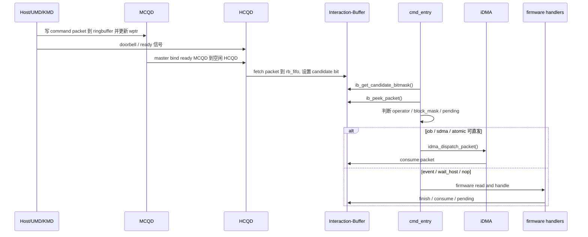
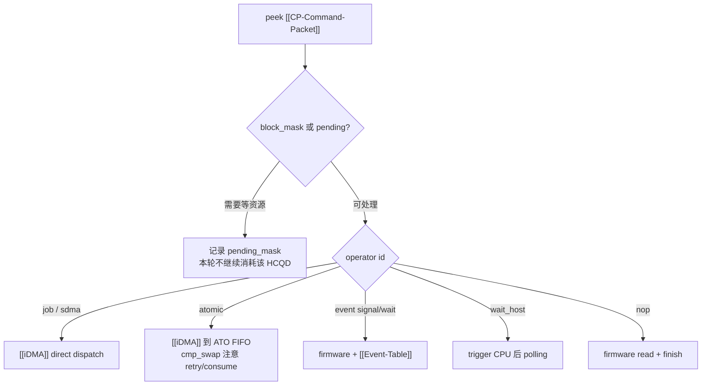

---
type: learning-card
created: 2026-05-09
source: "[[wiki/fw/flows/CP command processing flow|CP command processing flow]]"
category: "topics"
---

# CP command processing flow

## 原文

- 原文链接：[[wiki/fw/flows/CP command processing flow|CP command processing flow]]
- 原始路径：wiki\topics\CP command processing flow.md
- 分类：`topics`
- 文件大小：1662 bytes

## 它解决什么问题

这页回答“一个 CP command packet 从 host 写入到最终执行，中间经过哪些步骤”。它比 synthesis 页更像时序图：先看 host/UMD/KMD 写 ringbuffer，再看 master/HCQD fetch，最后看 [[cmd_entry]] 如何把 packet 分给 [[iDMA]] 或 firmware。

## 主流程图

## 在链路中的位置

这张卡放在 [[GraceC CP MAS v1.4 code knowledge map]] 之后读。前一页告诉你有哪些对象，这页告诉你对象之间按什么顺序交接。

| 位置 | 关注点 | 对应页面 |
|---|---|---|
| 队列写入 | command packet 谁写、写到哪里 | [[MCQD]]、[[CP-Command-Packet]] |
| 硬件 fetch | ready MCQD 如何进入 HCQD，candidate bit 如何出现 | [[HCQD]] |
| firmware 观察 | peek/read/consume/drop/finish 的语义 | [[Interaction-Buffer]] |
| packet 分流 | 哪些走 iDMA，哪些必须 firmware | [[CP-Firmware-CPE]]、[[iDMA]] |

## 输入输出

- 输入：host 侧 ringbuffer packet、wptr/doorbell、MCQD ready 信息。
- 中间状态：HCQD rb_fifo、candidate mask、packet header/body、per-HCQD pending/stop/flush 状态。
- 输出：downstream FIFO dispatch、event table 更新、wait_host polling 结果、packet consume/finish/drop。

## 分流判断

## 阅读关键点

- `ib_peek_packet()` 是判断路径的入口，但不要把 peek 理解成 consume。
- [[iDMA]] 的价值是减少 firmware 逐字搬运 packet，但 event/wait_host 的语义不能靠 iDMA 直接完成。
- pending 的存在说明 CP firmware 不是简单 while-loop 分发器，它还要维护跨轮次的等待状态。
- stop/flush 会打断普通分发逻辑，所以读主流程时要给队列状态处理留一个分支。

## 关联页面

- [[cmd_entry|cmd_entry]]
- [[CP-Command-Packet|CP-Command-Packet]]
- [[fw CP user firmware code summary|fw CP user firmware code summary]]
- [[GraceC CP MAS v1.4|GraceC CP MAS v1.4]]
- [[HCQD|HCQD]]
- [[iDMA|iDMA]]
- [[Interaction-Buffer|Interaction-Buffer]]
- [[MCQD|MCQD]]

