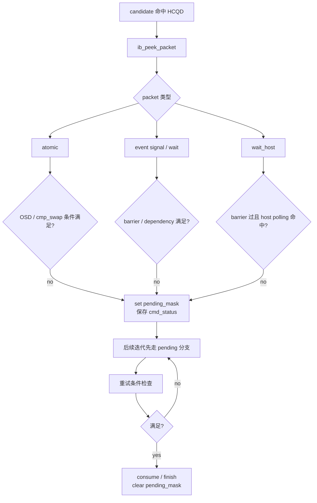
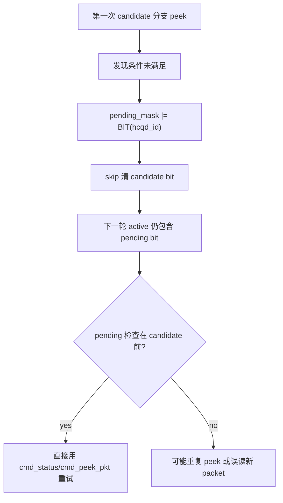

---
type: learning-card
created: 2026-05-09
source: "[[wiki/fw/flows/CP event atomic wait host handling|CP event atomic wait host handling]]"
category: "topics"
---

# CP event atomic wait host handling

## 原文

- 原文链接：[[wiki/fw/flows/CP event atomic wait host handling|CP event atomic wait host handling]]
- 原始路径：wiki\topics\CP event atomic wait host handling.md
- 分类：`topics`
- 文件大小：1516 bytes

## 结论

event、atomic、wait_host 是 `cmd_entry()` 中最容易进入 pending 的命令类型。它们的共同点是：第一次 candidate 命中后可能已经 peek 到 packet，但外部条件没满足，不能按普通 job 一次 consume 完成。

## pending 生命周期

## 三类 pending 的差异

| 类型 | 为什么 pending | 完成条件 | consume / finish 语义 |
|---|---|---|---|
| atomic add/swap | dispatch 后 outstanding 未清 | OSD 清零 | 通常 dispatch 后 consume，done 时清 pending |
| atomic cmp_swap | 比较/重试可能跨轮 | OSD 和比较结果满足 | done 后才 consume 更安全 |
| event wait/barrier | dependency 或前序 OSD 未满足 | event dependency 满足 | 完成时 `ib_finish_packet()` |
| wait_host | host 还没写回 polling 值 | polling 命中 expect value | phase1 consume，phase2 finish |
| block_mask | 对应 OSD 未清 | block mask gate 通过 | 先清 pending 再进入原 handler |

## 为什么 pending 不重复 peek

## 复习重点

- `pending_mask` 只保存“哪个 HCQD 要重试”，不保存 packet 内容。
- `cmd_status[hcqd_id]` 和 `cmd_peek_pkt[hcqd_id]` 才是 pending 状态上下文。
- stop/flush 会打断 pending；处理后必须清对应 `pending_mask` 和 `cmd_status`。
- wait_host 是两阶段：先 trigger host，再 poll host 回写，不能当作普通 event wait。

## 关联页面

- [[cmd_entry|cmd_entry]]
- [[CP-Command-Packet|CP-Command-Packet]]
- [[Event-Table|Event-Table]]
- [[iDMA|iDMA]]
