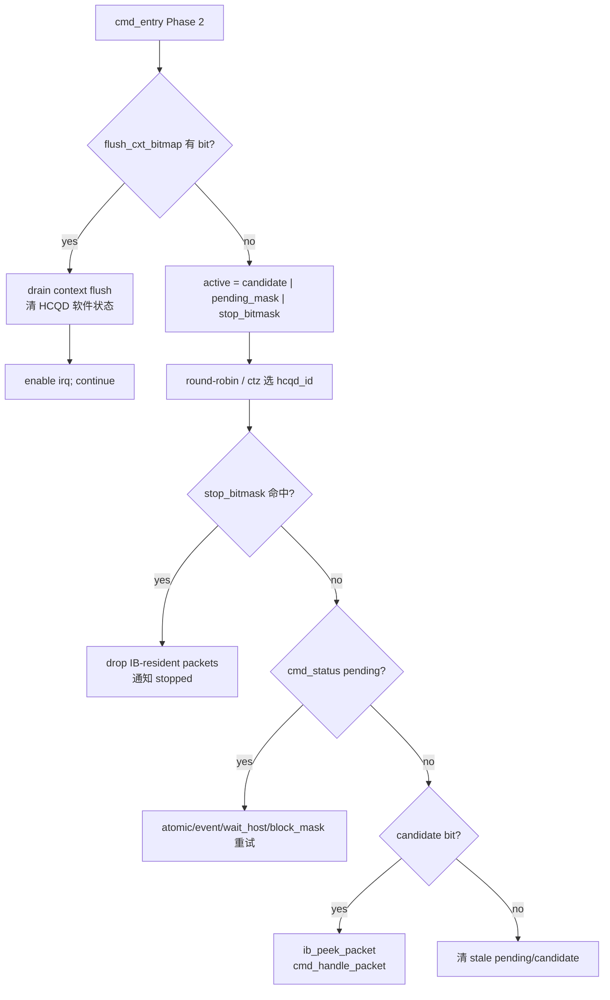
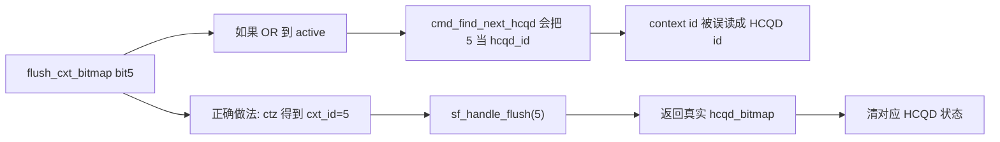

---
type: learning-card
created: 2026-05-09
source: "[[wiki/fw/cp-user/CP queue scheduling stop flush|CP queue scheduling stop flush]]"
category: "topics"
---

# CP queue scheduling stop flush

## 原文

- 原文链接：[[wiki/fw/cp-user/CP queue scheduling stop flush|CP queue scheduling stop flush]]
- 原始路径：wiki\topics\CP queue scheduling stop flush.md
- 分类：`topics`
- 文件大小：1863 bytes

## 这页怎么学

把它当作 MAS queue scheduling 与 firmware hot loop 的连接卡：普通 queue packet 通过 candidate/pending 进入 `active`，控制面 stop/flush 会打断普通 dispatch，其中 stop 落在 HCQD 维度，flush 落在 context 维度。

## 背景：为什么要改

从 queue scheduling 角度看，stop/flush 是“改变 queue 有效性”的控制事件，不是普通 packet。旧逻辑如果把它们和普通 dispatch 混在一起，会带来三个问题：

- stop 可能依赖 candidate 才被看见；但 stop 本身应该能主动唤醒对应 HCQD。
- flush 是 context 事件，如果只保存一个全局 flush 信息，多个 context 连续 flush 会互相覆盖。
- flush 后如果全量清 `cmd_status`，会误伤其他没有被 flush 的 HCQD。

所以修改方向是：stop 直接进入 HCQD active mask；flush 先在 context space 排队，再转换成 HCQD bitmap 做精确清理。

## 调度优先级

## queue 视角下的 stop/flush

| 场景 | 维度 | 对 queue 的含义 | `cmd_entry()` 动作 |
|---|---|---|---|
| 普通 candidate | HCQD | 该 HCQD 有新 packet | peek 后按 packet 类型处理 |
| pending | HCQD | packet 已经 peek，但依赖未满足 | 不重复 peek，继续推进状态机 |
| stop | HCQD | 单个 HCQD 需要打断/drop | 进入 `active`，优先于 pending/candidate |
| flush | context | 一个 context 下的相关 HCQD 都要失效 | 先按 context drain，再精确清 HCQD bit |

## 修改收益

| 修改点 | 对 queue scheduling 的收益 |
|---|---|
| `stop_bitmask` 合入 active | stop 不再依赖普通 candidate；HCQD 级控制事件不会漏处理 |
| `flush_cxt_bitmap` 独立于 active | context 事件不会被误当成 HCQD id |
| `flush_hcqd_bitmap[cxt_id]` | 每个 context 独立保存 affected HCQD，避免覆盖 |
| flush 返回 processed bitmap | 只清对应 HCQD 的 `cmd_status/candidate/pending_mask` |
| flush 优先级最高 | context 已失效时，不再继续 dispatch 旧 packet |

## 为什么 flush 不放进 active

## 复习检查点

- 能解释 `active` 为什么只包含 HCQD bit。
- 能解释 stop 为什么即使没有 candidate 也要被调度。
- 能解释 flush 为什么在 Phase 2 内优先，并且一次 drain 多个 context。
- 能解释 `pending_mask` 如何避免 event/wait_host 重复 peek。

## 关键不变量

- queue scheduling 的普通路径只在 HCQD space 上选择目标。
- flush 是 context space 的控制面事件，必须先转成 `flush_hcqd_bitmap[cxt_id]` 后，才能清 HCQD 状态。
- stop 是 HCQD space 的控制面事件，可以直接进入 `active`。
- pending 代表“同一个 HCQD 的当前 packet 还没完成”，不代表 queue 里有新 packet。
## 关联页面

- [[cmd_entry|cmd_entry]]
- [[GraceC CP MAS v1.4 code knowledge map|GraceC CP MAS v1.4 code knowledge map]]
- [[HCQD|HCQD]]
- [[iDMA|iDMA]]
- [[Interaction-Buffer|Interaction-Buffer]]
- [[MCQD|MCQD]]

